# Deploy: Zabbix + MySQL + Grafana com Docker.
<p>&nbsp;</p>

- [Deploy: Zabbix + MySQL + Grafana com Docker.](#deploy-zabbix--mysql--grafana-com-docker)
  - [**Introdução**](#introdução)
  - [**1. Passos iniciais do laboratório.**](#1-passos-iniciais-do-laboratório)
  - [**2. Docker - Provisionamento de conteiners**](#2-docker---provisionamento-de-conteiners)
    - [**2.1 - Ok! Mas o que é o **Docker**?**](#21---ok-mas-o-que-é-o-docker)
    - [**2.2 - E o que é o Docker Compose?**](#22---e-o-que-é-o-docker-compose)
  - [**3. Criação do arquivo docker-compose.yml**](#3-criação-do-arquivo-docker-composeyml)
  - [**4. Criação do arquivo de variáveis ".env".**](#4-criação-do-arquivo-de-variáveis-env)
  - [**5. Execução do ambiente**](#5-execução-do-ambiente)
  - [**6. Check-list de execução do ambiente.**](#6-check-list-de-execução-do-ambiente)
    - [**6.1 - Servidor MySQL**](#61---servidor-mysql)
  - [**6.2 - Servidores Zabbix Server e Zabbix Front-end.**](#62---servidores-zabbix-server-e-zabbix-front-end)
  - [**6.3 - Servidor Grafana**](#63---servidor-grafana)
  - [**7. Conclusão.**](#7-conclusão)
   
<p>&nbsp;</p>

## **Introdução**

Este artigo tem como finalidade ajudar a pessoas como eu que estão entrando no mundo DevOps a ter uma visão geral de como construir um ambiente de laboratório em conteiners, utilizando para a provisão o **Docker**.

Deixo claro que a idéia deste artigo é mostrar um rápido deploy de um ambiente em contêineres, mostrando o uso da tecnologia que é muito utilizado nesta área.
<p>&nbsp;</p>


## **1. Passos iniciais do laboratório.**

Nosso laboratório consistirá nos seguintes servidores (contêineres):

* **Servidor Mysql**: irá prover o banco de dados para uso no servidor **Zabbix**;
* **Servidor Zabbix Server**: este é o core do nosso ambiente de monitoramento, nele se concentrará os hosts que serão monitorados;
* **Servidor Zabbix Front-end**: será responsável pela interface WEB do nosso serviço de monitoramento. Como tecnologia, iremos utilizar o **NGINX** para prover esse acesso;
* **Zabbix Agent**: irá prover o monitoramento do host **"Zabbix Server"**.
* **Servidor Grafana**: será responsável pela criação de nossos dashboards.

Após uma breve descrição dos serviços de nosso laboratório, vamos colocar a mão na massa:

* Crie a pasta local chamada **"Labs"**:

```zsh
mkdir /Labs
```

* Entre na pasta **"Labs"**:

```zsh
cd /Labs
```
<p>&nbsp;</p>

## **2. Docker - Provisionamento de conteiners**

Para o provisionamento dos contêineres, iremos utilizar o **Docker**, mas especificamente, o **Docker Compose**.
<p>&nbsp;</p>

### **2.1 - Ok! Mas o que é o **Docker**?**

Segundo a **Docker Inc**, _"o Docker é uma plataforma aberta para desenvolvimento, envio e execução de aplicativos. O Docker permite que você separe seus aplicativos de sua infraestrutura para que você possa entregar software rapidamente. Com o Docker, você pode gerenciar sua infraestrutura da mesma forma que gerencia seus aplicativos. Ao aproveitar as metodologias do Docker para enviar, testar e implantar código rapidamente, você pode reduzir significativamente o atraso entre escrever o código e executá-lo na produção"._


<p>&nbsp;</p>

Para que o artigo não fique muito longo e para mais informações sobre o **Docker** e seus componentes, acesse: https://docs.docker.com/get-started/overview.

<p>&nbsp;</p>

### **2.2 - E o que é o Docker Compose?**

Em linhas gerais, a **Docker inc.** diz: _"o **Docker Compose** é uma ferramenta para definir e executar aplicativos **Docker** de vários contêineres.
Através de um arquivo YAML, você configura os serviços de seu aplicativo. Então, com um único comando, você cria e inicia todos os serviços da sua configuração"_. 
Para saber mais sobre todos os recursos do Compose, consulte: https://docs.docker.com/compose/#features

<p>&nbsp;</p>

## **3. Criação do arquivo docker-compose.yml**

Dentro da pasta **"Labs"**, crie com a ajuda de um editor de códigos, no meu caso com o **Visual Studio Code**, um arquivo chamado **docker-compose.yml** com o seguinte conteudo:

```yaml
version: '3.3'

services:
  mysqlserver:
    image: mysql:latest
    container_name: ${MYSQL_SERVER_NAME}
    environment:
      - MYSQL_DATABASE=${MYSQL_DATABASE}
      - MYSQL_USER=${MYSQL_USER}
      - MYSQL_PASSWORD=${MYSQL_PASSWORD}
      - MYSQL_ROOT_PASSWORD=${MYSQL_ROOT_PASSWORD}

    restart: unless-stopped
    command: mysqld --character-set-server=utf8 --collation-server=utf8_bin --default-authentication-plugin=mysql_native_password
    networks:
      minha-rede:
        aliases:
         - mysql-server
         - zabbix-database
         - mysql-database
    
    volumes:
      - mysql_database:/var/lib/mysql
  
  zabbixsrv:
    image: zabbix/zabbix-server-mysql:ubuntu-6.0-latest
    container_name: ${ZABBIX_SERVER_NAME}
    environment:
      - DB_SERVER_HOST=${MYSQL_SERVER_NAME}
      - MYSQL_DATABASE=${MYSQL_DATABASE}
      - MYSQL_USER=${MYSQL_USER}
      - MYSQL_PASSWORD=${MYSQL_PASSWORD}
      - MYSQL_ROOT_PASSWORD=${MYSQL_ROOT_PASSWORD}
    
    restart: unless-stopped    
    ports:
      - 10051:10051
      - 10052:10050
      
    volumes:
      - /etc/localtime:/etc/localtime:ro
      - zabbix_server_etc:/etc

    ulimits:
     nproc: 65535
     nofile:
      soft: 20000
      hard: 40000
    deploy:
     resources:
      limits:
       cpus: '0.70'
       memory: 1G
      reservations:
       cpus: '0.5'
       memory: 512M
    
    networks:
      minha-rede:
        aliases:
         - zabbix-server
         - zabbix-server-mysql
         - zabbix-server-ubuntu-mysql
         - zabbix-server-mysql-ubuntu
    
    depends_on:
      - mysqlserver

  zabbixweb:
    image: zabbix/zabbix-web-nginx-mysql:ubuntu-6.0-latest
    container_name: ${ZABBIX_WEB_NAME}
    environment:
      - ZBX_SERVER_HOST=${ZABBIX_SERVER_NAME}
      - DB_SERVER_HOST=${MYSQL_SERVER_NAME}
      - MYSQL_DATABASE=${MYSQL_DATABASE}
      - MYSQL_USER=${MYSQL_USER}
      - MYSQL_PASSWORD=${MYSQL_PASSWORD}
      - MYSQL_ROOT_PASSWORD=${MYSQL_ROOT_PASSWORD}
    
    restart: unless-stopped
    ports:
      - 80:8080
    
    volumes:
      - /etc/localtime:/etc/localtime:ro
      - zabbix_nginx_etc:/etc
      - zabbix_nginx_var:/var
    
    networks:
      minha-rede:
        aliases:
         - zabbix-web-nginx-mysql
         - zabbix-web-nginx-ubuntu-mysql
         - zabbix-web-nginx-mysql-ubuntu 
    
    depends_on:
      - mysqlserver
  
  zabbix-agent: 
    image: zabbix/zabbix-agent:ubuntu-6.0-latest
    container_name: ${ZABBIX_AGENT_NAME}
    privileged: true
    environment:
      - ZBX_SERVER_HOST=${ZABBIX_SERVER_NAME}
      - ZBX_HOSTNAME=${ZABBIX_HOSTNAME}
      - ZBX_ACTIVE_ALLOW=false
    
    volumes:
      - /etc/localtime:/etc/localtime:ro
      - zabbix_agent_etc:/etc/zabbix:rw

    restart: unless-stopped
    ports:
      - 10050:10050
    
    networks:
      minha-rede:
        aliases:
         - zabbix-agent
         - zabbix-agent-passive
         - zabbix-agent-ubuntu
    
  grafana:
    image: grafana/grafana
    container_name: grafana
    links:
      - mysqlserver
      - zabbixsrv
    ports:
      - '3000:3000'
    volumes:
      - /etc/localtime:/etc/localtime:ro
      - grafana_data:/var/lib/grafana
    
    networks:
      minha-rede:
        aliases:
         - grafana
         - grafana-server
         
    depends_on:
      - mysqlserver
      - zabbixsrv

networks: 
  minha-rede:
    driver: bridge

volumes:
  mysql_database:
  zabbix_server_etc:
  zabbix_nginx_etc:
  zabbix_nginx_var:
  zabbix_agent_etc:
  grafana_data:
```

Agora, vou quebra o arquivo em partes, para explicar o que estamos fazendo.
<p>&nbsp;</p>

**Servidor MySQL**

```yaml
services:
  mysqlserver:
    image: mysql:latest
    container_name: ${MYSQL_SERVER_NAME}
    environment:
      - MYSQL_DATABASE=${MYSQL_DATABASE}
      - MYSQL_USER=${MYSQL_USER}
      - MYSQL_PASSWORD=${MYSQL_PASSWORD}
      - MYSQL_ROOT_PASSWORD=${MYSQL_ROOT_PASSWORD}

    restart: unless-stopped
    command: mysqld --character-set-server=utf8 --collation-server=utf8_bin --default-authentication-plugin=mysql_native_password
    networks:
      minha-rede:
        aliases:
         - mysql-server
         - zabbix-database
         - mysql-database
    
    volumes:
      - mysql_database:/var/lib/mysql
```

Nesta parte do arquivo, vamos criar o **serviço (service)**, que neste caso é o próprio contêiner, chamado **mysqlserver** e logo abaixo, a descrição do que será configurado neste serviço:

* **image**: é a imagem utilizada para subirmos o nosso contêiner de banco de dados, neste caso, iremos utilizar a imagem **mysql:latest**;
* **container_name**: é o nome utilizado para identificar o container no nosso ambiente, neste caso, iremos utilizar a variável definida no arquivo **.env** chamada **${MYSQL_SERVER_NAME}**;
* **environment**: é usado para passarmos as variáveis que deverão ficar setadas no sistema operacional do contêiner, sendo elas:
  * **MYSQL_DATABASE**: é a variável que define o nome do nosso banco de dados, iremos utilizar aqui a variável definida no arquivo **.env** chamada **${MYSQL_DATABASE}**;
  * **MYSQL_USER**: é a variável que define qual o nome de usuário que iremos utlizar para acessar o banco de dados da aplicação, neste caso, iremos utilizar a variável definida no arquivo **.env** chamada **${MYSQL_USER}**;
  * **MYSQL_PASSWORD**: nesta váriável, difinimos a senha que será utilizada pelo usuário do banco de dados da aplicação, iremos utilizar a variável definida no arquivo **.env** chamada **${MYSQL_PASSWORD}**
  * **MYSQL_ROOT_PASSWORD**: é a variável na qual definimos a senha do super-usuário do banco de dados, iremos utilizar a senha definida no arquivo **.env** **${MYSQL_ROOT_PASSWORD}**.
* **restart**: é utilizado para informar ao contêiner que, caso haja uma parada brusca, que o mesmo seja executado novamente.
* **command**: aqui falamos para o **MySQL** que o banco em questão seja criado com seu **Charset** em **UTF8** e que seu **collation** utilize também **UTF8**. Aqui também falamos para utilizar a autenticação nativa do Mysql.
* **networks**: é utilizado para passarmos as configurações da rede que será utilizada, neste caso, estamos definindo o nome da rede (**minha-rede**) e os aliases que iremos utilizar para este contêiner.
* **volumes**: aqui definimos um volume persistente para nosso banco de dados, para que, caso seja recriado o contêiner, os dados não sejam perdidos.
<p>&nbsp;</p>

**Servidor Zabbix Server**

```yaml
  zabbixsrv:
    image: zabbix/zabbix-server-mysql:ubuntu-6.0-latest
    container_name: ${ZABBIX_SERVER_NAME}
    environment:
      - DB_SERVER_HOST=${MYSQL_SERVER_NAME}
      - MYSQL_DATABASE=${MYSQL_DATABASE}
      - MYSQL_USER=${MYSQL_USER}
      - MYSQL_PASSWORD=${MYSQL_PASSWORD}
      - MYSQL_ROOT_PASSWORD=${MYSQL_ROOT_PASSWORD}
    
    restart: unless-stopped    
    ports:
      - 10051:10051
      - 10052:10050
      
    volumes:
      - /etc/localtime:/etc/localtime:ro
      - zabbix_server_etc:/etc

    ulimits:
     nproc: 65535
     nofile:
      soft: 20000
      hard: 40000
    deploy:
     resources:
      limits:
       cpus: '0.70'
       memory: 1G
      reservations:
       cpus: '0.5'
       memory: 512M
    
    networks:
      minha-rede:
        aliases:
         - zabbix-server
         - zabbix-server-mysql
         - zabbix-server-ubuntu-mysql
         - zabbix-server-mysql-ubuntu
    
    depends_on:
      - mysqlserver
```

Nesta parte do arquivo, vamos criar o **serviço (service)**, que neste caso é o próprio contêiner, chamado **zabbixsrv** e logo abaixo a descrição do que será configurado neste serviço::

* **image**: é a imagem utilizada para subirmos o nosso contêiner do servidor **Zabbix**, neste caso, iremos utilizar a imagem **zabbix-server-mysql:ubuntu-6.0-latest**;
* **container_name**: é o nome utilizado para identificar o contêiner no nosso ambiente, neste caso, iremos utilizar a variável definida no arquivo **.env** chamada **${ZABBIX_SERVER_NAME}**;
* **environment**: é usado para passarmos as variáveis que deverão ficar setadas no sistema operacional do contêiner, sendo elas:
  * **DB_SERVER_HOST**: é a variável que define o nome do nosso servidor de banco de dados, iremos utilizar aqui a variável definida no arquivo **.env** chamada **${MYSQL_SERVER_NAME}**;
  * **MYSQL_DATABASE**: esta variável é usada para definirmos o nome do banco de dados que será utilizado pela aplicação. Iremos utilizar a variável definida no arquivo **.env** chamada **${MYSQL_DATABASE}**;
  
  * **MYSQL_USER**: é a variável que define qual o nome de usuário que iremos utilizar para acessar o banco de dados da aplicação, neste caso, iremos utilizar a variável definida no arquivo **.env** chamada **${MYSQL_USER}**;
  * **MYSQL_PASSWORD**: nesta váriável, definimos a senha que será utilizada pelo usuário do banco de dados da aplicação, iremos utilizar a variável definida no arquivo **.env** chamada **${MYSQL_PASSWORD}**
  * **MYSQL_ROOT_PASSWORD**: é a variável na qual definimos a senha do super-usuário do banco de dados, iremos utilizar a senha definida no arquivo **.env** **${MYSQL_ROOT_PASSWORD}**.
* **restart**: é utilizado para informar ao contêiner que, caso haja uma parada brusca, que o mesmo seja executado novamente.
* **ports**: neste campo definimos quais portas serão liberadas para uso no nosso contêiner. O padrão utilizado é "**(porta do host**)":"(**porta do contêiner**)", neste caso as portas **10051:10051** e **10052:10050**
  
* **volumes**: aqui definimos um volume persistente para as configurações do nosso servidor, para que, caso seja recriado o contêiner, os dados não sejam perdidos. Para que nosso ambiente utilize o mesmo horário e timezone, mapeamos o nosso arquivo **/etc/localtime** para o **/etc/localtime** do servidor.

* **ulimits**: neste campo definimos limites passados para o sistema operacional do contêiner.

* **deploy**: aqui definimos os limites de uso de cpu e memória que o contêiner poderá utilizar.

* **networks**: é utilizado para passarmos as configurações da rede que serão utilizadas, neste caso, estamos definindo o nome da rede (**minha-rede**) e os aliases que iremos utilizar para este contêiner.

* **depends_on**: neste campo, definimos que o conteiner só pode ser criado ou inicializado após a criação e inicialização do contêiner **mysqlserver**, que é o servidor do nosso banco de dados.
<p>&nbsp;</p>

**Servidor Zabbix Front-end**

```yaml
  zabbixweb:
    image: zabbix/zabbix-web-nginx-mysql:ubuntu-6.0-latest
    container_name: ${ZABBIX_WEB_NAME}
    environment:
      - ZBX_SERVER_HOST=${ZABBIX_SERVER_NAME}
      - DB_SERVER_HOST=${MYSQL_SERVER_NAME}
      - MYSQL_DATABASE=${MYSQL_DATABASE}
      - MYSQL_USER=${MYSQL_USER}
      - MYSQL_PASSWORD=${MYSQL_PASSWORD}
      - MYSQL_ROOT_PASSWORD=${MYSQL_ROOT_PASSWORD}
    
    restart: unless-stopped
    ports:
      - 80:8080
    
    volumes:
      - /etc/localtime:/etc/localtime:ro
      - zabbix_nginx_etc:/etc
      - zabbix_nginx_var:/var
    
    networks:
      minha-rede:
        aliases:
         - zabbix-web-nginx-mysql
         - zabbix-web-nginx-ubuntu-mysql
         - zabbix-web-nginx-mysql-ubuntu 
    
    depends_on:
      - mysqlserver
```

Nesta parte do arquivo, criaremos o serviço (**service**) **zabbixweb**, que é o próprio contêiner. 

Ele é o responsável pela **interface WEB** do **servidor Zabbix**. Irei listar abaixo somente as opções que ainda não foram cobertas até aqui:

* **image**: para esse conteiner, usaremos a imagem **zabbix-web-nginx-mysql:ubuntu-6.0-latest**;
  
* **ports**: iremos mapear a porta 80 do host com a porta 8080 do contêiner;

* **volumes**: aqui criaremos dois volumes persistentes para o diretório **/etc** e outro para o diretório **/var** do contêiner;
<p>&nbsp;</p>

**Zabbix Agent**

```yaml
  zabbix-agent: 
    image: zabbix/zabbix-agent:ubuntu-6.0-latest
    container_name: ${ZABBIX_AGENT_NAME}
    privileged: true
    environment:
      - ZBX_SERVER_HOST=${ZABBIX_SERVER_NAME}
      - ZBX_HOSTNAME=${ZABBIX_HOSTNAME}
      - ZBX_ACTIVE_ALLOW=false
    
    volumes:
      - /etc/localtime:/etc/localtime:ro
      - zabbix_agent_etc:/etc/zabbix:rw

    restart: unless-stopped
    ports:
      - 10050:10050
    
    networks:
      minha-rede:
        aliases:
         - zabbix-agent
         - zabbix-agent-passive
         - zabbix-agent-ubuntu
```

Nesta parte do arquivo criaremos o serviço (**service**) **zabbix-agent**, que será responsável por coletar as informações de host do servidor **Zabbix Server**. Para esse serviço irei listar as opções que ainda não vimos na criação dos demais contêineres:

* **privileged**: esta opção permite que este contêiner possa acessar ou manipular outros contêineres. Como precisaremos acessar o servidor **Zabbix Server**, vamos deixar setado para **True**.
<p>&nbsp;</p>

**Servidor Grafana**

```yaml
  grafana:
    image: grafana/grafana
    container_name: grafana
    links:
      - mysqlserver
      - zabbixsrv
    ports:
      - '3000:3000'
    volumes:
      - /etc/localtime:/etc/localtime:ro
      - grafana_data:/var/lib/grafana
    
    networks:
      minha-rede:
        aliases:
         - grafana
         - grafana-server
         
    depends_on:
      - mysqlserver
      - zabbixsrv
```

Aqui nesta parte do arquivo, criaremos o serviço (**service**) grafana, que será nosso servidor de dashboards.

Nas demais opções, o que ainda não foi abordado aqui é a utilização da opção **links**, que como o próprio nome diz, serve para linkarmos um contêiner no outro. 

Neste caso, iremos criar um link do **servidor grafana** com os servidores **mysqlserver** (**servidor de banco de dados**) e **zabbixsrv** (**Zabbix Server**).
<p>&nbsp;</p>

**Definições globais do ambiente**

```yaml
networks: 
  minha-rede:
    driver: bridge

volumes:
  mysql_database:
  zabbix_server_etc:
  zabbix_nginx_etc:
  zabbix_nginx_var:
  zabbix_agent_etc:
  grafana_data:
```

Nesta última parte do arquivo, configuramos o nome de nossa rede como **"minha-rede"** e o tipo dela como **bridge**.

Definimos também os volumes que deverão ser criados e utilizados em nosso ambiente.

Feito todas as configurações acima, salve o arquivo.
<p>&nbsp;</p>

## **4. Criação do arquivo de variáveis ".env".**

O último arquivo que iremos criar, é responsável por passar para o arquivo docker-compose.yml, os nomes setados nas váriáveis do nosso ambiente de laboratório.

Na pasta **"Labs"**, crie um arquivo chamado **.env** com o seu editor de códigos favorito, com o seguinte conteúdo:

```zsh
MYSQL_DATABASE=zabbix
MYSQL_USER=zabbix
MYSQL_PASSWORD=zabbix
MYSQL_ROOT_PASSWORD=rootzabbix

MYSQL_SERVER_NAME=mysqlserver
ZABBIX_SERVER_NAME=zabbixsrv
ZABBIX_WEB_NAME=zabbixweb
ZABBIX_AGENT_NAME=zabbixagent
ZABBIX_HOSTNAME=zabbixsrv
NETWORK=minha-rede
```

Neste arquivo, nós passamos o **nome da variável** e o seu **valor** no seguinte formato:

"NOME_VARIÁVEL"="VALOR"

terminado a configuração, salve o arquivo e vamos para a execução do ambiente do nosso laboratório.
<p>&nbsp;</p>

## **5. Execução do ambiente**

Dentro da pasta **"Labs"**, execute o comando abaixo:

```zsh
docker-compose up
```

Com o comando acima, será criado e executado os serviços configurados no nosso arquivo **docker-compose.yml** e sua saída será essa:

```zsh
docker-compose up                                                                                                          ─╯
[+] Running 12/12
 ⠿ Network docker_mysql_zabbix_minha-rede          Created                                                                 0.0s
 ⠿ Volume "docker_mysql_zabbix_zabbix_nginx_var"   Created                                                                 0.0s
 ⠿ Volume "docker_mysql_zabbix_zabbix_agent_etc"   Created                                                                 0.0s
 ⠿ Volume "docker_mysql_zabbix_grafana_data"       Created                                                                 0.0s
 ⠿ Volume "docker_mysql_zabbix_mysql_database"     Created                                                                 0.0s
 ⠿ Volume "docker_mysql_zabbix_zabbix_server_etc"  Created                                                                 0.0s
 ⠿ Volume "docker_mysql_zabbix_zabbix_nginx_etc"   Created                                                                 0.0s
 ⠿ Container mysqlserver                           Created                                                                 0.0s
 ⠿ Container zabbixagent                           Created                                                                 0.0s
 ⠿ Container zabbixweb                             Created                                                                 0.2s
 ⠿ Container zabbixsrv                             Created                                                                 0.1s
 ⠿ Container grafana                               Created                                                                 0.0s
Attaching to grafana, mysqlserver, zabbixagent, zabbixsrv, zabbixweb
zabbixagent  | ** Preparing Zabbix agent
zabbixagent  | ** Preparing Zabbix agent configuration file
zabbixagent  | ** Updating '/etc/zabbix/zabbix_agentd.conf' parameter "PidFile": ''...removed
mysqlserver  | 2022-03-22 19:16:50+00:00 [Note] [Entrypoint]: Entrypoint script for MySQL Server 8.0.28-1debian10 started.
mysqlserver  | 2022-03-22 19:16:50+00:00 [Note] [Entrypoint]: Switching to dedicated user 'mysql'
mysqlserver  | 2022-03-22 19:16:50+00:00 [Note] [Entrypoint]: Entrypoint script for MySQL Server 8.0.28-1debian10 started.
zabbixagent  | ** Updating '/etc/zabbix/zabbix_agentd.conf' parameter "LogType": 'console'...added
zabbixagent  | ** Updating '/etc/zabbix/zabbix_agentd.conf' parameter "LogFile": ''...removed
mysqlserver  | 2022-03-22 19:16:50+00:00 [Note] [Entrypoint]: Initializing database files
mysqlserver  | 2022-03-22T19:16:50.994403Z 0 [Warning] [MY-010918] [Server] 'default_authentication_plugin' is deprecated and will be removed in a future release. Please use authentication_policy instead.
mysqlserver  | 2022-03-22T19:16:50.994414Z 0 [System] [MY-013169] [Server] /usr/sbin/mysqld (mysqld 8.0.28) initializing of server in progress as process 42
mysqlserver  | 2022-03-22T19:16:50.995454Z 0 [Warning] [MY-013242] [Server] --character-set-server: 'utf8' is currently an alias for the character set UTF8MB3, but will be an alias for UTF8MB4 in a future release. Please consider using UTF8MB4 in order to be unambiguous.
mysqlserver  | 2022-03-22T19:16:50.995459Z 0 [Warning] [MY-013244] [Server] --collation-server: 'utf8_bin' is a collation of the deprecated character set UTF8MB3. Please consider using UTF8MB4 with an appropriate collation instead.
zabbixagent  | ** Updating '/etc/zabbix/zabbix_agentd.conf' parameter "LogFileSize": ''...removed
zabbixagent  | ** Updating '/etc/zabbix/zabbix_agentd.conf' parameter "DebugLevel": ''...removed
zabbixagent  | ** Updating '/etc/zabbix/zabbix_agentd.conf' parameter "SourceIP": ''...removed
zabbixagent  | ** Updating '/etc/zabbix/zabbix_agentd.conf' parameter "LogRemoteCommands": ''...removed
zabbixagent  | ** Using 'zabbixsrv' servers for passive checks
zabbixagent  | ** Updating '/etc/zabbix/zabbix_agentd.conf' parameter "Server": 'zabbixsrv'...updated
zabbixagent  | ** Updating '/etc/zabbix/zabbix_agentd.conf' parameter "ListenPort": ''...removed
zabbixagent  | ** Updating '/etc/zabbix/zabbix_agentd.conf' parameter "ListenIP": ''...removed
zabbixagent  | ** Updating '/etc/zabbix/zabbix_agentd.conf' parameter "ListenBacklog": ''...removed
mysqlserver  | 2022-03-22T19:16:51.330364Z 1 [System] [MY-013576] [InnoDB] InnoDB initialization has started.
zabbixagent  | ** Updating '/etc/zabbix/zabbix_agentd.conf' parameter "StartAgents": ''...removed
zabbixagent  | ** Updating '/etc/zabbix/zabbix_agentd.conf' parameter "ServerActive": ''...removed
zabbixagent  | ** Updating '/etc/zabbix/zabbix_agentd.conf' parameter "HostInterface": ''...removed
zabbixagent  | ** Updating '/etc/zabbix/zabbix_agentd.conf' parameter "HostInterfaceItem": ''...removed
zabbixagent  | ** Updating '/etc/zabbix/zabbix_agentd.conf' parameter "Hostname": 'zabbixsrv'...updated
zabbixagent  | ** Updating '/etc/zabbix/zabbix_agentd.conf' parameter "HostnameItem": ''...removed
zabbixagent  | ** Updating '/etc/zabbix/zabbix_agentd.conf' parameter "HostMetadata": ''...removed
zabbixagent  | ** Updating '/etc/zabbix/zabbix_agentd.conf' parameter "HostMetadataItem": ''...removed
zabbixagent  | ** Updating '/etc/zabbix/zabbix_agentd.conf' parameter "RefreshActiveChecks": ''...removed
zabbixagent  | ** Updating '/etc/zabbix/zabbix_agentd.conf' parameter "BufferSend": ''...removed
zabbixagent  | ** Updating '/etc/zabbix/zabbix_agentd.conf' parameter "BufferSize": ''...removed
zabbixagent  | ** Updating '/etc/zabbix/zabbix_agentd.conf' parameter "MaxLinesPerSecond": ''...removed
zabbixagent  | ** Updating '/etc/zabbix/zabbix_agentd.conf' parameter "Timeout": ''...removed
zabbixagent  | ** Updating '/etc/zabbix/zabbix_agentd.conf' parameter "Include": '/etc/zabbix/zabbix_agentd.d/'...added first occurrence
zabbixagent  | ** Updating '/etc/zabbix/zabbix_agentd.conf' parameter "UnsafeUserParameters": ''...removed
zabbixagent  | ** Updating '/etc/zabbix/zabbix_agentd.conf' parameter "LoadModulePath": '/var/lib/zabbix/modules/'...added
zabbixagent  | ** Updating '/etc/zabbix/zabbix_agentd.conf' parameter "TLSConnect": ''...removed
zabbixagent  | ** Updating '/etc/zabbix/zabbix_agentd.conf' parameter "TLSAccept": ''...removed
zabbixagent  | ** Updating '/etc/zabbix/zabbix_agentd.conf' parameter "TLSCAFile": ''...removed
zabbixagent  | ** Updating '/etc/zabbix/zabbix_agentd.conf' parameter "TLSCRLFile": ''...removed
zabbixagent  | ** Updating '/etc/zabbix/zabbix_agentd.conf' parameter "TLSServerCertIssuer": ''...removed
zabbixagent  | ** Updating '/etc/zabbix/zabbix_agentd.conf' parameter "TLSServerCertSubject": ''...removed
zabbixagent  | ** Updating '/etc/zabbix/zabbix_agentd.conf' parameter "TLSCertFile": ''...removed
zabbixagent  | ** Updating '/etc/zabbix/zabbix_agentd.conf' parameter "TLSCipherAll": ''...removed
zabbixagent  | ** Updating '/etc/zabbix/zabbix_agentd.conf' parameter "TLSCipherAll13": ''...removed
zabbixagent  | ** Updating '/etc/zabbix/zabbix_agentd.conf' parameter "TLSCipherCert": ''...removed
zabbixagent  | ** Updating '/etc/zabbix/zabbix_agentd.conf' parameter "TLSCipherCert13": ''...removed
zabbixagent  | ** Updating '/etc/zabbix/zabbix_agentd.conf' parameter "TLSCipherPSK": ''...removed
zabbixagent  | ** Updating '/etc/zabbix/zabbix_agentd.conf' parameter "TLSCipherPSK13": ''...removed
zabbixagent  | ** Updating '/etc/zabbix/zabbix_agentd.conf' parameter "TLSKeyFile": ''...removed
zabbixagent  | ** Updating '/etc/zabbix/zabbix_agentd.conf' parameter "TLSPSKIdentity": ''...removed
zabbixagent  | ** Updating '/etc/zabbix/zabbix_agentd.conf' parameter "TLSPSKFile": ''...removed
zabbixagent  | ** Updating '/etc/zabbix/zabbix_agentd.conf' parameter "User": 'zabbix'...added
zabbixagent  | Starting Zabbix Agent [zabbixsrv]. Zabbix 6.0.2 (revision d726a4d).
zabbixagent  | Press Ctrl+C to exit.
zabbixagent  | 
zabbixagent  |      7:20220322:191652.694 Starting Zabbix Agent [zabbixsrv]. Zabbix 6.0.2 (revision d726a4d).
zabbixagent  |      7:20220322:191652.694 **** Enabled features ****
zabbixagent  |      7:20220322:191652.694 IPv6 support:          YES
zabbixagent  |      7:20220322:191652.694 TLS support:           YES
zabbixagent  |      7:20220322:191652.694 **************************
zabbixagent  |      7:20220322:191652.694 using configuration file: /etc/zabbix/zabbix_agentd.conf
zabbixagent  |      7:20220322:191652.695 agent #0 started [main process]
zabbixagent  |     80:20220322:191652.696 agent #2 started [listener #1]
zabbixagent  |     79:20220322:191652.696 agent #1 started [collector]
zabbixagent  |     82:20220322:191652.697 agent #4 started [listener #3]
zabbixagent  |     81:20220322:191652.697 agent #3 started [listener #2]
zabbixweb    | ** Deploying Zabbix web-interface (Nginx) with MySQL database
zabbixweb    | ** Using MYSQL_USER variable from ENV
zabbixweb    | ** Using MYSQL_PASSWORD variable from ENV
zabbixweb    | ********************
zabbixweb    | * DB_SERVER_HOST: mysqlserver
zabbixweb    | * DB_SERVER_PORT: 3306
zabbixweb    | * DB_SERVER_DBNAME: zabbix
zabbixweb    | ********************
zabbixweb    | **** MySQL server is not available. Waiting 5 seconds...
mysqlserver  | 2022-03-22T19:16:53.097195Z 1 [System] [MY-013577] [InnoDB] InnoDB initialization has ended.
zabbixsrv    | ** Preparing Zabbix server
zabbixsrv    | ** Using MYSQL_USER variable from ENV
zabbixsrv    | ** Using MYSQL_PASSWORD variable from ENV
zabbixsrv    | ** Using MYSQL_ROOT_PASSWORD variable from ENV
zabbixsrv    | ********************
zabbixsrv    | * DB_SERVER_HOST: mysqlserver
zabbixsrv    | * DB_SERVER_PORT: 3306
zabbixsrv    | * DB_SERVER_DBNAME: zabbix
zabbixsrv    | ********************
zabbixsrv    | **** MySQL server is not available. Waiting 5 seconds...
grafana      | logger=settings t=2022-03-22T19:16:53.5+0000 lvl=info msg="Starting Grafana" version=8.4.4 commit=fcfb01faeb branch=HEAD compiled=2022-03-16T13:36:26Z
grafana      | logger=settings t=2022-03-22T19:16:53.5+0000 lvl=info msg="The state of unified alerting is still not defined. The decision will be made during as we run the database migrations"
grafana      | logger=settings t=2022-03-22T19:16:53.5+0000 lvl=warn msg="falling back to legacy setting of 'min_interval_seconds'; please use the configuration option in the `unified_alerting` section if Grafana 8 alerts are enabled."
grafana      | logger=settings t=2022-03-22T19:16:53.5+0000 lvl=info msg="Config loaded from" file=/usr/share/grafana/conf/defaults.ini
grafana      | logger=settings t=2022-03-22T19:16:53.5+0000 lvl=info msg="Config loaded from" file=/etc/grafana/grafana.ini
grafana      | logger=settings t=2022-03-22T19:16:53.5+0000 lvl=info msg="Config overridden from command line" arg="default.paths.data=/var/lib/grafana"
grafana      | logger=settings t=2022-03-22T19:16:53.5+0000 lvl=info msg="Config overridden from command line" arg="default.paths.logs=/var/log/grafana"
grafana      | logger=settings t=2022-03-22T19:16:53.5+0000 lvl=info msg="Config overridden from command line" arg="default.paths.plugins=/var/lib/grafana/plugins"
grafana      | logger=settings t=2022-03-22T19:16:53.5+0000 lvl=info msg="Config overridden from command line" arg="default.paths.provisioning=/etc/grafana/provisioning"
grafana      | logger=settings t=2022-03-22T19:16:53.5+0000 lvl=info msg="Config overridden from command line" arg="default.log.mode=console"
grafana      | logger=settings t=2022-03-22T19:16:53.5+0000 lvl=info msg="Config overridden from Environment variable" var="GF_PATHS_DATA=/var/lib/grafana"
grafana      | logger=settings t=2022-03-22T19:16:53.5+0000 lvl=info msg="Config overridden from Environment variable" var="GF_PATHS_LOGS=/var/log/grafana"
grafana      | logger=settings t=2022-03-22T19:16:53.5+0000 lvl=info msg="Config overridden from Environment variable" var="GF_PATHS_PLUGINS=/var/lib/grafana/plugins"
grafana      | logger=settings t=2022-03-22T19:16:53.5+0000 lvl=info msg="Config overridden from Environment variable" var="GF_PATHS_PROVISIONING=/etc/grafana/provisioning"
grafana      | logger=settings t=2022-03-22T19:16:53.5+0000 lvl=info msg="Path Home" path=/usr/share/grafana
grafana      | logger=settings t=2022-03-22T19:16:53.5+0000 lvl=info msg="Path Data" path=/var/lib/grafana
grafana      | logger=settings t=2022-03-22T19:16:53.5+0000 lvl=info msg="Path Logs" path=/var/log/grafana
grafana      | logger=settings t=2022-03-22T19:16:53.5+0000 lvl=info msg="Path Plugins" path=/var/lib/grafana/plugins
grafana      | logger=settings t=2022-03-22T19:16:53.5+0000 lvl=info msg="Path Provisioning" path=/etc/grafana/provisioning
grafana      | logger=settings t=2022-03-22T19:16:53.5+0000 lvl=info msg="App mode production"
grafana      | logger=sqlstore t=2022-03-22T19:16:53.5+0000 lvl=info msg="Connecting to DB" dbtype=sqlite3
grafana      | logger=sqlstore t=2022-03-22T19:16:53.5+0000 lvl=info msg="Creating SQLite database file" path=/var/lib/grafana/grafana.db
grafana      | logger=migrator t=2022-03-22T19:16:53.51+0000 lvl=info msg="Starting DB migrations"
grafana      | logger=migrator t=2022-03-22T19:16:53.51+0000 lvl=info msg="Executing migration" id="create migration_log table"
grafana      | logger=migrator t=2022-03-22T19:16:53.51+0000 lvl=info msg="Executing migration" id="create user table"
grafana      | logger=migrator t=2022-03-22T19:16:53.52+0000 lvl=info msg="Executing migration" id="add unique index user.login"
grafana      | logger=migrator t=2022-03-22T19:16:53.52+0000 lvl=info msg="Executing migration" id="add unique index user.email"
grafana      | logger=migrator t=2022-03-22T19:16:53.53+0000 lvl=info msg="Executing migration" id="drop index UQE_user_login - v1"
grafana      | logger=migrator t=2022-03-22T19:16:53.53+0000 lvl=info msg="Executing migration" id="drop index UQE_user_email - v1"
grafana      | logger=migrator t=2022-03-22T19:16:53.53+0000 lvl=info msg="Executing migration" id="Rename table user to user_v1 - v1"
grafana      | logger=migrator t=2022-03-22T19:16:53.54+0000 lvl=info msg="Executing migration" id="create user table v2"
grafana      | logger=migrator t=2022-03-22T19:16:53.54+0000 lvl=info msg="Executing migration" id="create index UQE_user_login - v2"
grafana      | logger=migrator t=2022-03-22T19:16:53.55+0000 lvl=info msg="Executing migration" id="create index UQE_user_email - v2"
grafana      | logger=migrator t=2022-03-22T19:16:53.55+0000 lvl=info msg="Executing migration" id="copy data_source v1 to v2"
grafana      | logger=migrator t=2022-03-22T19:16:53.56+0000 lvl=info msg="Executing migration" id="Drop old table user_v1"
grafana      | logger=migrator t=2022-03-22T19:16:53.56+0000 lvl=info msg="Executing migration" id="Add column help_flags1 to user table"
grafana      | logger=migrator t=2022-03-22T19:16:53.56+0000 lvl=info msg="Executing migration" id="Update user table charset"
grafana      | logger=migrator t=2022-03-22T19:16:53.57+0000 lvl=info msg="Executing migration" id="Add last_seen_at column to user"
grafana      | logger=migrator t=2022-03-22T19:16:53.57+0000 lvl=info msg="Executing migration" id="Add missing user data"
grafana      | logger=migrator t=2022-03-22T19:16:53.58+0000 lvl=info msg="Executing migration" id="Add is_disabled column to user"
grafana      | logger=migrator t=2022-03-22T19:16:53.58+0000 lvl=info msg="Executing migration" id="Add index user.login/user.email"
grafana      | logger=migrator t=2022-03-22T19:16:53.59+0000 lvl=info msg="Executing migration" id="Add is_service_account column to user"
grafana      | logger=migrator t=2022-03-22T19:16:53.59+0000 lvl=info msg="Executing migration" id="create temp user table v1-7"
grafana      | logger=migrator t=2022-03-22T19:16:53.59+0000 lvl=info msg="Executing migration" id="create index IDX_temp_user_email - v1-7"
grafana      | logger=migrator t=2022-03-22T19:16:53.6+0000 lvl=info msg="Executing migration" id="create index IDX_temp_user_org_id - v1-7"
grafana      | logger=migrator t=2022-03-22T19:16:53.61+0000 lvl=info msg="Executing migration" id="create index IDX_temp_user_code - v1-7"
grafana      | logger=migrator t=2022-03-22T19:16:53.61+0000 lvl=info msg="Executing migration" id="create index IDX_temp_user_status - v1-7"
grafana      | logger=migrator t=2022-03-22T19:16:53.61+0000 lvl=info msg="Executing migration" id="Update temp_user table charset"
grafana      | logger=migrator t=2022-03-22T19:16:53.62+0000 lvl=info msg="Executing migration" id="drop index IDX_temp_user_email - v1"
grafana      | logger=migrator t=2022-03-22T19:16:53.62+0000 lvl=info msg="Executing migration" id="drop index IDX_temp_user_org_id - v1"
grafana      | logger=migrator t=2022-03-22T19:16:53.63+0000 lvl=info msg="Executing migration" id="drop index IDX_temp_user_code - v1"
grafana      | logger=migrator t=2022-03-22T19:16:53.63+0000 lvl=info msg="Executing migration" id="drop index IDX_temp_user_status - v1"
grafana      | logger=migrator t=2022-03-22T19:16:53.64+0000 lvl=info msg="Executing migration" id="Rename table temp_user to temp_user_tmp_qwerty - v1"
grafana      | logger=migrator t=2022-03-22T19:16:53.64+0000 lvl=info msg="Executing migration" id="create temp_user v2"
grafana      | logger=migrator t=2022-03-22T19:16:53.65+0000 lvl=info msg="Executing migration" id="create index IDX_temp_user_email - v2"
grafana      | logger=migrator t=2022-03-22T19:16:53.65+0000 lvl=info msg="Executing migration" id="create index IDX_temp_user_org_id - v2"
grafana      | logger=migrator t=2022-03-22T19:16:53.66+0000 lvl=info msg="Executing migration" id="create index IDX_temp_user_code - v2"
grafana      | logger=migrator t=2022-03-22T19:16:53.66+0000 lvl=info msg="Executing migration" id="create index IDX_temp_user_status - v2"
grafana      | logger=migrator t=2022-03-22T19:16:53.67+0000 lvl=info msg="Executing migration" id="copy temp_user v1 to v2"
grafana      | logger=migrator t=2022-03-22T19:16:53.67+0000 lvl=info msg="Executing migration" id="drop temp_user_tmp_qwerty"
grafana      | logger=migrator t=2022-03-22T19:16:53.68+0000 lvl=info msg="Executing migration" id="Set created for temp users that will otherwise prematurely expire"
grafana      | logger=migrator t=2022-03-22T19:16:53.68+0000 lvl=info msg="Executing migration" id="create star table"
grafana      | logger=migrator t=2022-03-22T19:16:53.69+0000 lvl=info msg="Executing migration" id="add unique index star.user_id_dashboard_id"
grafana      | logger=migrator t=2022-03-22T19:16:53.69+0000 lvl=info msg="Executing migration" id="create org table v1"
grafana      | logger=migrator t=2022-03-22T19:16:53.7+0000 lvl=info msg="Executing migration" id="create index UQE_org_name - v1"
grafana      | logger=migrator t=2022-03-22T19:16:53.7+0000 lvl=info msg="Executing migration" id="create org_user table v1"
grafana      | logger=migrator t=2022-03-22T19:16:53.71+0000 lvl=info msg="Executing migration" id="create index IDX_org_user_org_id - v1"
grafana      | logger=migrator t=2022-03-22T19:16:53.71+0000 lvl=info msg="Executing migration" id="create index UQE_org_user_org_id_user_id - v1"
grafana      | logger=migrator t=2022-03-22T19:16:53.71+0000 lvl=info msg="Executing migration" id="create index IDX_org_user_user_id - v1"
grafana      | logger=migrator t=2022-03-22T19:16:53.72+0000 lvl=info msg="Executing migration" id="Update org table charset"
grafana      | logger=migrator t=2022-03-22T19:16:53.72+0000 lvl=info msg="Executing migration" id="Update org_user table charset"
grafana      | logger=migrator t=2022-03-22T19:16:53.73+0000 lvl=info msg="Executing migration" id="Migrate all Read Only Viewers to Viewers"
grafana      | logger=migrator t=2022-03-22T19:16:53.73+0000 lvl=info msg="Executing migration" id="create dashboard table"
grafana      | logger=migrator t=2022-03-22T19:16:53.74+0000 lvl=info msg="Executing migration" id="add index dashboard.account_id"
grafana      | logger=migrator t=2022-03-22T19:16:53.74+0000 lvl=info msg="Executing migration" id="add unique index dashboard_account_id_slug"
grafana      | logger=migrator t=2022-03-22T19:16:53.75+0000 lvl=info msg="Executing migration" id="create dashboard_tag table"
grafana      | logger=migrator t=2022-03-22T19:16:53.75+0000 lvl=info msg="Executing migration" id="add unique index dashboard_tag.dasboard_id_term"
grafana      | logger=migrator t=2022-03-22T19:16:53.76+0000 lvl=info msg="Executing migration" id="drop index UQE_dashboard_tag_dashboard_id_term - v1"
grafana      | logger=migrator t=2022-03-22T19:16:53.76+0000 lvl=info msg="Executing migration" id="Rename table dashboard to dashboard_v1 - v1"
grafana      | logger=migrator t=2022-03-22T19:16:53.77+0000 lvl=info msg="Executing migration" id="create dashboard v2"
grafana      | logger=migrator t=2022-03-22T19:16:53.77+0000 lvl=info msg="Executing migration" id="create index IDX_dashboard_org_id - v2"
grafana      | logger=migrator t=2022-03-22T19:16:53.78+0000 lvl=info msg="Executing migration" id="create index UQE_dashboard_org_id_slug - v2"
grafana      | logger=migrator t=2022-03-22T19:16:53.78+0000 lvl=info msg="Executing migration" id="copy dashboard v1 to v2"
grafana      | logger=migrator t=2022-03-22T19:16:53.79+0000 lvl=info msg="Executing migration" id="drop table dashboard_v1"
grafana      | logger=migrator t=2022-03-22T19:16:53.79+0000 lvl=info msg="Executing migration" id="alter dashboard.data to mediumtext v1"
grafana      | logger=migrator t=2022-03-22T19:16:53.8+0000 lvl=info msg="Executing migration" id="Add column updated_by in dashboard - v2"
grafana      | logger=migrator t=2022-03-22T19:16:53.8+0000 lvl=info msg="Executing migration" id="Add column created_by in dashboard - v2"
grafana      | logger=migrator t=2022-03-22T19:16:53.81+0000 lvl=info msg="Executing migration" id="Add column gnetId in dashboard"
grafana      | logger=migrator t=2022-03-22T19:16:53.81+0000 lvl=info msg="Executing migration" id="Add index for gnetId in dashboard"
grafana      | logger=migrator t=2022-03-22T19:16:53.82+0000 lvl=info msg="Executing migration" id="Add column plugin_id in dashboard"
grafana      | logger=migrator t=2022-03-22T19:16:53.82+0000 lvl=info msg="Executing migration" id="Add index for plugin_id in dashboard"
grafana      | logger=migrator t=2022-03-22T19:16:53.83+0000 lvl=info msg="Executing migration" id="Add index for dashboard_id in dashboard_tag"
grafana      | logger=migrator t=2022-03-22T19:16:53.83+0000 lvl=info msg="Executing migration" id="Update dashboard table charset"
grafana      | logger=migrator t=2022-03-22T19:16:53.84+0000 lvl=info msg="Executing migration" id="Update dashboard_tag table charset"
grafana      | logger=migrator t=2022-03-22T19:16:53.84+0000 lvl=info msg="Executing migration" id="Add column folder_id in dashboard"
grafana      | logger=migrator t=2022-03-22T19:16:53.85+0000 lvl=info msg="Executing migration" id="Add column isFolder in dashboard"
grafana      | logger=migrator t=2022-03-22T19:16:53.85+0000 lvl=info msg="Executing migration" id="Add column has_acl in dashboard"
grafana      | logger=migrator t=2022-03-22T19:16:53.86+0000 lvl=info msg="Executing migration" id="Add column uid in dashboard"
grafana      | logger=migrator t=2022-03-22T19:16:53.86+0000 lvl=info msg="Executing migration" id="Update uid column values in dashboard"
grafana      | logger=migrator t=2022-03-22T19:16:53.86+0000 lvl=info msg="Executing migration" id="Add unique index dashboard_org_id_uid"
grafana      | logger=migrator t=2022-03-22T19:16:53.87+0000 lvl=info msg="Executing migration" id="Remove unique index org_id_slug"
grafana      | logger=migrator t=2022-03-22T19:16:53.88+0000 lvl=info msg="Executing migration" id="Update dashboard title length"
grafana      | logger=migrator t=2022-03-22T19:16:53.88+0000 lvl=info msg="Executing migration" id="Add unique index for dashboard_org_id_title_folder_id"
grafana      | logger=migrator t=2022-03-22T19:16:53.88+0000 lvl=info msg="Executing migration" id="create dashboard_provisioning"
grafana      | logger=migrator t=2022-03-22T19:16:53.89+0000 lvl=info msg="Executing migration" id="Rename table dashboard_provisioning to dashboard_provisioning_tmp_qwerty - v1"
grafana      | logger=migrator t=2022-03-22T19:16:53.9+0000 lvl=info msg="Executing migration" id="create dashboard_provisioning v2"
grafana      | logger=migrator t=2022-03-22T19:16:53.9+0000 lvl=info msg="Executing migration" id="create index IDX_dashboard_provisioning_dashboard_id - v2"
grafana      | logger=migrator t=2022-03-22T19:16:53.91+0000 lvl=info msg="Executing migration" id="create index IDX_dashboard_provisioning_dashboard_id_name - v2"
grafana      | logger=migrator t=2022-03-22T19:16:53.91+0000 lvl=info msg="Executing migration" id="copy dashboard_provisioning v1 to v2"
grafana      | logger=migrator t=2022-03-22T19:16:53.92+0000 lvl=info msg="Executing migration" id="drop dashboard_provisioning_tmp_qwerty"
grafana      | logger=migrator t=2022-03-22T19:16:53.92+0000 lvl=info msg="Executing migration" id="Add check_sum column"
grafana      | logger=migrator t=2022-03-22T19:16:53.93+0000 lvl=info msg="Executing migration" id="Add index for dashboard_title"
grafana      | logger=migrator t=2022-03-22T19:16:53.93+0000 lvl=info msg="Executing migration" id="delete tags for deleted dashboards"
grafana      | logger=migrator t=2022-03-22T19:16:53.94+0000 lvl=info msg="Executing migration" id="delete stars for deleted dashboards"
grafana      | logger=migrator t=2022-03-22T19:16:53.94+0000 lvl=info msg="Executing migration" id="Add index for dashboard_is_folder"
grafana      | logger=migrator t=2022-03-22T19:16:53.95+0000 lvl=info msg="Executing migration" id="create data_source table"
grafana      | logger=migrator t=2022-03-22T19:16:53.95+0000 lvl=info msg="Executing migration" id="add index data_source.account_id"
grafana      | logger=migrator t=2022-03-22T19:16:53.96+0000 lvl=info msg="Executing migration" id="add unique index data_source.account_id_name"
grafana      | logger=migrator t=2022-03-22T19:16:53.96+0000 lvl=info msg="Executing migration" id="drop index IDX_data_source_account_id - v1"
grafana      | logger=migrator t=2022-03-22T19:16:53.97+0000 lvl=info msg="Executing migration" id="drop index UQE_data_source_account_id_name - v1"
grafana      | logger=migrator t=2022-03-22T19:16:53.97+0000 lvl=info msg="Executing migration" id="Rename table data_source to data_source_v1 - v1"
grafana      | logger=migrator t=2022-03-22T19:16:53.98+0000 lvl=info msg="Executing migration" id="create data_source table v2"
grafana      | logger=migrator t=2022-03-22T19:16:53.98+0000 lvl=info msg="Executing migration" id="create index IDX_data_source_org_id - v2"
grafana      | logger=migrator t=2022-03-22T19:16:53.99+0000 lvl=info msg="Executing migration" id="create index UQE_data_source_org_id_name - v2"
grafana      | logger=migrator t=2022-03-22T19:16:54+0000 lvl=info msg="Executing migration" id="copy data_source v1 to v2"
grafana      | logger=migrator t=2022-03-22T19:16:54+0000 lvl=info msg="Executing migration" id="Drop old table data_source_v1 #2"
grafana      | logger=migrator t=2022-03-22T19:16:54+0000 lvl=info msg="Executing migration" id="Add column with_credentials"
grafana      | logger=migrator t=2022-03-22T19:16:54.01+0000 lvl=info msg="Executing migration" id="Add secure json data column"
grafana      | logger=migrator t=2022-03-22T19:16:54.01+0000 lvl=info msg="Executing migration" id="Update data_source table charset"
grafana      | logger=migrator t=2022-03-22T19:16:54.02+0000 lvl=info msg="Executing migration" id="Update initial version to 1"
grafana      | logger=migrator t=2022-03-22T19:16:54.02+0000 lvl=info msg="Executing migration" id="Add read_only data column"
grafana      | logger=migrator t=2022-03-22T19:16:54.03+0000 lvl=info msg="Executing migration" id="Migrate logging ds to loki ds"
grafana      | logger=migrator t=2022-03-22T19:16:54.04+0000 lvl=info msg="Executing migration" id="Update json_data with nulls"
grafana      | logger=migrator t=2022-03-22T19:16:54.04+0000 lvl=info msg="Executing migration" id="Add uid column"
grafana      | logger=migrator t=2022-03-22T19:16:54.05+0000 lvl=info msg="Executing migration" id="Update uid value"
grafana      | logger=migrator t=2022-03-22T19:16:54.05+0000 lvl=info msg="Executing migration" id="Add unique index datasource_org_id_uid"
grafana      | logger=migrator t=2022-03-22T19:16:54.06+0000 lvl=info msg="Executing migration" id="add unique index datasource_org_id_is_default"
grafana      | logger=migrator t=2022-03-22T19:16:54.06+0000 lvl=info msg="Executing migration" id="create api_key table"
grafana      | logger=migrator t=2022-03-22T19:16:54.07+0000 lvl=info msg="Executing migration" id="add index api_key.account_id"
grafana      | logger=migrator t=2022-03-22T19:16:54.07+0000 lvl=info msg="Executing migration" id="add index api_key.key"
grafana      | logger=migrator t=2022-03-22T19:16:54.08+0000 lvl=info msg="Executing migration" id="add index api_key.account_id_name"
grafana      | logger=migrator t=2022-03-22T19:16:54.08+0000 lvl=info msg="Executing migration" id="drop index IDX_api_key_account_id - v1"
grafana      | logger=migrator t=2022-03-22T19:16:54.09+0000 lvl=info msg="Executing migration" id="drop index UQE_api_key_key - v1"
grafana      | logger=migrator t=2022-03-22T19:16:54.1+0000 lvl=info msg="Executing migration" id="drop index UQE_api_key_account_id_name - v1"
grafana      | logger=migrator t=2022-03-22T19:16:54.11+0000 lvl=info msg="Executing migration" id="Rename table api_key to api_key_v1 - v1"
grafana      | logger=migrator t=2022-03-22T19:16:54.12+0000 lvl=info msg="Executing migration" id="create api_key table v2"
grafana      | logger=migrator t=2022-03-22T19:16:54.12+0000 lvl=info msg="Executing migration" id="create index IDX_api_key_org_id - v2"
grafana      | logger=migrator t=2022-03-22T19:16:54.13+0000 lvl=info msg="Executing migration" id="create index UQE_api_key_key - v2"
grafana      | logger=migrator t=2022-03-22T19:16:54.14+0000 lvl=info msg="Executing migration" id="create index UQE_api_key_org_id_name - v2"
grafana      | logger=migrator t=2022-03-22T19:16:54.15+0000 lvl=info msg="Executing migration" id="copy api_key v1 to v2"
grafana      | logger=migrator t=2022-03-22T19:16:54.16+0000 lvl=info msg="Executing migration" id="Drop old table api_key_v1"
grafana      | logger=migrator t=2022-03-22T19:16:54.17+0000 lvl=info msg="Executing migration" id="Update api_key table charset"
grafana      | logger=migrator t=2022-03-22T19:16:54.17+0000 lvl=info msg="Executing migration" id="Add expires to api_key table"
grafana      | logger=migrator t=2022-03-22T19:16:54.18+0000 lvl=info msg="Executing migration" id="Add service account foreign key"
grafana      | logger=migrator t=2022-03-22T19:16:54.19+0000 lvl=info msg="Executing migration" id="create dashboard_snapshot table v4"
grafana      | logger=migrator t=2022-03-22T19:16:54.19+0000 lvl=info msg="Executing migration" id="drop table dashboard_snapshot_v4 #1"
grafana      | logger=migrator t=2022-03-22T19:16:54.21+0000 lvl=info msg="Executing migration" id="create dashboard_snapshot table v5 #2"
grafana      | logger=migrator t=2022-03-22T19:16:54.21+0000 lvl=info msg="Executing migration" id="create index UQE_dashboard_snapshot_key - v5"
grafana      | logger=migrator t=2022-03-22T19:16:54.22+0000 lvl=info msg="Executing migration" id="create index UQE_dashboard_snapshot_delete_key - v5"
grafana      | logger=migrator t=2022-03-22T19:16:54.23+0000 lvl=info msg="Executing migration" id="create index IDX_dashboard_snapshot_user_id - v5"
grafana      | logger=migrator t=2022-03-22T19:16:54.23+0000 lvl=info msg="Executing migration" id="alter dashboard_snapshot to mediumtext v2"
grafana      | logger=migrator t=2022-03-22T19:16:54.24+0000 lvl=info msg="Executing migration" id="Update dashboard_snapshot table charset"
grafana      | logger=migrator t=2022-03-22T19:16:54.24+0000 lvl=info msg="Executing migration" id="Add column external_delete_url to dashboard_snapshots table"
grafana      | logger=migrator t=2022-03-22T19:16:54.24+0000 lvl=info msg="Executing migration" id="Add encrypted dashboard json column"
grafana      | logger=migrator t=2022-03-22T19:16:54.25+0000 lvl=info msg="Executing migration" id="Change dashboard_encrypted column to MEDIUMBLOB"
grafana      | logger=migrator t=2022-03-22T19:16:54.25+0000 lvl=info msg="Executing migration" id="create quota table v1"
grafana      | logger=migrator t=2022-03-22T19:16:54.26+0000 lvl=info msg="Executing migration" id="create index UQE_quota_org_id_user_id_target - v1"
grafana      | logger=migrator t=2022-03-22T19:16:54.26+0000 lvl=info msg="Executing migration" id="Update quota table charset"
grafana      | logger=migrator t=2022-03-22T19:16:54.27+0000 lvl=info msg="Executing migration" id="create plugin_setting table"
grafana      | logger=migrator t=2022-03-22T19:16:54.27+0000 lvl=info msg="Executing migration" id="create index UQE_plugin_setting_org_id_plugin_id - v1"
grafana      | logger=migrator t=2022-03-22T19:16:54.27+0000 lvl=info msg="Executing migration" id="Add column plugin_version to plugin_settings"
grafana      | logger=migrator t=2022-03-22T19:16:54.28+0000 lvl=info msg="Executing migration" id="Update plugin_setting table charset"
grafana      | logger=migrator t=2022-03-22T19:16:54.28+0000 lvl=info msg="Executing migration" id="create session table"
grafana      | logger=migrator t=2022-03-22T19:16:54.28+0000 lvl=info msg="Executing migration" id="Drop old table playlist table"
grafana      | logger=migrator t=2022-03-22T19:16:54.29+0000 lvl=info msg="Executing migration" id="Drop old table playlist_item table"
grafana      | logger=migrator t=2022-03-22T19:16:54.29+0000 lvl=info msg="Executing migration" id="create playlist table v2"
grafana      | logger=migrator t=2022-03-22T19:16:54.29+0000 lvl=info msg="Executing migration" id="create playlist item table v2"
grafana      | logger=migrator t=2022-03-22T19:16:54.3+0000 lvl=info msg="Executing migration" id="Update playlist table charset"
grafana      | logger=migrator t=2022-03-22T19:16:54.3+0000 lvl=info msg="Executing migration" id="Update playlist_item table charset"
grafana      | logger=migrator t=2022-03-22T19:16:54.3+0000 lvl=info msg="Executing migration" id="drop preferences table v2"
grafana      | logger=migrator t=2022-03-22T19:16:54.3+0000 lvl=info msg="Executing migration" id="drop preferences table v3"
grafana      | logger=migrator t=2022-03-22T19:16:54.31+0000 lvl=info msg="Executing migration" id="create preferences table v3"
grafana      | logger=migrator t=2022-03-22T19:16:54.31+0000 lvl=info msg="Executing migration" id="Update preferences table charset"
grafana      | logger=migrator t=2022-03-22T19:16:54.31+0000 lvl=info msg="Executing migration" id="Add column team_id in preferences"
grafana      | logger=migrator t=2022-03-22T19:16:54.32+0000 lvl=info msg="Executing migration" id="Update team_id column values in preferences"
grafana      | logger=migrator t=2022-03-22T19:16:54.32+0000 lvl=info msg="Executing migration" id="Add column week_start in preferences"
grafana      | logger=migrator t=2022-03-22T19:16:54.32+0000 lvl=info msg="Executing migration" id="create alert table v1"
grafana      | logger=migrator t=2022-03-22T19:16:54.33+0000 lvl=info msg="Executing migration" id="add index alert org_id & id "
grafana      | logger=migrator t=2022-03-22T19:16:54.33+0000 lvl=info msg="Executing migration" id="add index alert state"
grafana      | logger=migrator t=2022-03-22T19:16:54.34+0000 lvl=info msg="Executing migration" id="add index alert dashboard_id"
grafana      | logger=migrator t=2022-03-22T19:16:54.34+0000 lvl=info msg="Executing migration" id="Create alert_rule_tag table v1"
grafana      | logger=migrator t=2022-03-22T19:16:54.34+0000 lvl=info msg="Executing migration" id="Add unique index alert_rule_tag.alert_id_tag_id"
grafana      | logger=migrator t=2022-03-22T19:16:54.34+0000 lvl=info msg="Executing migration" id="drop index UQE_alert_rule_tag_alert_id_tag_id - v1"
grafana      | logger=migrator t=2022-03-22T19:16:54.35+0000 lvl=info msg="Executing migration" id="Rename table alert_rule_tag to alert_rule_tag_v1 - v1"
grafana      | logger=migrator t=2022-03-22T19:16:54.35+0000 lvl=info msg="Executing migration" id="Create alert_rule_tag table v2"
grafana      | logger=migrator t=2022-03-22T19:16:54.36+0000 lvl=info msg="Executing migration" id="create index UQE_alert_rule_tag_alert_id_tag_id - Add unique index alert_rule_tag.alert_id_tag_id V2"
grafana      | logger=migrator t=2022-03-22T19:16:54.36+0000 lvl=info msg="Executing migration" id="copy alert_rule_tag v1 to v2"
grafana      | logger=migrator t=2022-03-22T19:16:54.36+0000 lvl=info msg="Executing migration" id="drop table alert_rule_tag_v1"
grafana      | logger=migrator t=2022-03-22T19:16:54.37+0000 lvl=info msg="Executing migration" id="create alert_notification table v1"
grafana      | logger=migrator t=2022-03-22T19:16:54.37+0000 lvl=info msg="Executing migration" id="Add column is_default"
grafana      | logger=migrator t=2022-03-22T19:16:54.37+0000 lvl=info msg="Executing migration" id="Add column frequency"
grafana      | logger=migrator t=2022-03-22T19:16:54.37+0000 lvl=info msg="Executing migration" id="Add column send_reminder"
grafana      | logger=migrator t=2022-03-22T19:16:54.38+0000 lvl=info msg="Executing migration" id="Add column disable_resolve_message"
grafana      | logger=migrator t=2022-03-22T19:16:54.38+0000 lvl=info msg="Executing migration" id="add index alert_notification org_id & name"
grafana      | logger=migrator t=2022-03-22T19:16:54.38+0000 lvl=info msg="Executing migration" id="Update alert table charset"
grafana      | logger=migrator t=2022-03-22T19:16:54.39+0000 lvl=info msg="Executing migration" id="Update alert_notification table charset"
grafana      | logger=migrator t=2022-03-22T19:16:54.39+0000 lvl=info msg="Executing migration" id="create notification_journal table v1"
grafana      | logger=migrator t=2022-03-22T19:16:54.39+0000 lvl=info msg="Executing migration" id="add index notification_journal org_id & alert_id & notifier_id"
grafana      | logger=migrator t=2022-03-22T19:16:54.4+0000 lvl=info msg="Executing migration" id="drop alert_notification_journal"
grafana      | logger=migrator t=2022-03-22T19:16:54.4+0000 lvl=info msg="Executing migration" id="create alert_notification_state table v1"
grafana      | logger=migrator t=2022-03-22T19:16:54.4+0000 lvl=info msg="Executing migration" id="add index alert_notification_state org_id & alert_id & notifier_id"
grafana      | logger=migrator t=2022-03-22T19:16:54.4+0000 lvl=info msg="Executing migration" id="Add for to alert table"
grafana      | logger=migrator t=2022-03-22T19:16:54.41+0000 lvl=info msg="Executing migration" id="Add column uid in alert_notification"
grafana      | logger=migrator t=2022-03-22T19:16:54.41+0000 lvl=info msg="Executing migration" id="Update uid column values in alert_notification"
grafana      | logger=migrator t=2022-03-22T19:16:54.41+0000 lvl=info msg="Executing migration" id="Add unique index alert_notification_org_id_uid"
grafana      | logger=migrator t=2022-03-22T19:16:54.42+0000 lvl=info msg="Executing migration" id="Remove unique index org_id_name"
grafana      | logger=migrator t=2022-03-22T19:16:54.42+0000 lvl=info msg="Executing migration" id="Add column secure_settings in alert_notification"
grafana      | logger=migrator t=2022-03-22T19:16:54.42+0000 lvl=info msg="Executing migration" id="alter alert.settings to mediumtext"
grafana      | logger=migrator t=2022-03-22T19:16:54.44+0000 lvl=info msg="Executing migration" id="Add non-unique index alert_notification_state_alert_id"
grafana      | logger=migrator t=2022-03-22T19:16:54.44+0000 lvl=info msg="Executing migration" id="Add non-unique index alert_rule_tag_alert_id"
grafana      | logger=migrator t=2022-03-22T19:16:54.44+0000 lvl=info msg="Executing migration" id="Drop old annotation table v4"
grafana      | logger=migrator t=2022-03-22T19:16:54.45+0000 lvl=info msg="Executing migration" id="create annotation table v5"
grafana      | logger=migrator t=2022-03-22T19:16:54.45+0000 lvl=info msg="Executing migration" id="add index annotation 0 v3"
grafana      | logger=migrator t=2022-03-22T19:16:54.45+0000 lvl=info msg="Executing migration" id="add index annotation 1 v3"
grafana      | logger=migrator t=2022-03-22T19:16:54.46+0000 lvl=info msg="Executing migration" id="add index annotation 2 v3"
grafana      | logger=migrator t=2022-03-22T19:16:54.46+0000 lvl=info msg="Executing migration" id="add index annotation 3 v3"
grafana      | logger=migrator t=2022-03-22T19:16:54.46+0000 lvl=info msg="Executing migration" id="add index annotation 4 v3"
grafana      | logger=migrator t=2022-03-22T19:16:54.47+0000 lvl=info msg="Executing migration" id="Update annotation table charset"
grafana      | logger=migrator t=2022-03-22T19:16:54.47+0000 lvl=info msg="Executing migration" id="Add column region_id to annotation table"
grafana      | logger=migrator t=2022-03-22T19:16:54.47+0000 lvl=info msg="Executing migration" id="Drop category_id index"
grafana      | logger=migrator t=2022-03-22T19:16:54.47+0000 lvl=info msg="Executing migration" id="Add column tags to annotation table"
grafana      | logger=migrator t=2022-03-22T19:16:54.48+0000 lvl=info msg="Executing migration" id="Create annotation_tag table v2"
grafana      | logger=migrator t=2022-03-22T19:16:54.48+0000 lvl=info msg="Executing migration" id="Add unique index annotation_tag.annotation_id_tag_id"
grafana      | logger=migrator t=2022-03-22T19:16:54.49+0000 lvl=info msg="Executing migration" id="drop index UQE_annotation_tag_annotation_id_tag_id - v2"
grafana      | logger=migrator t=2022-03-22T19:16:54.49+0000 lvl=info msg="Executing migration" id="Rename table annotation_tag to annotation_tag_v2 - v2"
grafana      | logger=migrator t=2022-03-22T19:16:54.49+0000 lvl=info msg="Executing migration" id="Create annotation_tag table v3"
grafana      | logger=migrator t=2022-03-22T19:16:54.5+0000 lvl=info msg="Executing migration" id="create index UQE_annotation_tag_annotation_id_tag_id - Add unique index annotation_tag.annotation_id_tag_id V3"
grafana      | logger=migrator t=2022-03-22T19:16:54.5+0000 lvl=info msg="Executing migration" id="copy annotation_tag v2 to v3"
grafana      | logger=migrator t=2022-03-22T19:16:54.5+0000 lvl=info msg="Executing migration" id="drop table annotation_tag_v2"
grafana      | logger=migrator t=2022-03-22T19:16:54.5+0000 lvl=info msg="Executing migration" id="Update alert annotations and set TEXT to empty"
grafana      | logger=migrator t=2022-03-22T19:16:54.51+0000 lvl=info msg="Executing migration" id="Add created time to annotation table"
grafana      | logger=migrator t=2022-03-22T19:16:54.51+0000 lvl=info msg="Executing migration" id="Add updated time to annotation table"
grafana      | logger=migrator t=2022-03-22T19:16:54.52+0000 lvl=info msg="Executing migration" id="Add index for created in annotation table"
grafana      | logger=migrator t=2022-03-22T19:16:54.52+0000 lvl=info msg="Executing migration" id="Add index for updated in annotation table"
grafana      | logger=migrator t=2022-03-22T19:16:54.52+0000 lvl=info msg="Executing migration" id="Convert existing annotations from seconds to milliseconds"
grafana      | logger=migrator t=2022-03-22T19:16:54.52+0000 lvl=info msg="Executing migration" id="Add epoch_end column"
grafana      | logger=migrator t=2022-03-22T19:16:54.53+0000 lvl=info msg="Executing migration" id="Add index for epoch_end"
grafana      | logger=migrator t=2022-03-22T19:16:54.53+0000 lvl=info msg="Executing migration" id="Make epoch_end the same as epoch"
grafana      | logger=migrator t=2022-03-22T19:16:54.53+0000 lvl=info msg="Executing migration" id="Move region to single row"
grafana      | logger=migrator t=2022-03-22T19:16:54.54+0000 lvl=info msg="Executing migration" id="Remove index org_id_epoch from annotation table"
grafana      | logger=migrator t=2022-03-22T19:16:54.54+0000 lvl=info msg="Executing migration" id="Remove index org_id_dashboard_id_panel_id_epoch from annotation table"
grafana      | logger=migrator t=2022-03-22T19:16:54.54+0000 lvl=info msg="Executing migration" id="Add index for org_id_dashboard_id_epoch_end_epoch on annotation table"
grafana      | logger=migrator t=2022-03-22T19:16:54.54+0000 lvl=info msg="Executing migration" id="Add index for org_id_epoch_end_epoch on annotation table"
grafana      | logger=migrator t=2022-03-22T19:16:54.55+0000 lvl=info msg="Executing migration" id="Remove index org_id_epoch_epoch_end from annotation table"
grafana      | logger=migrator t=2022-03-22T19:16:54.55+0000 lvl=info msg="Executing migration" id="Add index for alert_id on annotation table"
grafana      | logger=migrator t=2022-03-22T19:16:54.55+0000 lvl=info msg="Executing migration" id="create test_data table"
grafana      | logger=migrator t=2022-03-22T19:16:54.56+0000 lvl=info msg="Executing migration" id="create dashboard_version table v1"
grafana      | logger=migrator t=2022-03-22T19:16:54.56+0000 lvl=info msg="Executing migration" id="add index dashboard_version.dashboard_id"
grafana      | logger=migrator t=2022-03-22T19:16:54.56+0000 lvl=info msg="Executing migration" id="add unique index dashboard_version.dashboard_id and dashboard_version.version"
grafana      | logger=migrator t=2022-03-22T19:16:54.57+0000 lvl=info msg="Executing migration" id="Set dashboard version to 1 where 0"
grafana      | logger=migrator t=2022-03-22T19:16:54.57+0000 lvl=info msg="Executing migration" id="save existing dashboard data in dashboard_version table v1"
grafana      | logger=migrator t=2022-03-22T19:16:54.57+0000 lvl=info msg="Executing migration" id="alter dashboard_version.data to mediumtext v1"
grafana      | logger=migrator t=2022-03-22T19:16:54.57+0000 lvl=info msg="Executing migration" id="create team table"
grafana      | logger=migrator t=2022-03-22T19:16:54.58+0000 lvl=info msg="Executing migration" id="add index team.org_id"
grafana      | logger=migrator t=2022-03-22T19:16:54.58+0000 lvl=info msg="Executing migration" id="add unique index team_org_id_name"
grafana      | logger=migrator t=2022-03-22T19:16:54.58+0000 lvl=info msg="Executing migration" id="create team member table"
grafana      | logger=migrator t=2022-03-22T19:16:54.59+0000 lvl=info msg="Executing migration" id="add index team_member.org_id"
grafana      | logger=migrator t=2022-03-22T19:16:54.59+0000 lvl=info msg="Executing migration" id="add unique index team_member_org_id_team_id_user_id"
grafana      | logger=migrator t=2022-03-22T19:16:54.59+0000 lvl=info msg="Executing migration" id="add index team_member.team_id"
grafana      | logger=migrator t=2022-03-22T19:16:54.6+0000 lvl=info msg="Executing migration" id="Add column email to team table"
grafana      | logger=migrator t=2022-03-22T19:16:54.6+0000 lvl=info msg="Executing migration" id="Add column external to team_member table"
grafana      | logger=migrator t=2022-03-22T19:16:54.6+0000 lvl=info msg="Executing migration" id="Add column permission to team_member table"
grafana      | logger=migrator t=2022-03-22T19:16:54.61+0000 lvl=info msg="Executing migration" id="create dashboard acl table"
grafana      | logger=migrator t=2022-03-22T19:16:54.61+0000 lvl=info msg="Executing migration" id="add index dashboard_acl_dashboard_id"
grafana      | logger=migrator t=2022-03-22T19:16:54.61+0000 lvl=info msg="Executing migration" id="add unique index dashboard_acl_dashboard_id_user_id"
grafana      | logger=migrator t=2022-03-22T19:16:54.62+0000 lvl=info msg="Executing migration" id="add unique index dashboard_acl_dashboard_id_team_id"
grafana      | logger=migrator t=2022-03-22T19:16:54.62+0000 lvl=info msg="Executing migration" id="add index dashboard_acl_user_id"
grafana      | logger=migrator t=2022-03-22T19:16:54.63+0000 lvl=info msg="Executing migration" id="add index dashboard_acl_team_id"
grafana      | logger=migrator t=2022-03-22T19:16:54.63+0000 lvl=info msg="Executing migration" id="add index dashboard_acl_org_id_role"
grafana      | logger=migrator t=2022-03-22T19:16:54.63+0000 lvl=info msg="Executing migration" id="add index dashboard_permission"
grafana      | logger=migrator t=2022-03-22T19:16:54.63+0000 lvl=info msg="Executing migration" id="save default acl rules in dashboard_acl table"
grafana      | logger=migrator t=2022-03-22T19:16:54.64+0000 lvl=info msg="Executing migration" id="delete acl rules for deleted dashboards and folders"
grafana      | logger=migrator t=2022-03-22T19:16:54.64+0000 lvl=info msg="Executing migration" id="create tag table"
grafana      | logger=migrator t=2022-03-22T19:16:54.64+0000 lvl=info msg="Executing migration" id="add index tag.key_value"
grafana      | logger=migrator t=2022-03-22T19:16:54.65+0000 lvl=info msg="Executing migration" id="create login attempt table"
grafana      | logger=migrator t=2022-03-22T19:16:54.65+0000 lvl=info msg="Executing migration" id="add index login_attempt.username"
grafana      | logger=migrator t=2022-03-22T19:16:54.65+0000 lvl=info msg="Executing migration" id="drop index IDX_login_attempt_username - v1"
grafana      | logger=migrator t=2022-03-22T19:16:54.66+0000 lvl=info msg="Executing migration" id="Rename table login_attempt to login_attempt_tmp_qwerty - v1"
grafana      | logger=migrator t=2022-03-22T19:16:54.66+0000 lvl=info msg="Executing migration" id="create login_attempt v2"
grafana      | logger=migrator t=2022-03-22T19:16:54.66+0000 lvl=info msg="Executing migration" id="create index IDX_login_attempt_username - v2"
grafana      | logger=migrator t=2022-03-22T19:16:54.67+0000 lvl=info msg="Executing migration" id="copy login_attempt v1 to v2"
grafana      | logger=migrator t=2022-03-22T19:16:54.67+0000 lvl=info msg="Executing migration" id="drop login_attempt_tmp_qwerty"
grafana      | logger=migrator t=2022-03-22T19:16:54.67+0000 lvl=info msg="Executing migration" id="create user auth table"
grafana      | logger=migrator t=2022-03-22T19:16:54.68+0000 lvl=info msg="Executing migration" id="create index IDX_user_auth_auth_module_auth_id - v1"
grafana      | logger=migrator t=2022-03-22T19:16:54.68+0000 lvl=info msg="Executing migration" id="alter user_auth.auth_id to length 190"
grafana      | logger=migrator t=2022-03-22T19:16:54.68+0000 lvl=info msg="Executing migration" id="Add OAuth access token to user_auth"
grafana      | logger=migrator t=2022-03-22T19:16:54.68+0000 lvl=info msg="Executing migration" id="Add OAuth refresh token to user_auth"
grafana      | logger=migrator t=2022-03-22T19:16:54.69+0000 lvl=info msg="Executing migration" id="Add OAuth token type to user_auth"
grafana      | logger=migrator t=2022-03-22T19:16:54.69+0000 lvl=info msg="Executing migration" id="Add OAuth expiry to user_auth"
grafana      | logger=migrator t=2022-03-22T19:16:54.7+0000 lvl=info msg="Executing migration" id="Add index to user_id column in user_auth"
grafana      | logger=migrator t=2022-03-22T19:16:54.7+0000 lvl=info msg="Executing migration" id="Add OAuth ID token to user_auth"
grafana      | logger=migrator t=2022-03-22T19:16:54.7+0000 lvl=info msg="Executing migration" id="create server_lock table"
mysqlserver  | 2022-03-22T19:16:54.709202Z 6 [Warning] [MY-010453] [Server] root@localhost is created with an empty password ! Please consider switching off the --initialize-insecure option.
grafana      | logger=migrator t=2022-03-22T19:16:54.71+0000 lvl=info msg="Executing migration" id="add index server_lock.operation_uid"
grafana      | logger=migrator t=2022-03-22T19:16:54.71+0000 lvl=info msg="Executing migration" id="create user auth token table"
grafana      | logger=migrator t=2022-03-22T19:16:54.71+0000 lvl=info msg="Executing migration" id="add unique index user_auth_token.auth_token"
grafana      | logger=migrator t=2022-03-22T19:16:54.72+0000 lvl=info msg="Executing migration" id="add unique index user_auth_token.prev_auth_token"
grafana      | logger=migrator t=2022-03-22T19:16:54.72+0000 lvl=info msg="Executing migration" id="add index user_auth_token.user_id"
grafana      | logger=migrator t=2022-03-22T19:16:54.73+0000 lvl=info msg="Executing migration" id="Add revoked_at to the user auth token"
grafana      | logger=migrator t=2022-03-22T19:16:54.74+0000 lvl=info msg="Executing migration" id="create cache_data table"
grafana      | logger=migrator t=2022-03-22T19:16:54.74+0000 lvl=info msg="Executing migration" id="add unique index cache_data.cache_key"
grafana      | logger=migrator t=2022-03-22T19:16:54.75+0000 lvl=info msg="Executing migration" id="create short_url table v1"
grafana      | logger=migrator t=2022-03-22T19:16:54.75+0000 lvl=info msg="Executing migration" id="add index short_url.org_id-uid"
grafana      | logger=migrator t=2022-03-22T19:16:54.76+0000 lvl=info msg="Executing migration" id="delete alert_definition table"
grafana      | logger=migrator t=2022-03-22T19:16:54.76+0000 lvl=info msg="Executing migration" id="recreate alert_definition table"
grafana      | logger=migrator t=2022-03-22T19:16:54.77+0000 lvl=info msg="Executing migration" id="add index in alert_definition on org_id and title columns"
grafana      | logger=migrator t=2022-03-22T19:16:54.77+0000 lvl=info msg="Executing migration" id="add index in alert_definition on org_id and uid columns"
grafana      | logger=migrator t=2022-03-22T19:16:54.78+0000 lvl=info msg="Executing migration" id="alter alert_definition table data column to mediumtext in mysql"
grafana      | logger=migrator t=2022-03-22T19:16:54.78+0000 lvl=info msg="Executing migration" id="drop index in alert_definition on org_id and title columns"
grafana      | logger=migrator t=2022-03-22T19:16:54.79+0000 lvl=info msg="Executing migration" id="drop index in alert_definition on org_id and uid columns"
grafana      | logger=migrator t=2022-03-22T19:16:54.79+0000 lvl=info msg="Executing migration" id="add unique index in alert_definition on org_id and title columns"
grafana      | logger=migrator t=2022-03-22T19:16:54.8+0000 lvl=info msg="Executing migration" id="add unique index in alert_definition on org_id and uid columns"
grafana      | logger=migrator t=2022-03-22T19:16:54.8+0000 lvl=info msg="Executing migration" id="Add column paused in alert_definition"
grafana      | logger=migrator t=2022-03-22T19:16:54.81+0000 lvl=info msg="Executing migration" id="drop alert_definition table"
grafana      | logger=migrator t=2022-03-22T19:16:54.81+0000 lvl=info msg="Executing migration" id="delete alert_definition_version table"
grafana      | logger=migrator t=2022-03-22T19:16:54.82+0000 lvl=info msg="Executing migration" id="recreate alert_definition_version table"
grafana      | logger=migrator t=2022-03-22T19:16:54.82+0000 lvl=info msg="Executing migration" id="add index in alert_definition_version table on alert_definition_id and version columns"
grafana      | logger=migrator t=2022-03-22T19:16:54.83+0000 lvl=info msg="Executing migration" id="add index in alert_definition_version table on alert_definition_uid and version columns"
grafana      | logger=migrator t=2022-03-22T19:16:54.84+0000 lvl=info msg="Executing migration" id="alter alert_definition_version table data column to mediumtext in mysql"
grafana      | logger=migrator t=2022-03-22T19:16:54.84+0000 lvl=info msg="Executing migration" id="drop alert_definition_version table"
grafana      | logger=migrator t=2022-03-22T19:16:54.85+0000 lvl=info msg="Executing migration" id="create alert_instance table"
grafana      | logger=migrator t=2022-03-22T19:16:54.85+0000 lvl=info msg="Executing migration" id="add index in alert_instance table on def_org_id, def_uid and current_state columns"
grafana      | logger=migrator t=2022-03-22T19:16:54.86+0000 lvl=info msg="Executing migration" id="add index in alert_instance table on def_org_id, current_state columns"
grafana      | logger=migrator t=2022-03-22T19:16:54.86+0000 lvl=info msg="Executing migration" id="add column current_state_end to alert_instance"
grafana      | logger=migrator t=2022-03-22T19:16:54.87+0000 lvl=info msg="Executing migration" id="remove index def_org_id, def_uid, current_state on alert_instance"
grafana      | logger=migrator t=2022-03-22T19:16:54.87+0000 lvl=info msg="Executing migration" id="remove index def_org_id, current_state on alert_instance"
grafana      | logger=migrator t=2022-03-22T19:16:54.88+0000 lvl=info msg="Executing migration" id="rename def_org_id to rule_org_id in alert_instance"
grafana      | logger=migrator t=2022-03-22T19:16:54.89+0000 lvl=info msg="Executing migration" id="rename def_uid to rule_uid in alert_instance"
grafana      | logger=migrator t=2022-03-22T19:16:54.89+0000 lvl=info msg="Executing migration" id="add index rule_org_id, rule_uid, current_state on alert_instance"
grafana      | logger=migrator t=2022-03-22T19:16:54.9+0000 lvl=info msg="Executing migration" id="add index rule_org_id, current_state on alert_instance"
grafana      | logger=migrator t=2022-03-22T19:16:54.9+0000 lvl=info msg="Executing migration" id="create alert_rule table"
grafana      | logger=migrator t=2022-03-22T19:16:54.91+0000 lvl=info msg="Executing migration" id="add index in alert_rule on org_id and title columns"
grafana      | logger=migrator t=2022-03-22T19:16:54.91+0000 lvl=info msg="Executing migration" id="add index in alert_rule on org_id and uid columns"
grafana      | logger=migrator t=2022-03-22T19:16:54.92+0000 lvl=info msg="Executing migration" id="add index in alert_rule on org_id, namespace_uid, group_uid columns"
grafana      | logger=migrator t=2022-03-22T19:16:54.92+0000 lvl=info msg="Executing migration" id="alter alert_rule table data column to mediumtext in mysql"
grafana      | logger=migrator t=2022-03-22T19:16:54.93+0000 lvl=info msg="Executing migration" id="add column for to alert_rule"
grafana      | logger=migrator t=2022-03-22T19:16:54.93+0000 lvl=info msg="Executing migration" id="add column annotations to alert_rule"
grafana      | logger=migrator t=2022-03-22T19:16:54.94+0000 lvl=info msg="Executing migration" id="add column labels to alert_rule"
grafana      | logger=migrator t=2022-03-22T19:16:54.95+0000 lvl=info msg="Executing migration" id="remove unique index from alert_rule on org_id, title columns"
grafana      | logger=migrator t=2022-03-22T19:16:54.95+0000 lvl=info msg="Executing migration" id="add index in alert_rule on org_id, namespase_uid and title columns"
grafana      | logger=migrator t=2022-03-22T19:16:54.95+0000 lvl=info msg="Executing migration" id="add dashboard_uid column to alert_rule"
grafana      | logger=migrator t=2022-03-22T19:16:54.96+0000 lvl=info msg="Executing migration" id="add panel_id column to alert_rule"
grafana      | logger=migrator t=2022-03-22T19:16:54.96+0000 lvl=info msg="Executing migration" id="add index in alert_rule on org_id, dashboard_uid and panel_id columns"
grafana      | logger=migrator t=2022-03-22T19:16:54.97+0000 lvl=info msg="Executing migration" id="create alert_rule_version table"
grafana      | logger=migrator t=2022-03-22T19:16:54.97+0000 lvl=info msg="Executing migration" id="add index in alert_rule_version table on rule_org_id, rule_uid and version columns"
grafana      | logger=migrator t=2022-03-22T19:16:54.98+0000 lvl=info msg="Executing migration" id="add index in alert_rule_version table on rule_org_id, rule_namespace_uid and rule_group columns"
grafana      | logger=migrator t=2022-03-22T19:16:54.98+0000 lvl=info msg="Executing migration" id="alter alert_rule_version table data column to mediumtext in mysql"
grafana      | logger=migrator t=2022-03-22T19:16:54.99+0000 lvl=info msg="Executing migration" id="add column for to alert_rule_version"
grafana      | logger=migrator t=2022-03-22T19:16:54.99+0000 lvl=info msg="Executing migration" id="add column annotations to alert_rule_version"
grafana      | logger=migrator t=2022-03-22T19:16:55+0000 lvl=info msg="Executing migration" id="add column labels to alert_rule_version"
grafana      | logger=migrator t=2022-03-22T19:16:55.01+0000 lvl=info msg="Executing migration" id=create_alert_configuration_table
grafana      | logger=migrator t=2022-03-22T19:16:55.02+0000 lvl=info msg="Executing migration" id="Add column default in alert_configuration"
grafana      | logger=migrator t=2022-03-22T19:16:55.02+0000 lvl=info msg="Executing migration" id="alert alert_configuration alertmanager_configuration column from TEXT to MEDIUMTEXT if mysql"
grafana      | logger=migrator t=2022-03-22T19:16:55.03+0000 lvl=info msg="Executing migration" id="add column org_id in alert_configuration"
grafana      | logger=migrator t=2022-03-22T19:16:55.03+0000 lvl=info msg="Executing migration" id="add index in alert_configuration table on org_id column"
grafana      | logger=migrator t=2022-03-22T19:16:55.04+0000 lvl=info msg="Executing migration" id=create_ngalert_configuration_table
grafana      | logger=migrator t=2022-03-22T19:16:55.05+0000 lvl=info msg="Executing migration" id="add index in ngalert_configuration on org_id column"
grafana      | logger=migrator t=2022-03-22T19:16:55.05+0000 lvl=info msg="Executing migration" id="add column send_alerts_to in ngalert_configuration"
grafana      | logger=migrator t=2022-03-22T19:16:55.06+0000 lvl=info msg="Executing migration" id="clear migration entry \"remove unified alerting data\""
grafana      | logger=migrator t=2022-03-22T19:16:55.06+0000 lvl=info msg="Executing migration" id="move dashboard alerts to unified alerting"
grafana      | logger=migrator t=2022-03-22T19:16:55.06+0000 lvl=info msg="alerts found to migrate" alerts=0
grafana      | logger=migrator t=2022-03-22T19:16:55.07+0000 lvl=info msg="Executing migration" id="create library_element table v1"
grafana      | logger=migrator t=2022-03-22T19:16:55.07+0000 lvl=info msg="Executing migration" id="add index library_element org_id-folder_id-name-kind"
grafana      | logger=migrator t=2022-03-22T19:16:55.08+0000 lvl=info msg="Executing migration" id="create library_element_connection table v1"
grafana      | logger=migrator t=2022-03-22T19:16:55.09+0000 lvl=info msg="Executing migration" id="add index library_element_connection element_id-kind-connection_id"
grafana      | logger=migrator t=2022-03-22T19:16:55.09+0000 lvl=info msg="Executing migration" id="add unique index library_element org_id_uid"
grafana      | logger=migrator t=2022-03-22T19:16:55.1+0000 lvl=info msg="Executing migration" id="clone move dashboard alerts to unified alerting"
grafana      | logger=migrator t=2022-03-22T19:16:55.11+0000 lvl=info msg="Executing migration" id="create data_keys table"
grafana      | logger=migrator t=2022-03-22T19:16:55.11+0000 lvl=info msg="Executing migration" id="create kv_store table v1"
grafana      | logger=migrator t=2022-03-22T19:16:55.12+0000 lvl=info msg="Executing migration" id="add index kv_store.org_id-namespace-key"
grafana      | logger=migrator t=2022-03-22T19:16:55.12+0000 lvl=info msg="Executing migration" id="update dashboard_uid and panel_id from existing annotations"
grafana      | logger=migrator t=2022-03-22T19:16:55.13+0000 lvl=info msg="Executing migration" id="create permission table"
grafana      | logger=migrator t=2022-03-22T19:16:55.13+0000 lvl=info msg="Executing migration" id="add unique index permission.role_id"
grafana      | logger=migrator t=2022-03-22T19:16:55.14+0000 lvl=info msg="Executing migration" id="add unique index role_id_action_scope"
grafana      | logger=migrator t=2022-03-22T19:16:55.15+0000 lvl=info msg="Executing migration" id="create role table"
grafana      | logger=migrator t=2022-03-22T19:16:55.15+0000 lvl=info msg="Executing migration" id="add column display_name"
grafana      | logger=migrator t=2022-03-22T19:16:55.16+0000 lvl=info msg="Executing migration" id="add column group_name"
grafana      | logger=migrator t=2022-03-22T19:16:55.16+0000 lvl=info msg="Executing migration" id="add index role.org_id"
grafana      | logger=migrator t=2022-03-22T19:16:55.17+0000 lvl=info msg="Executing migration" id="add unique index role_org_id_name"
grafana      | logger=migrator t=2022-03-22T19:16:55.18+0000 lvl=info msg="Executing migration" id="add index role_org_id_uid"
grafana      | logger=migrator t=2022-03-22T19:16:55.18+0000 lvl=info msg="Executing migration" id="create team role table"
grafana      | logger=migrator t=2022-03-22T19:16:55.19+0000 lvl=info msg="Executing migration" id="add index team_role.org_id"
grafana      | logger=migrator t=2022-03-22T19:16:55.19+0000 lvl=info msg="Executing migration" id="add unique index team_role_org_id_team_id_role_id"
grafana      | logger=migrator t=2022-03-22T19:16:55.2+0000 lvl=info msg="Executing migration" id="add index team_role.team_id"
grafana      | logger=migrator t=2022-03-22T19:16:55.21+0000 lvl=info msg="Executing migration" id="create user role table"
grafana      | logger=migrator t=2022-03-22T19:16:55.21+0000 lvl=info msg="Executing migration" id="add index user_role.org_id"
grafana      | logger=migrator t=2022-03-22T19:16:55.22+0000 lvl=info msg="Executing migration" id="add unique index user_role_org_id_user_id_role_id"
grafana      | logger=migrator t=2022-03-22T19:16:55.23+0000 lvl=info msg="Executing migration" id="add index user_role.user_id"
grafana      | logger=migrator t=2022-03-22T19:16:55.23+0000 lvl=info msg="Executing migration" id="create builtin role table"
grafana      | logger=migrator t=2022-03-22T19:16:55.24+0000 lvl=info msg="Executing migration" id="add index builtin_role.role_id"
grafana      | logger=migrator t=2022-03-22T19:16:55.25+0000 lvl=info msg="Executing migration" id="add index builtin_role.name"
grafana      | logger=migrator t=2022-03-22T19:16:55.25+0000 lvl=info msg="Executing migration" id="Add column org_id to builtin_role table"
grafana      | logger=migrator t=2022-03-22T19:16:55.26+0000 lvl=info msg="Executing migration" id="add index builtin_role.org_id"
grafana      | logger=migrator t=2022-03-22T19:16:55.27+0000 lvl=info msg="Executing migration" id="add unique index builtin_role_org_id_role_id_role"
grafana      | logger=migrator t=2022-03-22T19:16:55.27+0000 lvl=info msg="Executing migration" id="Remove unique index role_org_id_uid"
grafana      | logger=migrator t=2022-03-22T19:16:55.28+0000 lvl=info msg="Executing migration" id="add unique index role.uid"
grafana      | logger=migrator t=2022-03-22T19:16:55.29+0000 lvl=info msg="Executing migration" id="create seed assignment table"
grafana      | logger=migrator t=2022-03-22T19:16:55.29+0000 lvl=info msg="Executing migration" id="add unique index builtin_role_role_name"
grafana      | logger=migrator t=2022-03-22T19:16:55.3+0000 lvl=info msg="Executing migration" id="create query_history table v1"
grafana      | logger=migrator t=2022-03-22T19:16:55.31+0000 lvl=info msg="Executing migration" id="add index query_history.org_id-created_by-datasource_uid"
grafana      | logger=migrator t=2022-03-22T19:16:55.31+0000 lvl=info msg="migrations completed" performed=385 skipped=0 duration=1.80651056s
grafana      | logger=sqlstore t=2022-03-22T19:16:55.32+0000 lvl=info msg="Created default admin" user=admin
grafana      | logger=sqlstore t=2022-03-22T19:16:55.32+0000 lvl=info msg="Created default organization"
grafana      | logger=plugin.manager t=2022-03-22T19:16:55.34+0000 lvl=info msg="Plugin registered" pluginId=input
grafana      | logger=query_data t=2022-03-22T19:16:55.36+0000 lvl=info msg="Query Service initialization"
grafana      | logger=live.push_http t=2022-03-22T19:16:55.37+0000 lvl=info msg="Live Push Gateway initialization"
grafana      | logger=ngalert t=2022-03-22T19:16:55.45+0000 lvl=info msg="warming cache for startup"
grafana      | logger=http.server t=2022-03-22T19:16:55.45+0000 lvl=info msg="HTTP Server Listen" address=[::]:3000 protocol=http subUrl= socket=
grafana      | logger=ngalert.multiorg.alertmanager t=2022-03-22T19:16:55.47+0000 lvl=info msg="starting MultiOrg Alertmanager"
mysqlserver  | 2022-03-22 19:16:57+00:00 [Note] [Entrypoint]: Database files initialized
mysqlserver  | 2022-03-22 19:16:57+00:00 [Note] [Entrypoint]: Starting temporary server
mysqlserver  | 2022-03-22T19:16:57.821772Z 0 [Warning] [MY-010918] [Server] 'default_authentication_plugin' is deprecated and will be removed in a future release. Please use authentication_policy instead.
mysqlserver  | 2022-03-22T19:16:57.821792Z 0 [System] [MY-010116] [Server] /usr/sbin/mysqld (mysqld 8.0.28) starting as process 91
mysqlserver  | 2022-03-22T19:16:57.824034Z 0 [Warning] [MY-013242] [Server] --character-set-server: 'utf8' is currently an alias for the character set UTF8MB3, but will be an alias for UTF8MB4 in a future release. Please consider using UTF8MB4 in order to be unambiguous.
mysqlserver  | 2022-03-22T19:16:57.824043Z 0 [Warning] [MY-013244] [Server] --collation-server: 'utf8_bin' is a collation of the deprecated character set UTF8MB3. Please consider using UTF8MB4 with an appropriate collation instead.
mysqlserver  | 2022-03-22T19:16:57.847272Z 1 [System] [MY-013576] [InnoDB] InnoDB initialization has started.
zabbixweb    | **** MySQL server is not available. Waiting 5 seconds...
mysqlserver  | 2022-03-22T19:16:58.015382Z 1 [System] [MY-013577] [InnoDB] InnoDB initialization has ended.
zabbixsrv    | **** MySQL server is not available. Waiting 5 seconds...
mysqlserver  | 2022-03-22T19:16:58.264146Z 0 [Warning] [MY-010068] [Server] CA certificate ca.pem is self signed.
mysqlserver  | 2022-03-22T19:16:58.264199Z 0 [System] [MY-013602] [Server] Channel mysql_main configured to support TLS. Encrypted connections are now supported for this channel.
mysqlserver  | 2022-03-22T19:16:58.266114Z 0 [Warning] [MY-011810] [Server] Insecure configuration for --pid-file: Location '/var/run/mysqld' in the path is accessible to all OS users. Consider choosing a different directory.
mysqlserver  | 2022-03-22T19:16:58.282593Z 0 [System] [MY-011323] [Server] X Plugin ready for connections. Socket: /var/run/mysqld/mysqlx.sock
mysqlserver  | 2022-03-22T19:16:58.282645Z 0 [System] [MY-010931] [Server] /usr/sbin/mysqld: ready for connections. Version: '8.0.28'  socket: '/var/run/mysqld/mysqld.sock'  port: 0  MySQL Community Server - GPL.
mysqlserver  | 2022-03-22 19:16:58+00:00 [Note] [Entrypoint]: Temporary server started.
mysqlserver  | Warning: Unable to load '/usr/share/zoneinfo/iso3166.tab' as time zone. Skipping it.
mysqlserver  | Warning: Unable to load '/usr/share/zoneinfo/leap-seconds.list' as time zone. Skipping it.
mysqlserver  | Warning: Unable to load '/usr/share/zoneinfo/zone.tab' as time zone. Skipping it.
mysqlserver  | Warning: Unable to load '/usr/share/zoneinfo/zone1970.tab' as time zone. Skipping it.
mysqlserver  | 2022-03-22 19:17:00+00:00 [Note] [Entrypoint]: Creating database zabbix
mysqlserver  | 2022-03-22 19:17:00+00:00 [Note] [Entrypoint]: Creating user zabbix
mysqlserver  | 2022-03-22 19:17:00+00:00 [Note] [Entrypoint]: Giving user zabbix access to schema zabbix
mysqlserver  | 
mysqlserver  | 2022-03-22 19:17:00+00:00 [Note] [Entrypoint]: Stopping temporary server
mysqlserver  | 2022-03-22T19:17:00.183453Z 13 [System] [MY-013172] [Server] Received SHUTDOWN from user root. Shutting down mysqld (Version: 8.0.28).
mysqlserver  | 2022-03-22T19:17:01.968895Z 0 [System] [MY-010910] [Server] /usr/sbin/mysqld: Shutdown complete (mysqld 8.0.28)  MySQL Community Server - GPL.
mysqlserver  | 2022-03-22 19:17:02+00:00 [Note] [Entrypoint]: Temporary server stopped
mysqlserver  | 
mysqlserver  | 2022-03-22 19:17:02+00:00 [Note] [Entrypoint]: MySQL init process done. Ready for start up.
mysqlserver  | 
mysqlserver  | 2022-03-22T19:17:02.435108Z 0 [Warning] [MY-010918] [Server] 'default_authentication_plugin' is deprecated and will be removed in a future release. Please use authentication_policy instead.
mysqlserver  | 2022-03-22T19:17:02.435128Z 0 [System] [MY-010116] [Server] /usr/sbin/mysqld (mysqld 8.0.28) starting as process 1
mysqlserver  | 2022-03-22T19:17:02.437407Z 0 [Warning] [MY-013242] [Server] --character-set-server: 'utf8' is currently an alias for the character set UTF8MB3, but will be an alias for UTF8MB4 in a future release. Please consider using UTF8MB4 in order to be unambiguous.
mysqlserver  | 2022-03-22T19:17:02.437416Z 0 [Warning] [MY-013244] [Server] --collation-server: 'utf8_bin' is a collation of the deprecated character set UTF8MB3. Please consider using UTF8MB4 with an appropriate collation instead.
mysqlserver  | 2022-03-22T19:17:02.447607Z 1 [System] [MY-013576] [InnoDB] InnoDB initialization has started.
zabbixweb    | **** MySQL server is not available. Waiting 5 seconds...
zabbixsrv    | **** MySQL server is not available. Waiting 5 seconds...
mysqlserver  | 2022-03-22T19:17:03.405459Z 1 [System] [MY-013577] [InnoDB] InnoDB initialization has ended.
mysqlserver  | 2022-03-22T19:17:03.619701Z 0 [Warning] [MY-010068] [Server] CA certificate ca.pem is self signed.
mysqlserver  | 2022-03-22T19:17:03.619761Z 0 [System] [MY-013602] [Server] Channel mysql_main configured to support TLS. Encrypted connections are now supported for this channel.
mysqlserver  | 2022-03-22T19:17:03.622121Z 0 [Warning] [MY-011810] [Server] Insecure configuration for --pid-file: Location '/var/run/mysqld' in the path is accessible to all OS users. Consider choosing a different directory.
mysqlserver  | 2022-03-22T19:17:03.648231Z 0 [System] [MY-011323] [Server] X Plugin ready for connections. Bind-address: '::' port: 33060, socket: /var/run/mysqld/mysqlx.sock
mysqlserver  | 2022-03-22T19:17:03.648283Z 0 [System] [MY-010931] [Server] /usr/sbin/mysqld: ready for connections. Version: '8.0.28'  socket: '/var/run/mysqld/mysqld.sock'  port: 3306  MySQL Community Server - GPL.
zabbixweb    | ** Adding Zabbix virtual host (HTTP)
zabbixweb    | **** Impossible to enable SSL support for Nginx. Certificates are missed.
zabbixweb    | ** Preparing Zabbix frontend configuration file
zabbixweb    | ########################################################
zabbixweb    | ** Executing supervisord
zabbixsrv    | ** Creating 'zabbix' user in MySQL database
zabbixsrv    | ** Database 'zabbix' already exists. Please be careful with database COLLATE!
zabbixweb    | 2022-03-22 19:17:08,205 INFO Included extra file "/etc/supervisor/conf.d/supervisord_zabbix.conf" during parsing
zabbixweb    | 2022-03-22 19:17:08,205 INFO Included extra file "/etc/supervisor/conf.d/supervisord_zabbix.conf" during parsing
zabbixsrv    | ** Creating 'zabbix' schema in MySQL
zabbixweb    | 2022-03-22 19:17:08,209 INFO RPC interface 'supervisor' initialized
zabbixweb    | 2022-03-22 19:17:08,209 INFO RPC interface 'supervisor' initialized
zabbixweb    | 2022-03-22 19:17:08,209 INFO supervisord started with pid 1
zabbixweb    | 2022-03-22 19:17:08,209 INFO supervisord started with pid 1
zabbixweb    | 2022-03-22 19:17:09,212 INFO spawned: 'nginx' with pid 21
zabbixweb    | 2022-03-22 19:17:09,212 INFO spawned: 'nginx' with pid 21
zabbixweb    | 2022-03-22 19:17:09,213 INFO spawned: 'php-fpm7.4' with pid 22
zabbixweb    | 2022-03-22 19:17:09,213 INFO spawned: 'php-fpm7.4' with pid 22
zabbixweb    | 2022/03/22 19:17:09 [notice] 21#21: using the "epoll" event method
zabbixweb    | 2022/03/22 19:17:09 [notice] 21#21: nginx/1.20.2
zabbixweb    | 2022/03/22 19:17:09 [notice] 21#21: built by gcc 9.3.0 (Ubuntu 9.3.0-10ubuntu2) 
zabbixweb    | 2022/03/22 19:17:09 [notice] 21#21: OS: Linux 5.15.0-23-generic
zabbixweb    | 2022/03/22 19:17:09 [notice] 21#21: getrlimit(RLIMIT_NOFILE): 1048576:1048576
zabbixweb    | 2022/03/22 19:17:09 [notice] 21#21: start worker processes
zabbixweb    | 2022/03/22 19:17:09 [notice] 21#21: start worker process 23
zabbixweb    | 2022/03/22 19:17:09 [notice] 21#21: start worker process 24
zabbixweb    | 2022/03/22 19:17:09 [notice] 21#21: start worker process 25
zabbixweb    | 2022/03/22 19:17:09 [notice] 21#21: start worker process 26
zabbixweb    | 2022/03/22 19:17:09 [notice] 21#21: start worker process 27
zabbixweb    | [22-Mar-2022 19:17:09] NOTICE: fpm is running, pid 22
zabbixweb    | [22-Mar-2022 19:17:09] NOTICE: ready to handle connections
zabbixweb    | [22-Mar-2022 19:17:09] NOTICE: systemd monitor interval set to 10000ms
zabbixweb    | 2022-03-22 19:17:11,241 INFO success: nginx entered RUNNING state, process has stayed up for > than 2 seconds (startsecs)
zabbixweb    | 2022-03-22 19:17:11,241 INFO success: nginx entered RUNNING state, process has stayed up for > than 2 seconds (startsecs)
zabbixweb    | 2022-03-22 19:17:11,241 INFO success: php-fpm7.4 entered RUNNING state, process has stayed up for > than 2 seconds (startsecs)
zabbixweb    | 2022-03-22 19:17:11,241 INFO success: php-fpm7.4 entered RUNNING state, process has stayed up for > than 2 seconds (startsecs)
zabbixsrv    | ** Preparing Zabbix server configuration file
zabbixsrv    | ** Updating '/etc/zabbix/zabbix_server.conf' parameter "ListenIP": ''...removed
zabbixsrv    | ** Updating '/etc/zabbix/zabbix_server.conf' parameter "ListenPort": ''...removed
zabbixsrv    | ** Updating '/etc/zabbix/zabbix_server.conf' parameter "ListenBacklog": ''...removed
zabbixsrv    | ** Updating '/etc/zabbix/zabbix_server.conf' parameter "SourceIP": ''...removed
zabbixsrv    | ** Updating '/etc/zabbix/zabbix_server.conf' parameter "LogType": 'console'...added
zabbixsrv    | ** Updating '/etc/zabbix/zabbix_server.conf' parameter "LogFile": ''...removed
zabbixsrv    | ** Updating '/etc/zabbix/zabbix_server.conf' parameter "LogFileSize": ''...removed
zabbixsrv    | ** Updating '/etc/zabbix/zabbix_server.conf' parameter "PidFile": ''...removed
zabbixsrv    | ** Updating '/etc/zabbix/zabbix_server.conf' parameter "DebugLevel": ''...removed
zabbixsrv    | ** Updating '/etc/zabbix/zabbix_server.conf' parameter "DBHost": 'mysqlserver'...added
zabbixsrv    | ** Updating '/etc/zabbix/zabbix_server.conf' parameter "DBName": 'zabbix'...updated
zabbixsrv    | ** Updating '/etc/zabbix/zabbix_server.conf' parameter "DBSchema": ''...removed
zabbixsrv    | ** Updating '/etc/zabbix/zabbix_server.conf' parameter "DBPort": '3306'...added
zabbixsrv    | ** Updating '/etc/zabbix/zabbix_server.conf' parameter "VaultDBPath": ''...removed
zabbixsrv    | ** Updating '/etc/zabbix/zabbix_server.conf' parameter "VaultURL": ''...removed
zabbixsrv    | ** Updating '/etc/zabbix/zabbix_server.conf' parameter "DBUser": 'zabbix'...updated
zabbixsrv    | ** Updating '/etc/zabbix/zabbix_server.conf' parameter "DBPassword": '****'. Enable DEBUG_MODE to view value ...added
zabbixsrv    | ** Updating '/etc/zabbix/zabbix_server.conf' parameter "AllowUnsupportedDBVersions": ''...removed
zabbixsrv    | ** Updating '/etc/zabbix/zabbix_server.conf' parameter "StartReportWriters": ''...removed
zabbixsrv    | ** Updating '/etc/zabbix/zabbix_server.conf' parameter "WebServiceURL": 'http://zabbix-web-service:10053/report'...added
zabbixsrv    | ** Updating '/etc/zabbix/zabbix_server.conf' parameter "HistoryStorageURL": ''...removed
zabbixsrv    | ** Updating '/etc/zabbix/zabbix_server.conf' parameter "HistoryStorageTypes": ''...removed
zabbixsrv    | ** Updating '/etc/zabbix/zabbix_server.conf' parameter "HistoryStorageDateIndex": ''...removed
zabbixsrv    | ** Updating '/etc/zabbix/zabbix_server.conf' parameter "DBSocket": ''...removed
zabbixsrv    | ** Updating '/etc/zabbix/zabbix_server.conf' parameter "StatsAllowedIP": ''...removed
zabbixsrv    | ** Updating '/etc/zabbix/zabbix_server.conf' parameter "StartPollers": ''...removed
zabbixsrv    | ** Updating '/etc/zabbix/zabbix_server.conf' parameter "StartIPMIPollers": ''...removed
zabbixsrv    | ** Updating '/etc/zabbix/zabbix_server.conf' parameter "StartPollersUnreachable": ''...removed
zabbixsrv    | ** Updating '/etc/zabbix/zabbix_server.conf' parameter "StartTrappers": ''...removed
zabbixsrv    | ** Updating '/etc/zabbix/zabbix_server.conf' parameter "StartPingers": ''...removed
zabbixsrv    | ** Updating '/etc/zabbix/zabbix_server.conf' parameter "StartDiscoverers": ''...removed
zabbixsrv    | ** Updating '/etc/zabbix/zabbix_server.conf' parameter "StartHistoryPollers": ''...removed
zabbixsrv    | ** Updating '/etc/zabbix/zabbix_server.conf' parameter "StartHTTPPollers": ''...removed
zabbixsrv    | ** Updating '/etc/zabbix/zabbix_server.conf' parameter "StartPreprocessors": ''...removed
zabbixsrv    | ** Updating '/etc/zabbix/zabbix_server.conf' parameter "StartTimers": ''...removed
zabbixsrv    | ** Updating '/etc/zabbix/zabbix_server.conf' parameter "StartEscalators": ''...removed
zabbixsrv    | ** Updating '/etc/zabbix/zabbix_server.conf' parameter "StartAlerters": ''...removed
zabbixsrv    | ** Updating '/etc/zabbix/zabbix_server.conf' parameter "StartTimers": ''...removed
zabbixsrv    | ** Updating '/etc/zabbix/zabbix_server.conf' parameter "StartEscalators": ''...removed
zabbixsrv    | ** Updating '/etc/zabbix/zabbix_server.conf' parameter "StartLLDProcessors": ''...removed
zabbixsrv    | ** Updating '/etc/zabbix/zabbix_server.conf' parameter "JavaGateway": ''...removed
zabbixsrv    | ** Updating '/etc/zabbix/zabbix_server.conf' parameter "JavaGatewayPort": ''...removed
zabbixsrv    | ** Updating '/etc/zabbix/zabbix_server.conf' parameter "StartJavaPollers": ''...removed
zabbixsrv    | ** Updating '/etc/zabbix/zabbix_server.conf' parameter "StartVMwareCollectors": ''...removed
zabbixsrv    | ** Updating '/etc/zabbix/zabbix_server.conf' parameter "VMwareFrequency": ''...removed
zabbixsrv    | ** Updating '/etc/zabbix/zabbix_server.conf' parameter "VMwarePerfFrequency": ''...removed
zabbixsrv    | ** Updating '/etc/zabbix/zabbix_server.conf' parameter "VMwareCacheSize": ''...removed
zabbixsrv    | ** Updating '/etc/zabbix/zabbix_server.conf' parameter "VMwareTimeout": ''...removed
zabbixsrv    | ** Updating '/etc/zabbix/zabbix_server.conf' parameter "SNMPTrapperFile": ''...removed
zabbixsrv    | ** Updating '/etc/zabbix/zabbix_server.conf' parameter "StartSNMPTrapper": ''...removed
zabbixsrv    | ** Updating '/etc/zabbix/zabbix_server.conf' parameter "HousekeepingFrequency": ''...removed
zabbixsrv    | ** Updating '/etc/zabbix/zabbix_server.conf' parameter "MaxHousekeeperDelete": ''...removed
zabbixsrv    | ** Updating '/etc/zabbix/zabbix_server.conf' parameter "ServiceManagerSyncFrequency": ''...removed
zabbixsrv    | ** Updating '/etc/zabbix/zabbix_server.conf' parameter "SenderFrequency": ''...removed
zabbixsrv    | ** Updating '/etc/zabbix/zabbix_server.conf' parameter "CacheSize": ''...removed
zabbixsrv    | ** Updating '/etc/zabbix/zabbix_server.conf' parameter "CacheUpdateFrequency": ''...removed
zabbixsrv    | ** Updating '/etc/zabbix/zabbix_server.conf' parameter "StartDBSyncers": ''...removed
zabbixsrv    | ** Updating '/etc/zabbix/zabbix_server.conf' parameter "HistoryCacheSize": ''...removed
zabbixsrv    | ** Updating '/etc/zabbix/zabbix_server.conf' parameter "HistoryIndexCacheSize": ''...removed
zabbixsrv    | ** Updating '/etc/zabbix/zabbix_server.conf' parameter "TrendCacheSize": ''...removed
zabbixsrv    | ** Updating '/etc/zabbix/zabbix_server.conf' parameter "TrendFunctionCacheSize": ''...removed
zabbixsrv    | ** Updating '/etc/zabbix/zabbix_server.conf' parameter "ValueCacheSize": ''...removed
zabbixsrv    | ** Updating '/etc/zabbix/zabbix_server.conf' parameter "Timeout": ''...removed
zabbixsrv    | ** Updating '/etc/zabbix/zabbix_server.conf' parameter "TrapperTimeout": ''...removed
zabbixsrv    | ** Updating '/etc/zabbix/zabbix_server.conf' parameter "UnreachablePeriod": ''...removed
zabbixsrv    | ** Updating '/etc/zabbix/zabbix_server.conf' parameter "UnavailableDelay": ''...removed
zabbixsrv    | ** Updating '/etc/zabbix/zabbix_server.conf' parameter "UnreachableDelay": ''...removed
zabbixsrv    | ** Updating '/etc/zabbix/zabbix_server.conf' parameter "AlertScriptsPath": '/usr/lib/zabbix/alertscripts'...added
zabbixsrv    | ** Updating '/etc/zabbix/zabbix_server.conf' parameter "ExternalScripts": '/usr/lib/zabbix/externalscripts'...added
zabbixsrv    | ** Updating '/etc/zabbix/zabbix_server.conf' parameter "FpingLocation": '/usr/bin/fping'...added
zabbixsrv    | ** Updating '/etc/zabbix/zabbix_server.conf' parameter "Fping6Location": '/usr/bin/fping6'...added
zabbixsrv    | ** Updating '/etc/zabbix/zabbix_server.conf' parameter "SSHKeyLocation": '/var/lib/zabbix/ssh_keys'...added
zabbixsrv    | ** Updating '/etc/zabbix/zabbix_server.conf' parameter "LogSlowQueries": ''...removed
zabbixsrv    | ** Updating '/etc/zabbix/zabbix_server.conf' parameter "StartProxyPollers": ''...removed
zabbixsrv    | ** Updating '/etc/zabbix/zabbix_server.conf' parameter "ProxyConfigFrequency": ''...removed
zabbixsrv    | ** Updating '/etc/zabbix/zabbix_server.conf' parameter "ProxyDataFrequency": ''...removed
zabbixsrv    | ** Updating '/etc/zabbix/zabbix_server.conf' parameter "SSLCertLocation": '/var/lib/zabbix/ssl/certs/'...added
zabbixsrv    | ** Updating '/etc/zabbix/zabbix_server.conf' parameter "SSLKeyLocation": '/var/lib/zabbix/ssl/keys/'...added
zabbixsrv    | ** Updating '/etc/zabbix/zabbix_server.conf' parameter "SSLCALocation": '/var/lib/zabbix/ssl/ssl_ca/'...added
zabbixsrv    | ** Updating '/etc/zabbix/zabbix_server.conf' parameter "LoadModulePath": '/var/lib/zabbix/modules/'...added
zabbixsrv    | ** Updating '/etc/zabbix/zabbix_server.conf' parameter "TLSCAFile": ''...removed
zabbixsrv    | ** Updating '/etc/zabbix/zabbix_server.conf' parameter "TLSCRLFile": ''...removed
zabbixsrv    | ** Updating '/etc/zabbix/zabbix_server.conf' parameter "TLSCertFile": ''...removed
zabbixsrv    | ** Updating '/etc/zabbix/zabbix_server.conf' parameter "TLSCipherAll": ''...removed
zabbixsrv    | ** Updating '/etc/zabbix/zabbix_server.conf' parameter "TLSCipherAll13": ''...removed
zabbixsrv    | ** Updating '/etc/zabbix/zabbix_server.conf' parameter "TLSCipherCert": ''...removed
zabbixsrv    | ** Updating '/etc/zabbix/zabbix_server.conf' parameter "TLSCipherCert13": ''...removed
zabbixsrv    | ** Updating '/etc/zabbix/zabbix_server.conf' parameter "TLSCipherPSK": ''...removed
zabbixsrv    | ** Updating '/etc/zabbix/zabbix_server.conf' parameter "TLSCipherPSK13": ''...removed
zabbixsrv    | ** Updating '/etc/zabbix/zabbix_server.conf' parameter "TLSKeyFile": ''...removed
zabbixsrv    | ** Updating '/etc/zabbix/zabbix_server.conf' parameter "TLSPSKIdentity": ''...removed
zabbixsrv    | ** Updating '/etc/zabbix/zabbix_server.conf' parameter "TLSPSKFile": ''...removed
zabbixsrv    | ** Updating '/etc/zabbix/zabbix_server.conf' parameter "ServiceManagerSyncFrequency": ''...removed
zabbixsrv    | ** Updating '/etc/zabbix/zabbix_server.conf' parameter "HANodeName": ''...removed
zabbixsrv    | ** Updating '/etc/zabbix/zabbix_server.conf' parameter "NodeAddress": ''...removed
zabbixsrv    | ** Updating '/etc/zabbix/zabbix_server.conf' parameter "User": 'zabbix'...added
zabbixsrv    | Starting Zabbix Server. Zabbix 6.0.2 (revision d726a4d).
zabbixsrv    | Press Ctrl+C to exit.
zabbixsrv    | 
zabbixsrv    |      7:20220322:191754.608 Starting Zabbix Server. Zabbix 6.0.2 (revision d726a4d).
zabbixsrv    |      7:20220322:191754.608 ****** Enabled features ******
zabbixsrv    |      7:20220322:191754.608 SNMP monitoring:           YES
zabbixsrv    |      7:20220322:191754.608 IPMI monitoring:           YES
zabbixsrv    |      7:20220322:191754.608 Web monitoring:            YES
zabbixsrv    |      7:20220322:191754.608 VMware monitoring:         YES
zabbixsrv    |      7:20220322:191754.608 SMTP authentication:       YES
zabbixsrv    |      7:20220322:191754.608 ODBC:                      YES
zabbixsrv    |      7:20220322:191754.608 SSH support:               YES
zabbixsrv    |      7:20220322:191754.608 IPv6 support:              YES
zabbixsrv    |      7:20220322:191754.608 TLS support:               YES
zabbixsrv    |      7:20220322:191754.608 ******************************
zabbixsrv    |      7:20220322:191754.608 using configuration file: /etc/zabbix/zabbix_server.conf
zabbixsrv    |      7:20220322:191754.639 current database version (mandatory/optional): 06000000/06000000
zabbixsrv    |      7:20220322:191754.639 required mandatory version: 06000000
mysqlserver  | mbind: Operation not permitted
zabbixsrv    |    196:20220322:191754.668 starting HA manager
zabbixsrv    |    196:20220322:191754.681 HA manager started in active mode
zabbixsrv    |      7:20220322:191754.682 server #0 started [main process]
zabbixsrv    |    197:20220322:191754.683 server #1 started [service manager #1]
zabbixsrv    |    198:20220322:191754.683 server #2 started [configuration syncer #1]
mysqlserver  | mbind: Operation not permitted
zabbixsrv    |    199:20220322:191754.867 server #3 started [alert manager #1]
zabbixsrv    |    200:20220322:191754.868 server #4 started [alerter #1]
zabbixsrv    |    201:20220322:191754.868 server #5 started [alerter #2]
zabbixsrv    |    202:20220322:191754.869 server #6 started [alerter #3]
zabbixsrv    |    203:20220322:191754.869 server #7 started [preprocessing manager #1]
zabbixsrv    |    204:20220322:191754.870 server #8 started [preprocessing worker #1]
zabbixsrv    |    205:20220322:191754.870 server #9 started [preprocessing worker #2]
zabbixsrv    |    206:20220322:191754.870 server #10 started [preprocessing worker #3]
zabbixsrv    |    207:20220322:191754.871 server #11 started [lld manager #1]
zabbixsrv    |    208:20220322:191754.871 server #12 started [lld worker #1]
zabbixsrv    |    209:20220322:191754.872 server #13 started [lld worker #2]
zabbixsrv    |    210:20220322:191754.872 server #14 started [housekeeper #1]
zabbixsrv    |    211:20220322:191754.873 server #15 started [timer #1]
zabbixsrv    |    212:20220322:191754.873 server #16 started [http poller #1]
zabbixsrv    |    213:20220322:191754.874 server #17 started [discoverer #1]
zabbixsrv    |    214:20220322:191754.874 server #18 started [history syncer #1]
zabbixsrv    |    216:20220322:191754.875 server #20 started [history syncer #3]
zabbixsrv    |    217:20220322:191754.876 server #21 started [history syncer #4]
zabbixsrv    |    218:20220322:191754.877 server #22 started [escalator #1]
zabbixsrv    |    220:20220322:191754.879 server #24 started [self-monitoring #1]
zabbixsrv    |    221:20220322:191754.879 server #25 started [task manager #1]
zabbixsrv    |    222:20220322:191754.880 server #26 started [poller #1]
zabbixsrv    |    223:20220322:191754.880 server #27 started [poller #2]
zabbixsrv    |    219:20220322:191754.881 server #23 started [proxy poller #1]
zabbixsrv    |    225:20220322:191754.882 server #29 started [poller #4]
zabbixsrv    |    226:20220322:191754.883 server #30 started [poller #5]
mysqlserver  | mbind: Operation not permitted
zabbixsrv    |    228:20220322:191754.885 server #32 started [trapper #1]
zabbixsrv    |    224:20220322:191754.885 server #28 started [poller #3]
zabbixsrv    |    227:20220322:191754.886 server #31 started [unreachable poller #1]
zabbixsrv    |    229:20220322:191754.887 server #33 started [trapper #2]
zabbixsrv    |    230:20220322:191754.887 server #34 started [trapper #3]
zabbixsrv    |    231:20220322:191754.888 server #35 started [trapper #4]
zabbixsrv    |    215:20220322:191754.889 server #19 started [history syncer #2]
zabbixsrv    |    232:20220322:191754.890 server #36 started [trapper #5]
zabbixsrv    |    233:20220322:191754.891 server #37 started [icmp pinger #1]
zabbixsrv    |    235:20220322:191754.892 server #39 started [history poller #1]
zabbixsrv    |    236:20220322:191754.893 server #40 started [history poller #2]
zabbixsrv    |    234:20220322:191754.893 server #38 started [alert syncer #1]
zabbixsrv    |    238:20220322:191754.894 server #42 started [history poller #4]
zabbixsrv    |    239:20220322:191754.895 server #43 started [history poller #5]
zabbixsrv    |    240:20220322:191754.896 server #44 started [availability manager #1]
zabbixsrv    |    241:20220322:191754.897 server #45 started [trigger housekeeper #1]
zabbixsrv    |    237:20220322:191754.898 server #41 started [history poller #3]
zabbixsrv    |    242:20220322:191754.899 server #46 started [odbc poller #1]
zabbixsrv    |    222:20220322:191756.882 Zabbix agent item "system.swap.size[,pfree]" on host "Zabbix server" failed: first network error, wait for 15 seconds
zabbixsrv    |    216:20220322:191756.883 item "Zabbix server:zabbix[vmware,buffer,pused]" became not supported: No "vmware collector" processes started.
zabbixsrv    |    216:20220322:191758.924 item "Zabbix server:zabbix[process,report writer,avg,busy]" became not supported: No "report writer" processes started.
zabbixsrv    |    216:20220322:191759.938 item "Zabbix server:zabbix[process,report manager,avg,busy]" became not supported: No "report manager" processes started.
zabbixsrv    |    227:20220322:191811.902 Zabbix agent item "agent.ping" on host "Zabbix server" failed: another network error, wait for 15 seconds
mysqlserver  | mbind: Operation not permitted
zabbixsrv    |    227:20220322:191826.913 Zabbix agent item "vm.memory.size[pavailable]" on host "Zabbix server" failed: another network error, wait for 15 seconds
zabbixsrv    |    227:20220322:191841.925 temporarily disabling Zabbix agent checks on host "Zabbix server": interface unavailable
zabbixsrv    |    216:20220322:191842.085 item "Zabbix server:zabbix[process,ipmi poller,avg,busy]" became not supported: No "ipmi poller" processes started.
zabbixsrv    |    216:20220322:191843.097 item "Zabbix server:zabbix[process,java poller,avg,busy]" became not supported: No "java poller" processes started.
zabbixsrv    |    216:20220322:191848.146 item "Zabbix server:zabbix[process,snmp trapper,avg,busy]" became not supported: No "snmp trapper" processes started.
zabbixsrv    |    216:20220322:191848.147 item "Zabbix server:zabbix[process,ipmi manager,avg,busy]" became not supported: No "ipmi manager" processes started.
zabbixsrv    |    216:20220322:191849.163 item "Zabbix server:zabbix[process,vmware collector,avg,busy]" became not supported: No "vmware collector" processes started.
mysqlserver  | mbind: Operation not permitted
mysqlserver  | mbind: Operation not permitted
zabbixweb    | 172.27.0.1 - - [22/Mar/2022:19:22:31 +0000] "GET /index.php?request=zabbix.php%3Faction%3Dhost.view.refresh HTTP/1.1" 200 1414 "http://localhost/zabbix.php?name=&ip=&dns=&port=&status=-1&evaltype=0&tags%5B0%5D%5Btag%5D=&tags%5B0%5D%5Boperator%5D=0&tags%5B0%5D%5Bvalue%5D=&maintenance_status=1&filter_name=&filter_show_counter=0&filter_custom_time=0&sort=name&sortorder=ASC&show_suppressed=0&action=host.view" "Mozilla/5.0 (X11; Linux x86_64) AppleWebKit/537.36 (KHTML, like Gecko) Chrome/99.0.4844.82 Safari/537.36" "-"
mysqlserver  | mbind: Operation not permitted
zabbixweb    | 172.27.0.1 - - [22/Mar/2022:19:22:39 +0000] "POST /index.php HTTP/1.1" 302 5 "http://localhost/index.php?request=zabbix.php%3Faction%3Dhost.view.refresh" "Mozilla/5.0 (X11; Linux x86_64) AppleWebKit/537.36 (KHTML, like Gecko) Chrome/99.0.4844.82 Safari/537.36" "-"
mysqlserver  | mbind: Operation not permitted
zabbixweb    | 172.27.0.1 - - [22/Mar/2022:19:22:39 +0000] "GET /zabbix.php?action=host.view.refresh HTTP/1.1" 200 3885 "http://localhost/index.php?request=zabbix.php%3Faction%3Dhost.view.refresh" "Mozilla/5.0 (X11; Linux x86_64) AppleWebKit/537.36 (KHTML, like Gecko) Chrome/99.0.4844.82 Safari/537.36" "-"
mysqlserver  | mbind: Operation not permitted
zabbixweb    | 172.27.0.1 - - [22/Mar/2022:19:22:44 +0000] "GET /zabbix HTTP/1.1" 302 5 "-" "Mozilla/5.0 (X11; Linux x86_64) AppleWebKit/537.36 (KHTML, like Gecko) Chrome/99.0.4844.82 Safari/537.36" "-"
mysqlserver  | mbind: Operation not permitted
zabbixweb    | 172.27.0.1 - - [22/Mar/2022:19:22:44 +0000] "GET /zabbix.php?action=dashboard.view HTTP/1.1" 200 7263 "-" "Mozilla/5.0 (X11; Linux x86_64) AppleWebKit/537.36 (KHTML, like Gecko) Chrome/99.0.4844.82 Safari/537.36" "-"
zabbixweb    | 172.27.0.1 - - [22/Mar/2022:19:22:44 +0000] "GET /jsLoader.php?ver=6.0.2&lang=en_US&files%5B0%5D=flickerfreescreen.js&files%5B1%5D=gtlc.js&files%5B2%5D=leaflet.js&files%5B3%5D=leaflet.markercluster.js&files%5B4%5D=class.dashboard.js&files%5B5%5D=class.dashboard.page.js&files%5B6%5D=class.dashboard.widget.placeholder.js&files%5B7%5D=class.geomaps.js&files%5B8%5D=class.widget.js&files%5B9%5D=class.widget.iterator.js&files%5B10%5D=class.widget.clock.js&files%5B11%5D=class.widget.geomap.js&files%5B12%5D=class.widget.graph.js&files%5B13%5D=class.widget.graph-prototype.js&files%5B14%5D=class.widget.item.js&files%5B15%5D=class.widget.map.js&files%5B16%5D=class.widget.navtree.js&files%5B17%5D=class.widget.paste-placeholder.js&files%5B18%5D=class.widget.problems.js&files%5B19%5D=class.widget.problemsbysv.js&files%5B20%5D=class.widget.svggraph.js&files%5B21%5D=class.widget.trigerover.js&files%5B22%5D=class.calendar.js&files%5B23%5D=layout.mode.js&files%5B24%5D=class.coverride.js&files%5B25%5D=class.crangecontrol.js&files%5B26%5D=colorpicker.js&files%5B27%5D=class.csvggraph.js&files%5B28%5D=class.cnavtree.js&files%5B29%5D=class.svg.canvas.js&files%5B30%5D=class.svg.map.js&files%5B31%5D=class.tagfilteritem.js&files%5B32%5D=class.sortable.js&files%5B33%5D=servercheck.js HTTP/1.1" 304 0 "http://localhost/zabbix.php?action=dashboard.view" "Mozilla/5.0 (X11; Linux x86_64) AppleWebKit/537.36 (KHTML, like Gecko) Chrome/99.0.4844.82 Safari/537.36" "-"
zabbixweb    | 172.27.0.1 - - [22/Mar/2022:19:22:44 +0000] "GET /jsLoader.php?lang=en_US&ver=6.0.2&showGuiMessaging=1 HTTP/1.1" 200 913608 "http://localhost/zabbix.php?action=dashboard.view" "Mozilla/5.0 (X11; Linux x86_64) AppleWebKit/537.36 (KHTML, like Gecko) Chrome/99.0.4844.82 Safari/537.36" "-"
mysqlserver  | mbind: Operation not permitted
zabbixweb    | 172.27.0.1 - - [22/Mar/2022:19:22:45 +0000] "GET /zabbix HTTP/1.1" 302 5 "-" "Mozilla/5.0 (X11; Linux x86_64) AppleWebKit/537.36 (KHTML, like Gecko) Chrome/99.0.4844.82 Safari/537.36" "-"
mysqlserver  | mbind: Operation not permitted
zabbixweb    | 172.27.0.1 - - [22/Mar/2022:19:22:45 +0000] "GET /zabbix.php?action=dashboard.view HTTP/1.1" 200 7262 "-" "Mozilla/5.0 (X11; Linux x86_64) AppleWebKit/537.36 (KHTML, like Gecko) Chrome/99.0.4844.82 Safari/537.36" "-"
mysqlserver  | mbind: Operation not permitted
zabbixweb    | 172.27.0.1 - - [22/Mar/2022:19:22:45 +0000] "POST /zabbix.php?action=notifications.get&sid=9fc9c75f8997ddc1&output=ajax HTTP/1.1" 200 436 "http://localhost/zabbix.php?action=dashboard.view" "Mozilla/5.0 (X11; Linux x86_64) AppleWebKit/537.36 (KHTML, like Gecko) Chrome/99.0.4844.82 Safari/537.36" "-"
mysqlserver  | mbind: Operation not permitted
mysqlserver  | mbind: Operation not permitted
mysqlserver  | mbind: Operation not permitted
zabbixweb    | 172.27.0.1 - - [22/Mar/2022:19:22:45 +0000] "POST /zabbix.php?sid=9fc9c75f8997ddc1&action=widget.hostavail.view HTTP/1.1" 200 440 "http://localhost/zabbix.php?action=dashboard.view" "Mozilla/5.0 (X11; Linux x86_64) AppleWebKit/537.36 (KHTML, like Gecko) Chrome/99.0.4844.82 Safari/537.36" "-"
mysqlserver  | mbind: Operation not permitted
mysqlserver  | mbind: Operation not permitted
zabbixweb    | 172.27.0.1 - - [22/Mar/2022:19:22:45 +0000] "POST /zabbix.php?sid=9fc9c75f8997ddc1&action=widget.clock.view HTTP/1.1" 200 2072 "http://localhost/zabbix.php?action=dashboard.view" "Mozilla/5.0 (X11; Linux x86_64) AppleWebKit/537.36 (KHTML, like Gecko) Chrome/99.0.4844.82 Safari/537.36" "-"
mysqlserver  | mbind: Operation not permitted
mysqlserver  | mbind: Operation not permitted
zabbixweb    | 172.27.0.1 - - [22/Mar/2022:19:22:45 +0000] "POST /zabbix.php?sid=9fc9c75f8997ddc1&action=widget.systeminfo.view HTTP/1.1" 200 1344 "http://localhost/zabbix.php?action=dashboard.view" "Mozilla/5.0 (X11; Linux x86_64) AppleWebKit/537.36 (KHTML, like Gecko) Chrome/99.0.4844.82 Safari/537.36" "-"
zabbixweb    | 172.27.0.1 - - [22/Mar/2022:19:22:45 +0000] "POST /zabbix.php?sid=9fc9c75f8997ddc1&action=widget.favmaps.view HTTP/1.1" 200 203 "http://localhost/zabbix.php?action=dashboard.view" "Mozilla/5.0 (X11; Linux x86_64) AppleWebKit/537.36 (KHTML, like Gecko) Chrome/99.0.4844.82 Safari/537.36" "-"
zabbixweb    | 172.27.0.1 - - [22/Mar/2022:19:22:45 +0000] "POST /zabbix.php?sid=9fc9c75f8997ddc1&action=widget.favgraphs.view HTTP/1.1" 200 207 "http://localhost/zabbix.php?action=dashboard.view" "Mozilla/5.0 (X11; Linux x86_64) AppleWebKit/537.36 (KHTML, like Gecko) Chrome/99.0.4844.82 Safari/537.36" "-"
zabbixweb    | 172.27.0.1 - - [22/Mar/2022:19:22:45 +0000] "POST /zabbix.php?sid=9fc9c75f8997ddc1&action=widget.problems.view HTTP/1.1" 200 3363 "http://localhost/zabbix.php?action=dashboard.view" "Mozilla/5.0 (X11; Linux x86_64) AppleWebKit/537.36 (KHTML, like Gecko) Chrome/99.0.4844.82 Safari/537.36" "-"
zabbixweb    | 172.27.0.1 - - [22/Mar/2022:19:22:45 +0000] "POST /zabbix.php?sid=9fc9c75f8997ddc1&action=widget.problemsbysv.view HTTP/1.1" 200 3109 "http://localhost/zabbix.php?action=dashboard.view" "Mozilla/5.0 (X11; Linux x86_64) AppleWebKit/537.36 (KHTML, like Gecko) Chrome/99.0.4844.82 Safari/537.36" "-"
mysqlserver  | mbind: Operation not permitted
zabbixweb    | 172.27.0.1 - - [22/Mar/2022:19:22:50 +0000] "POST /jsrpc.php?output=json-rpc HTTP/1.1" 200 73 "http://localhost/zabbix.php?action=dashboard.view" "Mozilla/5.0 (X11; Linux x86_64) AppleWebKit/537.36 (KHTML, like Gecko) Chrome/99.0.4844.82 Safari/537.36" "-"
mysqlserver  | mbind: Operation not permitted
zabbixweb    | 172.27.0.1 - - [22/Mar/2022:19:22:51 +0000] "POST /zabbix.php?sid=9fc9c75f8997ddc1&action=menu.popup&type=host HTTP/1.1" 200 530 "http://localhost/zabbix.php?action=dashboard.view" "Mozilla/5.0 (X11; Linux x86_64) AppleWebKit/537.36 (KHTML, like Gecko) Chrome/99.0.4844.82 Safari/537.36" "-"
mysqlserver  | mbind: Operation not permitted
zabbixweb    | 172.27.0.1 - - [22/Mar/2022:19:22:54 +0000] "POST /zabbix.php?sid=9fc9c75f8997ddc1&action=popup.host.edit HTTP/1.1" 200 71315 "http://localhost/zabbix.php?action=dashboard.view" "Mozilla/5.0 (X11; Linux x86_64) AppleWebKit/537.36 (KHTML, like Gecko) Chrome/99.0.4844.82 Safari/537.36" "-"
mysqlserver  | mbind: Operation not permitted
zabbixweb    | 172.27.0.1 - - [22/Mar/2022:19:23:00 +0000] "POST /jsrpc.php?output=json-rpc HTTP/1.1" 200 73 "http://localhost/zabbix.php?action=host.edit&hostid=10084" "Mozilla/5.0 (X11; Linux x86_64) AppleWebKit/537.36 (KHTML, like Gecko) Chrome/99.0.4844.82 Safari/537.36" "-"
mysqlserver  | mbind: Operation not permitted
zabbixweb    | 172.27.0.1 - - [22/Mar/2022:19:23:10 +0000] "POST /jsrpc.php?output=json-rpc HTTP/1.1" 200 73 "http://localhost/zabbix.php?action=host.edit&hostid=10084" "Mozilla/5.0 (X11; Linux x86_64) AppleWebKit/537.36 (KHTML, like Gecko) Chrome/99.0.4844.82 Safari/537.36" "-"
mysqlserver  | mbind: Operation not permitted
zabbixweb    | 172.27.0.1 - - [22/Mar/2022:19:23:15 +0000] "POST /zabbix.php?action=notifications.get&sid=9fc9c75f8997ddc1&output=ajax HTTP/1.1" 200 436 "http://localhost/zabbix.php?action=host.edit&hostid=10084" "Mozilla/5.0 (X11; Linux x86_64) AppleWebKit/537.36 (KHTML, like Gecko) Chrome/99.0.4844.82 Safari/537.36" "-"
mysqlserver  | mbind: Operation not permitted
zabbixweb    | 172.27.0.1 - - [22/Mar/2022:19:23:20 +0000] "POST /jsrpc.php?output=json-rpc HTTP/1.1" 200 73 "http://localhost/zabbix.php?action=host.edit&hostid=10084" "Mozilla/5.0 (X11; Linux x86_64) AppleWebKit/537.36 (KHTML, like Gecko) Chrome/99.0.4844.82 Safari/537.36" "-"
mysqlserver  | mbind: Operation not permitted
zabbixweb    | 172.27.0.1 - - [22/Mar/2022:19:23:30 +0000] "POST /jsrpc.php?output=json-rpc HTTP/1.1" 200 73 "http://localhost/zabbix.php?action=host.edit&hostid=10084" "Mozilla/5.0 (X11; Linux x86_64) AppleWebKit/537.36 (KHTML, like Gecko) Chrome/99.0.4844.82 Safari/537.36" "-"
mysqlserver  | mbind: Operation not permitted
zabbixweb    | 172.27.0.1 - - [22/Mar/2022:19:23:39 +0000] "POST /zabbix.php?action=host.update HTTP/1.1" 200 47 "http://localhost/zabbix.php?action=host.edit&hostid=10084" "Mozilla/5.0 (X11; Linux x86_64) AppleWebKit/537.36 (KHTML, like Gecko) Chrome/99.0.4844.82 Safari/537.36" "-"
mysqlserver  | mbind: Operation not permitted
zabbixweb    | 172.27.0.1 - - [22/Mar/2022:19:23:39 +0000] "GET /zabbix.php?action=dashboard.view HTTP/1.1" 200 7336 "http://localhost/zabbix.php?action=dashboard.view" "Mozilla/5.0 (X11; Linux x86_64) AppleWebKit/537.36 (KHTML, like Gecko) Chrome/99.0.4844.82 Safari/537.36" "-"
zabbixweb    | 172.27.0.1 - - [22/Mar/2022:19:23:39 +0000] "GET /jsLoader.php?ver=6.0.2&lang=en_US&files%5B0%5D=flickerfreescreen.js&files%5B1%5D=gtlc.js&files%5B2%5D=leaflet.js&files%5B3%5D=leaflet.markercluster.js&files%5B4%5D=class.dashboard.js&files%5B5%5D=class.dashboard.page.js&files%5B6%5D=class.dashboard.widget.placeholder.js&files%5B7%5D=class.geomaps.js&files%5B8%5D=class.widget.js&files%5B9%5D=class.widget.iterator.js&files%5B10%5D=class.widget.clock.js&files%5B11%5D=class.widget.geomap.js&files%5B12%5D=class.widget.graph.js&files%5B13%5D=class.widget.graph-prototype.js&files%5B14%5D=class.widget.item.js&files%5B15%5D=class.widget.map.js&files%5B16%5D=class.widget.navtree.js&files%5B17%5D=class.widget.paste-placeholder.js&files%5B18%5D=class.widget.problems.js&files%5B19%5D=class.widget.problemsbysv.js&files%5B20%5D=class.widget.svggraph.js&files%5B21%5D=class.widget.trigerover.js&files%5B22%5D=class.calendar.js&files%5B23%5D=layout.mode.js&files%5B24%5D=class.coverride.js&files%5B25%5D=class.crangecontrol.js&files%5B26%5D=colorpicker.js&files%5B27%5D=class.csvggraph.js&files%5B28%5D=class.cnavtree.js&files%5B29%5D=class.svg.canvas.js&files%5B30%5D=class.svg.map.js&files%5B31%5D=class.tagfilteritem.js&files%5B32%5D=class.sortable.js&files%5B33%5D=servercheck.js HTTP/1.1" 304 0 "http://localhost/zabbix.php?action=dashboard.view" "Mozilla/5.0 (X11; Linux x86_64) AppleWebKit/537.36 (KHTML, like Gecko) Chrome/99.0.4844.82 Safari/537.36" "-"
zabbixweb    | 172.27.0.1 - - [22/Mar/2022:19:23:39 +0000] "GET /jsLoader.php?lang=en_US&ver=6.0.2&showGuiMessaging=1 HTTP/1.1" 304 0 "http://localhost/zabbix.php?action=dashboard.view" "Mozilla/5.0 (X11; Linux x86_64) AppleWebKit/537.36 (KHTML, like Gecko) Chrome/99.0.4844.82 Safari/537.36" "-"
mysqlserver  | mbind: Operation not permitted
zabbixweb    | 172.27.0.1 - - [22/Mar/2022:19:23:39 +0000] "POST /zabbix.php?action=notifications.get&sid=9fc9c75f8997ddc1&output=ajax HTTP/1.1" 200 436 "http://localhost/zabbix.php?action=dashboard.view" "Mozilla/5.0 (X11; Linux x86_64) AppleWebKit/537.36 (KHTML, like Gecko) Chrome/99.0.4844.82 Safari/537.36" "-"
mysqlserver  | mbind: Operation not permitted
mysqlserver  | mbind: Operation not permitted
mysqlserver  | mbind: Operation not permitted
zabbixweb    | 172.27.0.1 - - [22/Mar/2022:19:23:39 +0000] "POST /zabbix.php?sid=9fc9c75f8997ddc1&action=widget.clock.view HTTP/1.1" 200 2072 "http://localhost/zabbix.php?action=dashboard.view" "Mozilla/5.0 (X11; Linux x86_64) AppleWebKit/537.36 (KHTML, like Gecko) Chrome/99.0.4844.82 Safari/537.36" "-"
zabbixweb    | 172.27.0.1 - - [22/Mar/2022:19:23:39 +0000] "POST /zabbix.php?sid=9fc9c75f8997ddc1&action=widget.hostavail.view HTTP/1.1" 200 440 "http://localhost/zabbix.php?action=dashboard.view" "Mozilla/5.0 (X11; Linux x86_64) AppleWebKit/537.36 (KHTML, like Gecko) Chrome/99.0.4844.82 Safari/537.36" "-"
mysqlserver  | mbind: Operation not permitted
mysqlserver  | mbind: Operation not permitted
mysqlserver  | mbind: Operation not permitted
mysqlserver  | mbind: Operation not permitted
zabbixweb    | 172.27.0.1 - - [22/Mar/2022:19:23:39 +0000] "POST /zabbix.php?sid=9fc9c75f8997ddc1&action=widget.favmaps.view HTTP/1.1" 200 203 "http://localhost/zabbix.php?action=dashboard.view" "Mozilla/5.0 (X11; Linux x86_64) AppleWebKit/537.36 (KHTML, like Gecko) Chrome/99.0.4844.82 Safari/537.36" "-"
zabbixweb    | 172.27.0.1 - - [22/Mar/2022:19:23:39 +0000] "POST /zabbix.php?sid=9fc9c75f8997ddc1&action=widget.favgraphs.view HTTP/1.1" 200 207 "http://localhost/zabbix.php?action=dashboard.view" "Mozilla/5.0 (X11; Linux x86_64) AppleWebKit/537.36 (KHTML, like Gecko) Chrome/99.0.4844.82 Safari/537.36" "-"
zabbixweb    | 172.27.0.1 - - [22/Mar/2022:19:23:39 +0000] "POST /zabbix.php?sid=9fc9c75f8997ddc1&action=widget.systeminfo.view HTTP/1.1" 200 1344 "http://localhost/zabbix.php?action=dashboard.view" "Mozilla/5.0 (X11; Linux x86_64) AppleWebKit/537.36 (KHTML, like Gecko) Chrome/99.0.4844.82 Safari/537.36" "-"
zabbixweb    | 172.27.0.1 - - [22/Mar/2022:19:23:39 +0000] "POST /zabbix.php?sid=9fc9c75f8997ddc1&action=widget.problemsbysv.view HTTP/1.1" 200 3108 "http://localhost/zabbix.php?action=dashboard.view" "Mozilla/5.0 (X11; Linux x86_64) AppleWebKit/537.36 (KHTML, like Gecko) Chrome/99.0.4844.82 Safari/537.36" "-"
zabbixweb    | 172.27.0.1 - - [22/Mar/2022:19:23:39 +0000] "POST /zabbix.php?sid=9fc9c75f8997ddc1&action=widget.problems.view HTTP/1.1" 200 3361 "http://localhost/zabbix.php?action=dashboard.view" "Mozilla/5.0 (X11; Linux x86_64) AppleWebKit/537.36 (KHTML, like Gecko) Chrome/99.0.4844.82 Safari/537.36" "-"
mysqlserver  | mbind: Operation not permitted
zabbixweb    | 172.27.0.1 - - [22/Mar/2022:19:23:44 +0000] "POST /jsrpc.php?output=json-rpc HTTP/1.1" 200 73 "http://localhost/zabbix.php?action=dashboard.view" "Mozilla/5.0 (X11; Linux x86_64) AppleWebKit/537.36 (KHTML, like Gecko) Chrome/99.0.4844.82 Safari/537.36" "-"
mysqlserver  | mbind: Operation not permitted
zabbixweb    | 172.27.0.1 - - [22/Mar/2022:19:23:54 +0000] "POST /jsrpc.php?output=json-rpc HTTP/1.1" 200 73 "http://localhost/zabbix.php?action=dashboard.view" "Mozilla/5.0 (X11; Linux x86_64) AppleWebKit/537.36 (KHTML, like Gecko) Chrome/99.0.4844.82 Safari/537.36" "-"
mysqlserver  | mbind: Operation not permitted
zabbixweb    | 172.27.0.1 - - [22/Mar/2022:19:24:04 +0000] "POST /jsrpc.php?output=json-rpc HTTP/1.1" 200 73 "http://localhost/zabbix.php?action=dashboard.view" "Mozilla/5.0 (X11; Linux x86_64) AppleWebKit/537.36 (KHTML, like Gecko) Chrome/99.0.4844.82 Safari/537.36" "-"
mysqlserver  | mbind: Operation not permitted
zabbixweb    | 172.27.0.1 - - [22/Mar/2022:19:24:09 +0000] "POST /zabbix.php?action=notifications.get&sid=9fc9c75f8997ddc1&output=ajax HTTP/1.1" 200 436 "http://localhost/zabbix.php?action=dashboard.view" "Mozilla/5.0 (X11; Linux x86_64) AppleWebKit/537.36 (KHTML, like Gecko) Chrome/99.0.4844.82 Safari/537.36" "-"
mysqlserver  | mbind: Operation not permitted
zabbixweb    | 172.27.0.1 - - [22/Mar/2022:19:24:15 +0000] "POST /jsrpc.php?output=json-rpc HTTP/1.1" 200 73 "http://localhost/zabbix.php?action=dashboard.view" "Mozilla/5.0 (X11; Linux x86_64) AppleWebKit/537.36 (KHTML, like Gecko) Chrome/99.0.4844.82 Safari/537.36" "-"
mysqlserver  | mbind: Operation not permitted
zabbixweb    | 172.27.0.1 - - [22/Mar/2022:19:24:19 +0000] "GET /zabbix.php?action=host.view HTTP/1.1" 200 7792 "http://localhost/zabbix.php?action=dashboard.view" "Mozilla/5.0 (X11; Linux x86_64) AppleWebKit/537.36 (KHTML, like Gecko) Chrome/99.0.4844.82 Safari/537.36" "-"
zabbixweb    | 172.27.0.1 - - [22/Mar/2022:19:24:19 +0000] "GET /jsLoader.php?lang=en_US&ver=6.0.2&showGuiMessaging=1 HTTP/1.1" 304 0 "http://localhost/zabbix.php?action=host.view" "Mozilla/5.0 (X11; Linux x86_64) AppleWebKit/537.36 (KHTML, like Gecko) Chrome/99.0.4844.82 Safari/537.36" "-"
zabbixweb    | 172.27.0.1 - - [22/Mar/2022:19:24:19 +0000] "GET /jsLoader.php?ver=6.0.2&lang=en_US&files%5B0%5D=layout.mode.js&files%5B1%5D=gtlc.js&files%5B2%5D=class.calendar.js&files%5B3%5D=class.tabfilter.js&files%5B4%5D=class.tabfilteritem.js&files%5B5%5D=class.tagfilteritem.js&files%5B6%5D=servercheck.js HTTP/1.1" 304 0 "http://localhost/zabbix.php?action=host.view" "Mozilla/5.0 (X11; Linux x86_64) AppleWebKit/537.36 (KHTML, like Gecko) Chrome/99.0.4844.82 Safari/537.36" "-"
mysqlserver  | mbind: Operation not permitted
zabbixweb    | 172.27.0.1 - - [22/Mar/2022:19:24:19 +0000] "POST /zabbix.php?action=notifications.get&sid=9fc9c75f8997ddc1&output=ajax HTTP/1.1" 200 436 "http://localhost/zabbix.php?action=host.view" "Mozilla/5.0 (X11; Linux x86_64) AppleWebKit/537.36 (KHTML, like Gecko) Chrome/99.0.4844.82 Safari/537.36" "-"
mysqlserver  | mbind: Operation not permitted
mysqlserver  | mbind: Operation not permitted
zabbixweb    | 172.27.0.1 - - [22/Mar/2022:19:24:19 +0000] "POST /zabbix.php?action=host.view.refresh HTTP/1.1" 200 34 "http://localhost/zabbix.php?name=&ip=&dns=&port=&status=-1&evaltype=0&tags%5B0%5D%5Btag%5D=&tags%5B0%5D%5Boperator%5D=0&tags%5B0%5D%5Bvalue%5D=&maintenance_status=1&filter_name=&filter_show_counter=0&filter_custom_time=0&sort=name&sortorder=ASC&show_suppressed=0&action=host.view" "Mozilla/5.0 (X11; Linux x86_64) AppleWebKit/537.36 (KHTML, like Gecko) Chrome/99.0.4844.82 Safari/537.36" "-"
zabbixweb    | 172.27.0.1 - - [22/Mar/2022:19:24:19 +0000] "POST /zabbix.php?action=host.view.refresh HTTP/1.1" 200 3881 "http://localhost/zabbix.php?name=&ip=&dns=&port=&status=-1&evaltype=0&tags%5B0%5D%5Btag%5D=&tags%5B0%5D%5Boperator%5D=0&tags%5B0%5D%5Bvalue%5D=&maintenance_status=1&filter_name=&filter_show_counter=0&filter_custom_time=0&sort=name&sortorder=ASC&show_suppressed=0&action=host.view" "Mozilla/5.0 (X11; Linux x86_64) AppleWebKit/537.36 (KHTML, like Gecko) Chrome/99.0.4844.82 Safari/537.36" "-"
mysqlserver  | mbind: Operation not permitted
zabbixweb    | 172.27.0.1 - - [22/Mar/2022:19:24:24 +0000] "POST /jsrpc.php?output=json-rpc HTTP/1.1" 200 73 "http://localhost/zabbix.php?name=&ip=&dns=&port=&status=-1&evaltype=0&tags%5B0%5D%5Btag%5D=&tags%5B0%5D%5Boperator%5D=0&tags%5B0%5D%5Bvalue%5D=&maintenance_status=1&filter_name=&filter_show_counter=0&filter_custom_time=0&sort=name&sortorder=ASC&show_suppressed=0&action=host.view" "Mozilla/5.0 (X11; Linux x86_64) AppleWebKit/537.36 (KHTML, like Gecko) Chrome/99.0.4844.82 Safari/537.36" "-"
mysqlserver  | mbind: Operation not permitted
zabbixweb    | 172.27.0.1 - - [22/Mar/2022:19:24:34 +0000] "POST /zabbix.php?sid=9fc9c75f8997ddc1&action=menu.popup&type=host HTTP/1.1" 200 530 "http://localhost/zabbix.php?name=&ip=&dns=&port=&status=-1&evaltype=0&tags%5B0%5D%5Btag%5D=&tags%5B0%5D%5Boperator%5D=0&tags%5B0%5D%5Bvalue%5D=&maintenance_status=1&filter_name=&filter_show_counter=0&filter_custom_time=0&sort=name&sortorder=ASC&show_suppressed=0&action=host.view" "Mozilla/5.0 (X11; Linux x86_64) AppleWebKit/537.36 (KHTML, like Gecko) Chrome/99.0.4844.82 Safari/537.36" "-"
mysqlserver  | mbind: Operation not permitted
zabbixweb    | 172.27.0.1 - - [22/Mar/2022:19:24:34 +0000] "POST /jsrpc.php?output=json-rpc HTTP/1.1" 200 73 "http://localhost/zabbix.php?name=&ip=&dns=&port=&status=-1&evaltype=0&tags%5B0%5D%5Btag%5D=&tags%5B0%5D%5Boperator%5D=0&tags%5B0%5D%5Bvalue%5D=&maintenance_status=1&filter_name=&filter_show_counter=0&filter_custom_time=0&sort=name&sortorder=ASC&show_suppressed=0&action=host.view" "Mozilla/5.0 (X11; Linux x86_64) AppleWebKit/537.36 (KHTML, like Gecko) Chrome/99.0.4844.82 Safari/537.36" "-"
mysqlserver  | mbind: Operation not permitted
zabbixweb    | 172.27.0.1 - - [22/Mar/2022:19:24:38 +0000] "POST /zabbix.php?sid=9fc9c75f8997ddc1&action=popup.scriptexec HTTP/1.1" 200 2311 "http://localhost/zabbix.php?name=&ip=&dns=&port=&status=-1&evaltype=0&tags%5B0%5D%5Btag%5D=&tags%5B0%5D%5Boperator%5D=0&tags%5B0%5D%5Bvalue%5D=&maintenance_status=1&filter_name=&filter_show_counter=0&filter_custom_time=0&sort=name&sortorder=ASC&show_suppressed=0&action=host.view" "Mozilla/5.0 (X11; Linux x86_64) AppleWebKit/537.36 (KHTML, like Gecko) Chrome/99.0.4844.82 Safari/537.36" "-"
mysqlserver  | mbind: Operation not permitted
zabbixweb    | 172.27.0.1 - - [22/Mar/2022:19:24:45 +0000] "POST /jsrpc.php?output=json-rpc HTTP/1.1" 200 73 "http://localhost/zabbix.php?name=&ip=&dns=&port=&status=-1&evaltype=0&tags%5B0%5D%5Btag%5D=&tags%5B0%5D%5Boperator%5D=0&tags%5B0%5D%5Bvalue%5D=&maintenance_status=1&filter_name=&filter_show_counter=0&filter_custom_time=0&sort=name&sortorder=ASC&show_suppressed=0&action=host.view" "Mozilla/5.0 (X11; Linux x86_64) AppleWebKit/537.36 (KHTML, like Gecko) Chrome/99.0.4844.82 Safari/537.36" "-"
mysqlserver  | mbind: Operation not permitted
zabbixweb    | 172.27.0.1 - - [22/Mar/2022:19:24:49 +0000] "POST /zabbix.php?action=notifications.get&sid=9fc9c75f8997ddc1&output=ajax HTTP/1.1" 200 436 "http://localhost/zabbix.php?name=&ip=&dns=&port=&status=-1&evaltype=0&tags%5B0%5D%5Btag%5D=&tags%5B0%5D%5Boperator%5D=0&tags%5B0%5D%5Bvalue%5D=&maintenance_status=1&filter_name=&filter_show_counter=0&filter_custom_time=0&sort=name&sortorder=ASC&show_suppressed=0&action=host.view" "Mozilla/5.0 (X11; Linux x86_64) AppleWebKit/537.36 (KHTML, like Gecko) Chrome/99.0.4844.82 Safari/537.36" "-"
mysqlserver  | mbind: Operation not permitted
mysqlserver  | mbind: Operation not permitted
zabbixweb    | 172.27.0.1 - - [22/Mar/2022:19:24:49 +0000] "POST /zabbix.php?action=host.view.refresh HTTP/1.1" 200 34 "http://localhost/zabbix.php?name=&ip=&dns=&port=&status=-1&evaltype=0&tags%5B0%5D%5Btag%5D=&tags%5B0%5D%5Boperator%5D=0&tags%5B0%5D%5Bvalue%5D=&maintenance_status=1&filter_name=&filter_show_counter=0&filter_custom_time=0&sort=name&sortorder=ASC&show_suppressed=0&action=host.view" "Mozilla/5.0 (X11; Linux x86_64) AppleWebKit/537.36 (KHTML, like Gecko) Chrome/99.0.4844.82 Safari/537.36" "-"
zabbixweb    | 172.27.0.1 - - [22/Mar/2022:19:24:50 +0000] "POST /zabbix.php?action=host.view.refresh HTTP/1.1" 200 3881 "http://localhost/zabbix.php?name=&ip=&dns=&port=&status=-1&evaltype=0&tags%5B0%5D%5Btag%5D=&tags%5B0%5D%5Boperator%5D=0&tags%5B0%5D%5Bvalue%5D=&maintenance_status=1&filter_name=&filter_show_counter=0&filter_custom_time=0&sort=name&sortorder=ASC&show_suppressed=0&action=host.view" "Mozilla/5.0 (X11; Linux x86_64) AppleWebKit/537.36 (KHTML, like Gecko) Chrome/99.0.4844.82 Safari/537.36" "-"
mysqlserver  | mbind: Operation not permitted
zabbixweb    | 172.27.0.1 - - [22/Mar/2022:19:24:55 +0000] "POST /jsrpc.php?output=json-rpc HTTP/1.1" 200 73 "http://localhost/zabbix.php?name=&ip=&dns=&port=&status=-1&evaltype=0&tags%5B0%5D%5Btag%5D=&tags%5B0%5D%5Boperator%5D=0&tags%5B0%5D%5Bvalue%5D=&maintenance_status=1&filter_name=&filter_show_counter=0&filter_custom_time=0&sort=name&sortorder=ASC&show_suppressed=0&action=host.view" "Mozilla/5.0 (X11; Linux x86_64) AppleWebKit/537.36 (KHTML, like Gecko) Chrome/99.0.4844.82 Safari/537.36" "-"
mysqlserver  | mbind: Operation not permitted
zabbixweb    | 172.27.0.1 - - [22/Mar/2022:19:25:05 +0000] "POST /jsrpc.php?output=json-rpc HTTP/1.1" 200 73 "http://localhost/zabbix.php?name=&ip=&dns=&port=&status=-1&evaltype=0&tags%5B0%5D%5Btag%5D=&tags%5B0%5D%5Boperator%5D=0&tags%5B0%5D%5Bvalue%5D=&maintenance_status=1&filter_name=&filter_show_counter=0&filter_custom_time=0&sort=name&sortorder=ASC&show_suppressed=0&action=host.view" "Mozilla/5.0 (X11; Linux x86_64) AppleWebKit/537.36 (KHTML, like Gecko) Chrome/99.0.4844.82 Safari/537.36" "-"
mysqlserver  | mbind: Operation not permitted
zabbixweb    | 172.27.0.1 - - [22/Mar/2022:19:25:15 +0000] "POST /jsrpc.php?output=json-rpc HTTP/1.1" 200 73 "http://localhost/zabbix.php?name=&ip=&dns=&port=&status=-1&evaltype=0&tags%5B0%5D%5Btag%5D=&tags%5B0%5D%5Boperator%5D=0&tags%5B0%5D%5Bvalue%5D=&maintenance_status=1&filter_name=&filter_show_counter=0&filter_custom_time=0&sort=name&sortorder=ASC&show_suppressed=0&action=host.view" "Mozilla/5.0 (X11; Linux x86_64) AppleWebKit/537.36 (KHTML, like Gecko) Chrome/99.0.4844.82 Safari/537.36" "-"
mysqlserver  | mbind: Operation not permitted
zabbixweb    | 172.27.0.1 - - [22/Mar/2022:19:25:19 +0000] "POST /zabbix.php?action=notifications.get&sid=9fc9c75f8997ddc1&output=ajax HTTP/1.1" 200 436 "http://localhost/zabbix.php?name=&ip=&dns=&port=&status=-1&evaltype=0&tags%5B0%5D%5Btag%5D=&tags%5B0%5D%5Boperator%5D=0&tags%5B0%5D%5Bvalue%5D=&maintenance_status=1&filter_name=&filter_show_counter=0&filter_custom_time=0&sort=name&sortorder=ASC&show_suppressed=0&action=host.view" "Mozilla/5.0 (X11; Linux x86_64) AppleWebKit/537.36 (KHTML, like Gecko) Chrome/99.0.4844.82 Safari/537.36" "-"
mysqlserver  | mbind: Operation not permitted
zabbixweb    | 172.27.0.1 - - [22/Mar/2022:19:25:20 +0000] "POST /zabbix.php?action=host.view.refresh HTTP/1.1" 200 34 "http://localhost/zabbix.php?name=&ip=&dns=&port=&status=-1&evaltype=0&tags%5B0%5D%5Btag%5D=&tags%5B0%5D%5Boperator%5D=0&tags%5B0%5D%5Bvalue%5D=&maintenance_status=1&filter_name=&filter_show_counter=0&filter_custom_time=0&sort=name&sortorder=ASC&show_suppressed=0&action=host.view" "Mozilla/5.0 (X11; Linux x86_64) AppleWebKit/537.36 (KHTML, like Gecko) Chrome/99.0.4844.82 Safari/537.36" "-"
mysqlserver  | mbind: Operation not permitted
zabbixweb    | 172.27.0.1 - - [22/Mar/2022:19:25:20 +0000] "POST /zabbix.php?action=host.view.refresh HTTP/1.1" 200 3881 "http://localhost/zabbix.php?name=&ip=&dns=&port=&status=-1&evaltype=0&tags%5B0%5D%5Btag%5D=&tags%5B0%5D%5Boperator%5D=0&tags%5B0%5D%5Bvalue%5D=&maintenance_status=1&filter_name=&filter_show_counter=0&filter_custom_time=0&sort=name&sortorder=ASC&show_suppressed=0&action=host.view" "Mozilla/5.0 (X11; Linux x86_64) AppleWebKit/537.36 (KHTML, like Gecko) Chrome/99.0.4844.82 Safari/537.36" "-"
mysqlserver  | mbind: Operation not permitted
zabbixweb    | 172.27.0.1 - - [22/Mar/2022:19:25:25 +0000] "POST /jsrpc.php?output=json-rpc HTTP/1.1" 200 73 "http://localhost/zabbix.php?name=&ip=&dns=&port=&status=-1&evaltype=0&tags%5B0%5D%5Btag%5D=&tags%5B0%5D%5Boperator%5D=0&tags%5B0%5D%5Bvalue%5D=&maintenance_status=1&filter_name=&filter_show_counter=0&filter_custom_time=0&sort=name&sortorder=ASC&show_suppressed=0&action=host.view" "Mozilla/5.0 (X11; Linux x86_64) AppleWebKit/537.36 (KHTML, like Gecko) Chrome/99.0.4844.82 Safari/537.36" "-"
mysqlserver  | mbind: Operation not permitted
zabbixweb    | 172.27.0.1 - - [22/Mar/2022:19:25:35 +0000] "POST /jsrpc.php?output=json-rpc HTTP/1.1" 200 73 "http://localhost/zabbix.php?name=&ip=&dns=&port=&status=-1&evaltype=0&tags%5B0%5D%5Btag%5D=&tags%5B0%5D%5Boperator%5D=0&tags%5B0%5D%5Bvalue%5D=&maintenance_status=1&filter_name=&filter_show_counter=0&filter_custom_time=0&sort=name&sortorder=ASC&show_suppressed=0&action=host.view" "Mozilla/5.0 (X11; Linux x86_64) AppleWebKit/537.36 (KHTML, like Gecko) Chrome/99.0.4844.82 Safari/537.36" "-"
mysqlserver  | mbind: Operation not permitted
zabbixweb    | 172.27.0.1 - - [22/Mar/2022:19:25:45 +0000] "POST /jsrpc.php?output=json-rpc HTTP/1.1" 200 73 "http://localhost/zabbix.php?name=&ip=&dns=&port=&status=-1&evaltype=0&tags%5B0%5D%5Btag%5D=&tags%5B0%5D%5Boperator%5D=0&tags%5B0%5D%5Bvalue%5D=&maintenance_status=1&filter_name=&filter_show_counter=0&filter_custom_time=0&sort=name&sortorder=ASC&show_suppressed=0&action=host.view" "Mozilla/5.0 (X11; Linux x86_64) AppleWebKit/537.36 (KHTML, like Gecko) Chrome/99.0.4844.82 Safari/537.36" "-"
mysqlserver  | mbind: Operation not permitted
zabbixweb    | 172.27.0.1 - - [22/Mar/2022:19:25:49 +0000] "POST /zabbix.php?action=notifications.get&sid=9fc9c75f8997ddc1&output=ajax HTTP/1.1" 200 436 "http://localhost/zabbix.php?name=&ip=&dns=&port=&status=-1&evaltype=0&tags%5B0%5D%5Btag%5D=&tags%5B0%5D%5Boperator%5D=0&tags%5B0%5D%5Bvalue%5D=&maintenance_status=1&filter_name=&filter_show_counter=0&filter_custom_time=0&sort=name&sortorder=ASC&show_suppressed=0&action=host.view" "Mozilla/5.0 (X11; Linux x86_64) AppleWebKit/537.36 (KHTML, like Gecko) Chrome/99.0.4844.82 Safari/537.36" "-"
mysqlserver  | mbind: Operation not permitted
zabbixweb    | 172.27.0.1 - - [22/Mar/2022:19:25:50 +0000] "POST /zabbix.php?action=host.view.refresh HTTP/1.1" 200 34 "http://localhost/zabbix.php?name=&ip=&dns=&port=&status=-1&evaltype=0&tags%5B0%5D%5Btag%5D=&tags%5B0%5D%5Boperator%5D=0&tags%5B0%5D%5Bvalue%5D=&maintenance_status=1&filter_name=&filter_show_counter=0&filter_custom_time=0&sort=name&sortorder=ASC&show_suppressed=0&action=host.view" "Mozilla/5.0 (X11; Linux x86_64) AppleWebKit/537.36 (KHTML, like Gecko) Chrome/99.0.4844.82 Safari/537.36" "-"
mysqlserver  | mbind: Operation not permitted
zabbixweb    | 172.27.0.1 - - [22/Mar/2022:19:25:50 +0000] "POST /zabbix.php?action=host.view.refresh HTTP/1.1" 200 3881 "http://localhost/zabbix.php?name=&ip=&dns=&port=&status=-1&evaltype=0&tags%5B0%5D%5Btag%5D=&tags%5B0%5D%5Boperator%5D=0&tags%5B0%5D%5Bvalue%5D=&maintenance_status=1&filter_name=&filter_show_counter=0&filter_custom_time=0&sort=name&sortorder=ASC&show_suppressed=0&action=host.view" "Mozilla/5.0 (X11; Linux x86_64) AppleWebKit/537.36 (KHTML, like Gecko) Chrome/99.0.4844.82 Safari/537.36" "-"
mysqlserver  | mbind: Operation not permitted
zabbixweb    | 172.27.0.1 - - [22/Mar/2022:19:25:55 +0000] "POST /jsrpc.php?output=json-rpc HTTP/1.1" 200 74 "http://localhost/zabbix.php?name=&ip=&dns=&port=&status=-1&evaltype=0&tags%5B0%5D%5Btag%5D=&tags%5B0%5D%5Boperator%5D=0&tags%5B0%5D%5Bvalue%5D=&maintenance_status=1&filter_name=&filter_show_counter=0&filter_custom_time=0&sort=name&sortorder=ASC&show_suppressed=0&action=host.view" "Mozilla/5.0 (X11; Linux x86_64) AppleWebKit/537.36 (KHTML, like Gecko) Chrome/99.0.4844.82 Safari/537.36" "-"
mysqlserver  | mbind: Operation not permitted
zabbixweb    | 172.27.0.1 - - [22/Mar/2022:19:26:05 +0000] "POST /jsrpc.php?output=json-rpc HTTP/1.1" 200 74 "http://localhost/zabbix.php?name=&ip=&dns=&port=&status=-1&evaltype=0&tags%5B0%5D%5Btag%5D=&tags%5B0%5D%5Boperator%5D=0&tags%5B0%5D%5Bvalue%5D=&maintenance_status=1&filter_name=&filter_show_counter=0&filter_custom_time=0&sort=name&sortorder=ASC&show_suppressed=0&action=host.view" "Mozilla/5.0 (X11; Linux x86_64) AppleWebKit/537.36 (KHTML, like Gecko) Chrome/99.0.4844.82 Safari/537.36" "-"
mysqlserver  | mbind: Operation not permitted
zabbixweb    | 172.27.0.1 - - [22/Mar/2022:19:26:13 +0000] "GET /zabbix.php?action=host.view HTTP/1.1" 200 7792 "http://localhost/zabbix.php?name=&ip=&dns=&port=&status=-1&evaltype=0&tags%5B0%5D%5Btag%5D=&tags%5B0%5D%5Boperator%5D=0&tags%5B0%5D%5Bvalue%5D=&maintenance_status=1&filter_name=&filter_show_counter=0&filter_custom_time=0&sort=name&sortorder=ASC&show_suppressed=0&action=host.view" "Mozilla/5.0 (X11; Linux x86_64) AppleWebKit/537.36 (KHTML, like Gecko) Chrome/99.0.4844.82 Safari/537.36" "-"
zabbixweb    | 172.27.0.1 - - [22/Mar/2022:19:26:13 +0000] "GET /jsLoader.php?ver=6.0.2&lang=en_US&files%5B0%5D=layout.mode.js&files%5B1%5D=gtlc.js&files%5B2%5D=class.calendar.js&files%5B3%5D=class.tabfilter.js&files%5B4%5D=class.tabfilteritem.js&files%5B5%5D=class.tagfilteritem.js&files%5B6%5D=servercheck.js HTTP/1.1" 304 0 "http://localhost/zabbix.php?action=host.view" "Mozilla/5.0 (X11; Linux x86_64) AppleWebKit/537.36 (KHTML, like Gecko) Chrome/99.0.4844.82 Safari/537.36" "-"
zabbixweb    | 172.27.0.1 - - [22/Mar/2022:19:26:13 +0000] "GET /jsLoader.php?lang=en_US&ver=6.0.2&showGuiMessaging=1 HTTP/1.1" 304 0 "http://localhost/zabbix.php?action=host.view" "Mozilla/5.0 (X11; Linux x86_64) AppleWebKit/537.36 (KHTML, like Gecko) Chrome/99.0.4844.82 Safari/537.36" "-"
mysqlserver  | mbind: Operation not permitted
zabbixweb    | 172.27.0.1 - - [22/Mar/2022:19:26:13 +0000] "POST /zabbix.php?action=notifications.get&sid=9fc9c75f8997ddc1&output=ajax HTTP/1.1" 200 436 "http://localhost/zabbix.php?action=host.view" "Mozilla/5.0 (X11; Linux x86_64) AppleWebKit/537.36 (KHTML, like Gecko) Chrome/99.0.4844.82 Safari/537.36" "-"
mysqlserver  | mbind: Operation not permitted
mysqlserver  | mbind: Operation not permitted
zabbixweb    | 172.27.0.1 - - [22/Mar/2022:19:26:13 +0000] "POST /zabbix.php?action=host.view.refresh HTTP/1.1" 200 34 "http://localhost/zabbix.php?name=&ip=&dns=&port=&status=-1&evaltype=0&tags%5B0%5D%5Btag%5D=&tags%5B0%5D%5Boperator%5D=0&tags%5B0%5D%5Bvalue%5D=&maintenance_status=1&filter_name=&filter_show_counter=0&filter_custom_time=0&sort=name&sortorder=ASC&show_suppressed=0&action=host.view" "Mozilla/5.0 (X11; Linux x86_64) AppleWebKit/537.36 (KHTML, like Gecko) Chrome/99.0.4844.82 Safari/537.36" "-"
zabbixweb    | 172.27.0.1 - - [22/Mar/2022:19:26:13 +0000] "POST /zabbix.php?action=host.view.refresh HTTP/1.1" 200 3881 "http://localhost/zabbix.php?name=&ip=&dns=&port=&status=-1&evaltype=0&tags%5B0%5D%5Btag%5D=&tags%5B0%5D%5Boperator%5D=0&tags%5B0%5D%5Bvalue%5D=&maintenance_status=1&filter_name=&filter_show_counter=0&filter_custom_time=0&sort=name&sortorder=ASC&show_suppressed=0&action=host.view" "Mozilla/5.0 (X11; Linux x86_64) AppleWebKit/537.36 (KHTML, like Gecko) Chrome/99.0.4844.82 Safari/537.36" "-"
mysqlserver  | mbind: Operation not permitted
zabbixweb    | 172.27.0.1 - - [22/Mar/2022:19:26:18 +0000] "POST /jsrpc.php?output=json-rpc HTTP/1.1" 200 73 "http://localhost/zabbix.php?name=&ip=&dns=&port=&status=-1&evaltype=0&tags%5B0%5D%5Btag%5D=&tags%5B0%5D%5Boperator%5D=0&tags%5B0%5D%5Bvalue%5D=&maintenance_status=1&filter_name=&filter_show_counter=0&filter_custom_time=0&sort=name&sortorder=ASC&show_suppressed=0&action=host.view" "Mozilla/5.0 (X11; Linux x86_64) AppleWebKit/537.36 (KHTML, like Gecko) Chrome/99.0.4844.82 Safari/537.36" "-"
mysqlserver  | mbind: Operation not permitted
zabbixweb    | 172.27.0.1 - - [22/Mar/2022:19:26:28 +0000] "POST /jsrpc.php?output=json-rpc HTTP/1.1" 200 73 "http://localhost/zabbix.php?name=&ip=&dns=&port=&status=-1&evaltype=0&tags%5B0%5D%5Btag%5D=&tags%5B0%5D%5Boperator%5D=0&tags%5B0%5D%5Bvalue%5D=&maintenance_status=1&filter_name=&filter_show_counter=0&filter_custom_time=0&sort=name&sortorder=ASC&show_suppressed=0&action=host.view" "Mozilla/5.0 (X11; Linux x86_64) AppleWebKit/537.36 (KHTML, like Gecko) Chrome/99.0.4844.82 Safari/537.36" "-"
mysqlserver  | mbind: Operation not permitted
zabbixweb    | 172.27.0.1 - - [22/Mar/2022:19:26:39 +0000] "POST /jsrpc.php?output=json-rpc HTTP/1.1" 200 73 "http://localhost/zabbix.php?name=&ip=&dns=&port=&status=-1&evaltype=0&tags%5B0%5D%5Btag%5D=&tags%5B0%5D%5Boperator%5D=0&tags%5B0%5D%5Bvalue%5D=&maintenance_status=1&filter_name=&filter_show_counter=0&filter_custom_time=0&sort=name&sortorder=ASC&show_suppressed=0&action=host.view" "Mozilla/5.0 (X11; Linux x86_64) AppleWebKit/537.36 (KHTML, like Gecko) Chrome/99.0.4844.82 Safari/537.36" "-"
mysqlserver  | mbind: Operation not permitted
zabbixweb    | 172.27.0.1 - - [22/Mar/2022:19:26:42 +0000] "POST /zabbix.php?sid=9fc9c75f8997ddc1&action=menu.popup&type=host HTTP/1.1" 200 530 "http://localhost/zabbix.php?name=&ip=&dns=&port=&status=-1&evaltype=0&tags%5B0%5D%5Btag%5D=&tags%5B0%5D%5Boperator%5D=0&tags%5B0%5D%5Bvalue%5D=&maintenance_status=1&filter_name=&filter_show_counter=0&filter_custom_time=0&sort=name&sortorder=ASC&show_suppressed=0&action=host.view" "Mozilla/5.0 (X11; Linux x86_64) AppleWebKit/537.36 (KHTML, like Gecko) Chrome/99.0.4844.82 Safari/537.36" "-"
mysqlserver  | mbind: Operation not permitted
zabbixweb    | 172.27.0.1 - - [22/Mar/2022:19:26:43 +0000] "POST /zabbix.php?action=notifications.get&sid=9fc9c75f8997ddc1&output=ajax HTTP/1.1" 200 436 "http://localhost/zabbix.php?name=&ip=&dns=&port=&status=-1&evaltype=0&tags%5B0%5D%5Btag%5D=&tags%5B0%5D%5Boperator%5D=0&tags%5B0%5D%5Bvalue%5D=&maintenance_status=1&filter_name=&filter_show_counter=0&filter_custom_time=0&sort=name&sortorder=ASC&show_suppressed=0&action=host.view" "Mozilla/5.0 (X11; Linux x86_64) AppleWebKit/537.36 (KHTML, like Gecko) Chrome/99.0.4844.82 Safari/537.36" "-"
mysqlserver  | mbind: Operation not permitted
mysqlserver  | mbind: Operation not permitted
zabbixweb    | 172.27.0.1 - - [22/Mar/2022:19:26:43 +0000] "POST /zabbix.php?action=host.view.refresh HTTP/1.1" 200 34 "http://localhost/zabbix.php?name=&ip=&dns=&port=&status=-1&evaltype=0&tags%5B0%5D%5Btag%5D=&tags%5B0%5D%5Boperator%5D=0&tags%5B0%5D%5Bvalue%5D=&maintenance_status=1&filter_name=&filter_show_counter=0&filter_custom_time=0&sort=name&sortorder=ASC&show_suppressed=0&action=host.view" "Mozilla/5.0 (X11; Linux x86_64) AppleWebKit/537.36 (KHTML, like Gecko) Chrome/99.0.4844.82 Safari/537.36" "-"
zabbixweb    | 172.27.0.1 - - [22/Mar/2022:19:26:43 +0000] "POST /zabbix.php?action=host.view.refresh HTTP/1.1" 200 3881 "http://localhost/zabbix.php?name=&ip=&dns=&port=&status=-1&evaltype=0&tags%5B0%5D%5Btag%5D=&tags%5B0%5D%5Boperator%5D=0&tags%5B0%5D%5Bvalue%5D=&maintenance_status=1&filter_name=&filter_show_counter=0&filter_custom_time=0&sort=name&sortorder=ASC&show_suppressed=0&action=host.view" "Mozilla/5.0 (X11; Linux x86_64) AppleWebKit/537.36 (KHTML, like Gecko) Chrome/99.0.4844.82 Safari/537.36" "-"
mysqlserver  | mbind: Operation not permitted
zabbixweb    | 172.27.0.1 - - [22/Mar/2022:19:26:45 +0000] "POST /zabbix.php?sid=9fc9c75f8997ddc1&action=popup.host.edit HTTP/1.1" 200 71311 "http://localhost/zabbix.php?name=&ip=&dns=&port=&status=-1&evaltype=0&tags%5B0%5D%5Btag%5D=&tags%5B0%5D%5Boperator%5D=0&tags%5B0%5D%5Bvalue%5D=&maintenance_status=1&filter_name=&filter_show_counter=0&filter_custom_time=0&sort=name&sortorder=ASC&show_suppressed=0&action=host.view" "Mozilla/5.0 (X11; Linux x86_64) AppleWebKit/537.36 (KHTML, like Gecko) Chrome/99.0.4844.82 Safari/537.36" "-"
mysqlserver  | mbind: Operation not permitted
zabbixweb    | 172.27.0.1 - - [22/Mar/2022:19:26:49 +0000] "POST /jsrpc.php?output=json-rpc HTTP/1.1" 200 73 "http://localhost/zabbix.php?action=host.edit&hostid=10084" "Mozilla/5.0 (X11; Linux x86_64) AppleWebKit/537.36 (KHTML, like Gecko) Chrome/99.0.4844.82 Safari/537.36" "-"
mysqlserver  | mbind: Operation not permitted
zabbixweb    | 172.27.0.1 - - [22/Mar/2022:19:26:59 +0000] "POST /jsrpc.php?output=json-rpc HTTP/1.1" 200 73 "http://localhost/zabbix.php?action=host.edit&hostid=10084" "Mozilla/5.0 (X11; Linux x86_64) AppleWebKit/537.36 (KHTML, like Gecko) Chrome/99.0.4844.82 Safari/537.36" "-"
mysqlserver  | mbind: Operation not permitted
zabbixweb    | 172.27.0.1 - - [22/Mar/2022:19:27:09 +0000] "POST /jsrpc.php?output=json-rpc HTTP/1.1" 200 73 "http://localhost/zabbix.php?action=host.edit&hostid=10084" "Mozilla/5.0 (X11; Linux x86_64) AppleWebKit/537.36 (KHTML, like Gecko) Chrome/99.0.4844.82 Safari/537.36" "-"
mysqlserver  | mbind: Operation not permitted
zabbixweb    | 172.27.0.1 - - [22/Mar/2022:19:27:13 +0000] "POST /zabbix.php?action=notifications.get&sid=9fc9c75f8997ddc1&output=ajax HTTP/1.1" 200 436 "http://localhost/zabbix.php?action=host.edit&hostid=10084" "Mozilla/5.0 (X11; Linux x86_64) AppleWebKit/537.36 (KHTML, like Gecko) Chrome/99.0.4844.82 Safari/537.36" "-"
mysqlserver  | mbind: Operation not permitted
zabbixweb    | 172.27.0.1 - - [22/Mar/2022:19:27:14 +0000] "POST /zabbix.php?action=host.view.refresh HTTP/1.1" 200 34 "http://localhost/zabbix.php?action=host.edit&hostid=10084" "Mozilla/5.0 (X11; Linux x86_64) AppleWebKit/537.36 (KHTML, like Gecko) Chrome/99.0.4844.82 Safari/537.36" "-"
mysqlserver  | mbind: Operation not permitted
zabbixweb    | 172.27.0.1 - - [22/Mar/2022:19:27:19 +0000] "POST /jsrpc.php?output=json-rpc HTTP/1.1" 200 73 "http://localhost/zabbix.php?action=host.edit&hostid=10084" "Mozilla/5.0 (X11; Linux x86_64) AppleWebKit/537.36 (KHTML, like Gecko) Chrome/99.0.4844.82 Safari/537.36" "-"
mysqlserver  | mbind: Operation not permitted
zabbixweb    | 172.27.0.1 - - [22/Mar/2022:19:27:29 +0000] "POST /jsrpc.php?output=json-rpc HTTP/1.1" 200 73 "http://localhost/zabbix.php?action=host.edit&hostid=10084" "Mozilla/5.0 (X11; Linux x86_64) AppleWebKit/537.36 (KHTML, like Gecko) Chrome/99.0.4844.82 Safari/537.36" "-"
mysqlserver  | mbind: Operation not permitted
zabbixweb    | 172.27.0.1 - - [22/Mar/2022:19:27:39 +0000] "POST /jsrpc.php?output=json-rpc HTTP/1.1" 200 73 "http://localhost/zabbix.php?action=host.edit&hostid=10084" "Mozilla/5.0 (X11; Linux x86_64) AppleWebKit/537.36 (KHTML, like Gecko) Chrome/99.0.4844.82 Safari/537.36" "-"
mysqlserver  | mbind: Operation not permitted
zabbixweb    | 172.27.0.1 - - [22/Mar/2022:19:27:43 +0000] "POST /zabbix.php?action=notifications.get&sid=9fc9c75f8997ddc1&output=ajax HTTP/1.1" 200 436 "http://localhost/zabbix.php?action=host.edit&hostid=10084" "Mozilla/5.0 (X11; Linux x86_64) AppleWebKit/537.36 (KHTML, like Gecko) Chrome/99.0.4844.82 Safari/537.36" "-"
mysqlserver  | mbind: Operation not permitted
zabbixweb    | 172.27.0.1 - - [22/Mar/2022:19:27:44 +0000] "POST /zabbix.php?action=host.view.refresh HTTP/1.1" 200 34 "http://localhost/zabbix.php?action=host.edit&hostid=10084" "Mozilla/5.0 (X11; Linux x86_64) AppleWebKit/537.36 (KHTML, like Gecko) Chrome/99.0.4844.82 Safari/537.36" "-"
mysqlserver  | mbind: Operation not permitted
zabbixweb    | 172.27.0.1 - - [22/Mar/2022:19:27:49 +0000] "POST /jsrpc.php?output=json-rpc HTTP/1.1" 200 74 "http://localhost/zabbix.php?action=host.edit&hostid=10084" "Mozilla/5.0 (X11; Linux x86_64) AppleWebKit/537.36 (KHTML, like Gecko) Chrome/99.0.4844.82 Safari/537.36" "-"
mysqlserver  | mbind: Operation not permitted
zabbixweb    | 172.27.0.1 - - [22/Mar/2022:19:27:59 +0000] "POST /jsrpc.php?output=json-rpc HTTP/1.1" 200 74 "http://localhost/zabbix.php?action=host.edit&hostid=10084" "Mozilla/5.0 (X11; Linux x86_64) AppleWebKit/537.36 (KHTML, like Gecko) Chrome/99.0.4844.82 Safari/537.36" "-"
mysqlserver  | mbind: Operation not permitted
zabbixweb    | 172.27.0.1 - - [22/Mar/2022:19:28:09 +0000] "POST /jsrpc.php?output=json-rpc HTTP/1.1" 200 74 "http://localhost/zabbix.php?action=host.edit&hostid=10084" "Mozilla/5.0 (X11; Linux x86_64) AppleWebKit/537.36 (KHTML, like Gecko) Chrome/99.0.4844.82 Safari/537.36" "-"
mysqlserver  | mbind: Operation not permitted
zabbixweb    | 172.27.0.1 - - [22/Mar/2022:19:28:13 +0000] "POST /zabbix.php?action=notifications.get&sid=9fc9c75f8997ddc1&output=ajax HTTP/1.1" 200 436 "http://localhost/zabbix.php?action=host.edit&hostid=10084" "Mozilla/5.0 (X11; Linux x86_64) AppleWebKit/537.36 (KHTML, like Gecko) Chrome/99.0.4844.82 Safari/537.36" "-"
mysqlserver  | mbind: Operation not permitted
zabbixweb    | 172.27.0.1 - - [22/Mar/2022:19:28:14 +0000] "POST /zabbix.php?action=host.view.refresh HTTP/1.1" 200 34 "http://localhost/zabbix.php?action=host.edit&hostid=10084" "Mozilla/5.0 (X11; Linux x86_64) AppleWebKit/537.36 (KHTML, like Gecko) Chrome/99.0.4844.82 Safari/537.36" "-"
mysqlserver  | mbind: Operation not permitted
zabbixweb    | 172.27.0.1 - - [22/Mar/2022:19:28:19 +0000] "POST /jsrpc.php?output=json-rpc HTTP/1.1" 200 74 "http://localhost/zabbix.php?action=host.edit&hostid=10084" "Mozilla/5.0 (X11; Linux x86_64) AppleWebKit/537.36 (KHTML, like Gecko) Chrome/99.0.4844.82 Safari/537.36" "-"
mysqlserver  | mbind: Operation not permitted
zabbixweb    | 172.27.0.1 - - [22/Mar/2022:19:28:29 +0000] "POST /jsrpc.php?output=json-rpc HTTP/1.1" 200 74 "http://localhost/zabbix.php?action=host.edit&hostid=10084" "Mozilla/5.0 (X11; Linux x86_64) AppleWebKit/537.36 (KHTML, like Gecko) Chrome/99.0.4844.82 Safari/537.36" "-"
mysqlserver  | mbind: Operation not permitted
zabbixweb    | 172.27.0.1 - - [22/Mar/2022:19:28:39 +0000] "POST /jsrpc.php?output=json-rpc HTTP/1.1" 200 74 "http://localhost/zabbix.php?action=host.edit&hostid=10084" "Mozilla/5.0 (X11; Linux x86_64) AppleWebKit/537.36 (KHTML, like Gecko) Chrome/99.0.4844.82 Safari/537.36" "-"
mysqlserver  | mbind: Operation not permitted
zabbixweb    | 172.27.0.1 - - [22/Mar/2022:19:28:43 +0000] "POST /zabbix.php?action=notifications.get&sid=9fc9c75f8997ddc1&output=ajax HTTP/1.1" 200 436 "http://localhost/zabbix.php?action=host.edit&hostid=10084" "Mozilla/5.0 (X11; Linux x86_64) AppleWebKit/537.36 (KHTML, like Gecko) Chrome/99.0.4844.82 Safari/537.36" "-"
mysqlserver  | mbind: Operation not permitted
zabbixweb    | 172.27.0.1 - - [22/Mar/2022:19:28:44 +0000] "POST /zabbix.php?action=host.view.refresh HTTP/1.1" 200 34 "http://localhost/zabbix.php?action=host.edit&hostid=10084" "Mozilla/5.0 (X11; Linux x86_64) AppleWebKit/537.36 (KHTML, like Gecko) Chrome/99.0.4844.82 Safari/537.36" "-"
mysqlserver  | mbind: Operation not permitted
zabbixweb    | 172.27.0.1 - - [22/Mar/2022:19:28:49 +0000] "POST /jsrpc.php?output=json-rpc HTTP/1.1" 200 74 "http://localhost/zabbix.php?action=host.edit&hostid=10084" "Mozilla/5.0 (X11; Linux x86_64) AppleWebKit/537.36 (KHTML, like Gecko) Chrome/99.0.4844.82 Safari/537.36" "-"
mysqlserver  | mbind: Operation not permitted
zabbixweb    | 172.27.0.1 - - [22/Mar/2022:19:28:59 +0000] "POST /jsrpc.php?output=json-rpc HTTP/1.1" 200 74 "http://localhost/zabbix.php?action=host.edit&hostid=10084" "Mozilla/5.0 (X11; Linux x86_64) AppleWebKit/537.36 (KHTML, like Gecko) Chrome/99.0.4844.82 Safari/537.36" "-"
mysqlserver  | mbind: Operation not permitted
zabbixweb    | 172.27.0.1 - - [22/Mar/2022:19:29:03 +0000] "POST /zabbix.php?action=host.update HTTP/1.1" 200 47 "http://localhost/zabbix.php?action=host.edit&hostid=10084" "Mozilla/5.0 (X11; Linux x86_64) AppleWebKit/537.36 (KHTML, like Gecko) Chrome/99.0.4844.82 Safari/537.36" "-"
mysqlserver  | mbind: Operation not permitted
zabbixweb    | 172.27.0.1 - - [22/Mar/2022:19:29:03 +0000] "POST /zabbix.php?action=host.view.refresh HTTP/1.1" 200 3883 "http://localhost/zabbix.php?name=&ip=&dns=&port=&status=-1&evaltype=0&tags%5B0%5D%5Btag%5D=&tags%5B0%5D%5Boperator%5D=0&tags%5B0%5D%5Bvalue%5D=&maintenance_status=1&filter_name=&filter_show_counter=0&filter_custom_time=0&sort=name&sortorder=ASC&show_suppressed=0&action=host.view" "Mozilla/5.0 (X11; Linux x86_64) AppleWebKit/537.36 (KHTML, like Gecko) Chrome/99.0.4844.82 Safari/537.36" "-"
mysqlserver  | mbind: Operation not permitted
zabbixweb    | 172.27.0.1 - - [22/Mar/2022:19:29:09 +0000] "POST /jsrpc.php?output=json-rpc HTTP/1.1" 200 74 "http://localhost/zabbix.php?name=&ip=&dns=&port=&status=-1&evaltype=0&tags%5B0%5D%5Btag%5D=&tags%5B0%5D%5Boperator%5D=0&tags%5B0%5D%5Bvalue%5D=&maintenance_status=1&filter_name=&filter_show_counter=0&filter_custom_time=0&sort=name&sortorder=ASC&show_suppressed=0&action=host.view" "Mozilla/5.0 (X11; Linux x86_64) AppleWebKit/537.36 (KHTML, like Gecko) Chrome/99.0.4844.82 Safari/537.36" "-"
mysqlserver  | mbind: Operation not permitted
zabbixweb    | 172.27.0.1 - - [22/Mar/2022:19:29:11 +0000] "GET /zabbix.php?action=host.view HTTP/1.1" 200 7792 "http://localhost/zabbix.php?name=&ip=&dns=&port=&status=-1&evaltype=0&tags%5B0%5D%5Btag%5D=&tags%5B0%5D%5Boperator%5D=0&tags%5B0%5D%5Bvalue%5D=&maintenance_status=1&filter_name=&filter_show_counter=0&filter_custom_time=0&sort=name&sortorder=ASC&show_suppressed=0&action=host.view" "Mozilla/5.0 (X11; Linux x86_64) AppleWebKit/537.36 (KHTML, like Gecko) Chrome/99.0.4844.82 Safari/537.36" "-"
zabbixweb    | 172.27.0.1 - - [22/Mar/2022:19:29:11 +0000] "GET /jsLoader.php?ver=6.0.2&lang=en_US&files%5B0%5D=layout.mode.js&files%5B1%5D=gtlc.js&files%5B2%5D=class.calendar.js&files%5B3%5D=class.tabfilter.js&files%5B4%5D=class.tabfilteritem.js&files%5B5%5D=class.tagfilteritem.js&files%5B6%5D=servercheck.js HTTP/1.1" 304 0 "http://localhost/zabbix.php?action=host.view" "Mozilla/5.0 (X11; Linux x86_64) AppleWebKit/537.36 (KHTML, like Gecko) Chrome/99.0.4844.82 Safari/537.36" "-"
zabbixweb    | 172.27.0.1 - - [22/Mar/2022:19:29:11 +0000] "GET /jsLoader.php?lang=en_US&ver=6.0.2&showGuiMessaging=1 HTTP/1.1" 304 0 "http://localhost/zabbix.php?action=host.view" "Mozilla/5.0 (X11; Linux x86_64) AppleWebKit/537.36 (KHTML, like Gecko) Chrome/99.0.4844.82 Safari/537.36" "-"
mysqlserver  | mbind: Operation not permitted
zabbixweb    | 172.27.0.1 - - [22/Mar/2022:19:29:11 +0000] "POST /zabbix.php?action=notifications.get&sid=9fc9c75f8997ddc1&output=ajax HTTP/1.1" 200 436 "http://localhost/zabbix.php?action=host.view" "Mozilla/5.0 (X11; Linux x86_64) AppleWebKit/537.36 (KHTML, like Gecko) Chrome/99.0.4844.82 Safari/537.36" "-"
mysqlserver  | mbind: Operation not permitted
mysqlserver  | mbind: Operation not permitted
zabbixweb    | 172.27.0.1 - - [22/Mar/2022:19:29:11 +0000] "POST /zabbix.php?action=host.view.refresh HTTP/1.1" 200 34 "http://localhost/zabbix.php?name=&ip=&dns=&port=&status=-1&evaltype=0&tags%5B0%5D%5Btag%5D=&tags%5B0%5D%5Boperator%5D=0&tags%5B0%5D%5Bvalue%5D=&maintenance_status=1&filter_name=&filter_show_counter=0&filter_custom_time=0&sort=name&sortorder=ASC&show_suppressed=0&action=host.view" "Mozilla/5.0 (X11; Linux x86_64) AppleWebKit/537.36 (KHTML, like Gecko) Chrome/99.0.4844.82 Safari/537.36" "-"
zabbixweb    | 172.27.0.1 - - [22/Mar/2022:19:29:11 +0000] "POST /zabbix.php?action=host.view.refresh HTTP/1.1" 200 3883 "http://localhost/zabbix.php?name=&ip=&dns=&port=&status=-1&evaltype=0&tags%5B0%5D%5Btag%5D=&tags%5B0%5D%5Boperator%5D=0&tags%5B0%5D%5Bvalue%5D=&maintenance_status=1&filter_name=&filter_show_counter=0&filter_custom_time=0&sort=name&sortorder=ASC&show_suppressed=0&action=host.view" "Mozilla/5.0 (X11; Linux x86_64) AppleWebKit/537.36 (KHTML, like Gecko) Chrome/99.0.4844.82 Safari/537.36" "-"
mysqlserver  | mbind: Operation not permitted
zabbixweb    | 172.27.0.1 - - [22/Mar/2022:19:29:16 +0000] "POST /jsrpc.php?output=json-rpc HTTP/1.1" 200 73 "http://localhost/zabbix.php?name=&ip=&dns=&port=&status=-1&evaltype=0&tags%5B0%5D%5Btag%5D=&tags%5B0%5D%5Boperator%5D=0&tags%5B0%5D%5Bvalue%5D=&maintenance_status=1&filter_name=&filter_show_counter=0&filter_custom_time=0&sort=name&sortorder=ASC&show_suppressed=0&action=host.view" "Mozilla/5.0 (X11; Linux x86_64) AppleWebKit/537.36 (KHTML, like Gecko) Chrome/99.0.4844.82 Safari/537.36" "-"
mysqlserver  | mbind: Operation not permitted
zabbixweb    | 172.27.0.1 - - [22/Mar/2022:19:29:26 +0000] "POST /jsrpc.php?output=json-rpc HTTP/1.1" 200 73 "http://localhost/zabbix.php?name=&ip=&dns=&port=&status=-1&evaltype=0&tags%5B0%5D%5Btag%5D=&tags%5B0%5D%5Boperator%5D=0&tags%5B0%5D%5Bvalue%5D=&maintenance_status=1&filter_name=&filter_show_counter=0&filter_custom_time=0&sort=name&sortorder=ASC&show_suppressed=0&action=host.view" "Mozilla/5.0 (X11; Linux x86_64) AppleWebKit/537.36 (KHTML, like Gecko) Chrome/99.0.4844.82 Safari/537.36" "-"
mysqlserver  | mbind: Operation not permitted
zabbixweb    | 172.27.0.1 - - [22/Mar/2022:19:29:36 +0000] "POST /jsrpc.php?output=json-rpc HTTP/1.1" 200 73 "http://localhost/zabbix.php?name=&ip=&dns=&port=&status=-1&evaltype=0&tags%5B0%5D%5Btag%5D=&tags%5B0%5D%5Boperator%5D=0&tags%5B0%5D%5Bvalue%5D=&maintenance_status=1&filter_name=&filter_show_counter=0&filter_custom_time=0&sort=name&sortorder=ASC&show_suppressed=0&action=host.view" "Mozilla/5.0 (X11; Linux x86_64) AppleWebKit/537.36 (KHTML, like Gecko) Chrome/99.0.4844.82 Safari/537.36" "-"
mysqlserver  | mbind: Operation not permitted
zabbixweb    | 172.27.0.1 - - [22/Mar/2022:19:29:41 +0000] "POST /zabbix.php?action=notifications.get&sid=9fc9c75f8997ddc1&output=ajax HTTP/1.1" 200 436 "http://localhost/zabbix.php?name=&ip=&dns=&port=&status=-1&evaltype=0&tags%5B0%5D%5Btag%5D=&tags%5B0%5D%5Boperator%5D=0&tags%5B0%5D%5Bvalue%5D=&maintenance_status=1&filter_name=&filter_show_counter=0&filter_custom_time=0&sort=name&sortorder=ASC&show_suppressed=0&action=host.view" "Mozilla/5.0 (X11; Linux x86_64) AppleWebKit/537.36 (KHTML, like Gecko) Chrome/99.0.4844.82 Safari/537.36" "-"
mysqlserver  | mbind: Operation not permitted
mysqlserver  | mbind: Operation not permitted
zabbixweb    | 172.27.0.1 - - [22/Mar/2022:19:29:41 +0000] "POST /zabbix.php?action=host.view.refresh HTTP/1.1" 200 34 "http://localhost/zabbix.php?name=&ip=&dns=&port=&status=-1&evaltype=0&tags%5B0%5D%5Btag%5D=&tags%5B0%5D%5Boperator%5D=0&tags%5B0%5D%5Bvalue%5D=&maintenance_status=1&filter_name=&filter_show_counter=0&filter_custom_time=0&sort=name&sortorder=ASC&show_suppressed=0&action=host.view" "Mozilla/5.0 (X11; Linux x86_64) AppleWebKit/537.36 (KHTML, like Gecko) Chrome/99.0.4844.82 Safari/537.36" "-"
zabbixweb    | 172.27.0.1 - - [22/Mar/2022:19:29:41 +0000] "POST /zabbix.php?action=host.view.refresh HTTP/1.1" 200 3883 "http://localhost/zabbix.php?name=&ip=&dns=&port=&status=-1&evaltype=0&tags%5B0%5D%5Btag%5D=&tags%5B0%5D%5Boperator%5D=0&tags%5B0%5D%5Bvalue%5D=&maintenance_status=1&filter_name=&filter_show_counter=0&filter_custom_time=0&sort=name&sortorder=ASC&show_suppressed=0&action=host.view" "Mozilla/5.0 (X11; Linux x86_64) AppleWebKit/537.36 (KHTML, like Gecko) Chrome/99.0.4844.82 Safari/537.36" "-"
mysqlserver  | mbind: Operation not permitted
zabbixweb    | 172.27.0.1 - - [22/Mar/2022:19:29:46 +0000] "POST /jsrpc.php?output=json-rpc HTTP/1.1" 200 73 "http://localhost/zabbix.php?name=&ip=&dns=&port=&status=-1&evaltype=0&tags%5B0%5D%5Btag%5D=&tags%5B0%5D%5Boperator%5D=0&tags%5B0%5D%5Bvalue%5D=&maintenance_status=1&filter_name=&filter_show_counter=0&filter_custom_time=0&sort=name&sortorder=ASC&show_suppressed=0&action=host.view" "Mozilla/5.0 (X11; Linux x86_64) AppleWebKit/537.36 (KHTML, like Gecko) Chrome/99.0.4844.82 Safari/537.36" "-"
mysqlserver  | mbind: Operation not permitted
zabbixweb    | 172.27.0.1 - - [22/Mar/2022:19:29:57 +0000] "POST /jsrpc.php?output=json-rpc HTTP/1.1" 200 73 "http://localhost/zabbix.php?name=&ip=&dns=&port=&status=-1&evaltype=0&tags%5B0%5D%5Btag%5D=&tags%5B0%5D%5Boperator%5D=0&tags%5B0%5D%5Bvalue%5D=&maintenance_status=1&filter_name=&filter_show_counter=0&filter_custom_time=0&sort=name&sortorder=ASC&show_suppressed=0&action=host.view" "Mozilla/5.0 (X11; Linux x86_64) AppleWebKit/537.36 (KHTML, like Gecko) Chrome/99.0.4844.82 Safari/537.36" "-"
mysqlserver  | mbind: Operation not permitted
zabbixweb    | 172.27.0.1 - - [22/Mar/2022:19:30:07 +0000] "POST /jsrpc.php?output=json-rpc HTTP/1.1" 200 73 "http://localhost/zabbix.php?name=&ip=&dns=&port=&status=-1&evaltype=0&tags%5B0%5D%5Btag%5D=&tags%5B0%5D%5Boperator%5D=0&tags%5B0%5D%5Bvalue%5D=&maintenance_status=1&filter_name=&filter_show_counter=0&filter_custom_time=0&sort=name&sortorder=ASC&show_suppressed=0&action=host.view" "Mozilla/5.0 (X11; Linux x86_64) AppleWebKit/537.36 (KHTML, like Gecko) Chrome/99.0.4844.82 Safari/537.36" "-"
mysqlserver  | mbind: Operation not permitted
zabbixweb    | 172.27.0.1 - - [22/Mar/2022:19:30:09 +0000] "GET /zabbix.php?action=host.view HTTP/1.1" 200 7792 "http://localhost/zabbix.php?name=&ip=&dns=&port=&status=-1&evaltype=0&tags%5B0%5D%5Btag%5D=&tags%5B0%5D%5Boperator%5D=0&tags%5B0%5D%5Bvalue%5D=&maintenance_status=1&filter_name=&filter_show_counter=0&filter_custom_time=0&sort=name&sortorder=ASC&show_suppressed=0&action=host.view" "Mozilla/5.0 (X11; Linux x86_64) AppleWebKit/537.36 (KHTML, like Gecko) Chrome/99.0.4844.82 Safari/537.36" "-"
zabbixweb    | 172.27.0.1 - - [22/Mar/2022:19:30:09 +0000] "GET /jsLoader.php?ver=6.0.2&lang=en_US&files%5B0%5D=layout.mode.js&files%5B1%5D=gtlc.js&files%5B2%5D=class.calendar.js&files%5B3%5D=class.tabfilter.js&files%5B4%5D=class.tabfilteritem.js&files%5B5%5D=class.tagfilteritem.js&files%5B6%5D=servercheck.js HTTP/1.1" 304 0 "http://localhost/zabbix.php?action=host.view" "Mozilla/5.0 (X11; Linux x86_64) AppleWebKit/537.36 (KHTML, like Gecko) Chrome/99.0.4844.82 Safari/537.36" "-"
zabbixweb    | 172.27.0.1 - - [22/Mar/2022:19:30:09 +0000] "GET /jsLoader.php?lang=en_US&ver=6.0.2&showGuiMessaging=1 HTTP/1.1" 304 0 "http://localhost/zabbix.php?action=host.view" "Mozilla/5.0 (X11; Linux x86_64) AppleWebKit/537.36 (KHTML, like Gecko) Chrome/99.0.4844.82 Safari/537.36" "-"
mysqlserver  | mbind: Operation not permitted
zabbixweb    | 172.27.0.1 - - [22/Mar/2022:19:30:09 +0000] "POST /zabbix.php?action=notifications.get&sid=9fc9c75f8997ddc1&output=ajax HTTP/1.1" 200 436 "http://localhost/zabbix.php?action=host.view" "Mozilla/5.0 (X11; Linux x86_64) AppleWebKit/537.36 (KHTML, like Gecko) Chrome/99.0.4844.82 Safari/537.36" "-"
mysqlserver  | mbind: Operation not permitted
mysqlserver  | mbind: Operation not permitted
zabbixweb    | 172.27.0.1 - - [22/Mar/2022:19:30:09 +0000] "POST /zabbix.php?action=host.view.refresh HTTP/1.1" 200 34 "http://localhost/zabbix.php?name=&ip=&dns=&port=&status=-1&evaltype=0&tags%5B0%5D%5Btag%5D=&tags%5B0%5D%5Boperator%5D=0&tags%5B0%5D%5Bvalue%5D=&maintenance_status=1&filter_name=&filter_show_counter=0&filter_custom_time=0&sort=name&sortorder=ASC&show_suppressed=0&action=host.view" "Mozilla/5.0 (X11; Linux x86_64) AppleWebKit/537.36 (KHTML, like Gecko) Chrome/99.0.4844.82 Safari/537.36" "-"
zabbixweb    | 172.27.0.1 - - [22/Mar/2022:19:30:09 +0000] "POST /zabbix.php?action=host.view.refresh HTTP/1.1" 200 3883 "http://localhost/zabbix.php?name=&ip=&dns=&port=&status=-1&evaltype=0&tags%5B0%5D%5Btag%5D=&tags%5B0%5D%5Boperator%5D=0&tags%5B0%5D%5Bvalue%5D=&maintenance_status=1&filter_name=&filter_show_counter=0&filter_custom_time=0&sort=name&sortorder=ASC&show_suppressed=0&action=host.view" "Mozilla/5.0 (X11; Linux x86_64) AppleWebKit/537.36 (KHTML, like Gecko) Chrome/99.0.4844.82 Safari/537.36" "-"
mysqlserver  | mbind: Operation not permitted
zabbixweb    | 172.27.0.1 - - [22/Mar/2022:19:30:14 +0000] "POST /jsrpc.php?output=json-rpc HTTP/1.1" 200 73 "http://localhost/zabbix.php?name=&ip=&dns=&port=&status=-1&evaltype=0&tags%5B0%5D%5Btag%5D=&tags%5B0%5D%5Boperator%5D=0&tags%5B0%5D%5Bvalue%5D=&maintenance_status=1&filter_name=&filter_show_counter=0&filter_custom_time=0&sort=name&sortorder=ASC&show_suppressed=0&action=host.view" "Mozilla/5.0 (X11; Linux x86_64) AppleWebKit/537.36 (KHTML, like Gecko) Chrome/99.0.4844.82 Safari/537.36" "-"
mysqlserver  | mbind: Operation not permitted
zabbixweb    | 172.27.0.1 - - [22/Mar/2022:19:30:24 +0000] "POST /jsrpc.php?output=json-rpc HTTP/1.1" 200 73 "http://localhost/zabbix.php?name=&ip=&dns=&port=&status=-1&evaltype=0&tags%5B0%5D%5Btag%5D=&tags%5B0%5D%5Boperator%5D=0&tags%5B0%5D%5Bvalue%5D=&maintenance_status=1&filter_name=&filter_show_counter=0&filter_custom_time=0&sort=name&sortorder=ASC&show_suppressed=0&action=host.view" "Mozilla/5.0 (X11; Linux x86_64) AppleWebKit/537.36 (KHTML, like Gecko) Chrome/99.0.4844.82 Safari/537.36" "-"
mysqlserver  | mbind: Operation not permitted
zabbixweb    | 172.27.0.1 - - [22/Mar/2022:19:30:35 +0000] "POST /jsrpc.php?output=json-rpc HTTP/1.1" 200 73 "http://localhost/zabbix.php?name=&ip=&dns=&port=&status=-1&evaltype=0&tags%5B0%5D%5Btag%5D=&tags%5B0%5D%5Boperator%5D=0&tags%5B0%5D%5Bvalue%5D=&maintenance_status=1&filter_name=&filter_show_counter=0&filter_custom_time=0&sort=name&sortorder=ASC&show_suppressed=0&action=host.view" "Mozilla/5.0 (X11; Linux x86_64) AppleWebKit/537.36 (KHTML, like Gecko) Chrome/99.0.4844.82 Safari/537.36" "-"
mysqlserver  | mbind: Operation not permitted
zabbixweb    | 172.27.0.1 - - [22/Mar/2022:19:30:39 +0000] "POST /zabbix.php?action=notifications.get&sid=9fc9c75f8997ddc1&output=ajax HTTP/1.1" 200 436 "http://localhost/zabbix.php?name=&ip=&dns=&port=&status=-1&evaltype=0&tags%5B0%5D%5Btag%5D=&tags%5B0%5D%5Boperator%5D=0&tags%5B0%5D%5Bvalue%5D=&maintenance_status=1&filter_name=&filter_show_counter=0&filter_custom_time=0&sort=name&sortorder=ASC&show_suppressed=0&action=host.view" "Mozilla/5.0 (X11; Linux x86_64) AppleWebKit/537.36 (KHTML, like Gecko) Chrome/99.0.4844.82 Safari/537.36" "-"
mysqlserver  | mbind: Operation not permitted
mysqlserver  | mbind: Operation not permitted
zabbixweb    | 172.27.0.1 - - [22/Mar/2022:19:30:40 +0000] "POST /zabbix.php?action=host.view.refresh HTTP/1.1" 200 34 "http://localhost/zabbix.php?name=&ip=&dns=&port=&status=-1&evaltype=0&tags%5B0%5D%5Btag%5D=&tags%5B0%5D%5Boperator%5D=0&tags%5B0%5D%5Bvalue%5D=&maintenance_status=1&filter_name=&filter_show_counter=0&filter_custom_time=0&sort=name&sortorder=ASC&show_suppressed=0&action=host.view" "Mozilla/5.0 (X11; Linux x86_64) AppleWebKit/537.36 (KHTML, like Gecko) Chrome/99.0.4844.82 Safari/537.36" "-"
zabbixweb    | 172.27.0.1 - - [22/Mar/2022:19:30:40 +0000] "POST /zabbix.php?action=host.view.refresh HTTP/1.1" 200 3883 "http://localhost/zabbix.php?name=&ip=&dns=&port=&status=-1&evaltype=0&tags%5B0%5D%5Btag%5D=&tags%5B0%5D%5Boperator%5D=0&tags%5B0%5D%5Bvalue%5D=&maintenance_status=1&filter_name=&filter_show_counter=0&filter_custom_time=0&sort=name&sortorder=ASC&show_suppressed=0&action=host.view" "Mozilla/5.0 (X11; Linux x86_64) AppleWebKit/537.36 (KHTML, like Gecko) Chrome/99.0.4844.82 Safari/537.36" "-"
zabbixsrv    |    227:20220322:193041.529 enabling Zabbix agent checks on host "zabbixsrv": interface became available
mysqlserver  | mbind: Operation not permitted
zabbixweb    | 172.27.0.1 - - [22/Mar/2022:19:30:45 +0000] "POST /jsrpc.php?output=json-rpc HTTP/1.1" 200 73 "http://localhost/zabbix.php?name=&ip=&dns=&port=&status=-1&evaltype=0&tags%5B0%5D%5Btag%5D=&tags%5B0%5D%5Boperator%5D=0&tags%5B0%5D%5Bvalue%5D=&maintenance_status=1&filter_name=&filter_show_counter=0&filter_custom_time=0&sort=name&sortorder=ASC&show_suppressed=0&action=host.view" "Mozilla/5.0 (X11; Linux x86_64) AppleWebKit/537.36 (KHTML, like Gecko) Chrome/99.0.4844.82 Safari/537.36" "-"
mysqlserver  | mbind: Operation not permitted
zabbixweb    | 172.27.0.1 - - [22/Mar/2022:19:30:55 +0000] "POST /jsrpc.php?output=json-rpc HTTP/1.1" 200 73 "http://localhost/zabbix.php?name=&ip=&dns=&port=&status=-1&evaltype=0&tags%5B0%5D%5Btag%5D=&tags%5B0%5D%5Boperator%5D=0&tags%5B0%5D%5Bvalue%5D=&maintenance_status=1&filter_name=&filter_show_counter=0&filter_custom_time=0&sort=name&sortorder=ASC&show_suppressed=0&action=host.view" "Mozilla/5.0 (X11; Linux x86_64) AppleWebKit/537.36 (KHTML, like Gecko) Chrome/99.0.4844.82 Safari/537.36" "-"
mysqlserver  | mbind: Operation not permitted
zabbixweb    | 172.27.0.1 - - [22/Mar/2022:19:31:05 +0000] "POST /jsrpc.php?output=json-rpc HTTP/1.1" 200 73 "http://localhost/zabbix.php?name=&ip=&dns=&port=&status=-1&evaltype=0&tags%5B0%5D%5Btag%5D=&tags%5B0%5D%5Boperator%5D=0&tags%5B0%5D%5Bvalue%5D=&maintenance_status=1&filter_name=&filter_show_counter=0&filter_custom_time=0&sort=name&sortorder=ASC&show_suppressed=0&action=host.view" "Mozilla/5.0 (X11; Linux x86_64) AppleWebKit/537.36 (KHTML, like Gecko) Chrome/99.0.4844.82 Safari/537.36" "-"
mysqlserver  | mbind: Operation not permitted
zabbixweb    | 172.27.0.1 - - [22/Mar/2022:19:31:09 +0000] "POST /zabbix.php?action=notifications.get&sid=9fc9c75f8997ddc1&output=ajax HTTP/1.1" 200 436 "http://localhost/zabbix.php?name=&ip=&dns=&port=&status=-1&evaltype=0&tags%5B0%5D%5Btag%5D=&tags%5B0%5D%5Boperator%5D=0&tags%5B0%5D%5Bvalue%5D=&maintenance_status=1&filter_name=&filter_show_counter=0&filter_custom_time=0&sort=name&sortorder=ASC&show_suppressed=0&action=host.view" "Mozilla/5.0 (X11; Linux x86_64) AppleWebKit/537.36 (KHTML, like Gecko) Chrome/99.0.4844.82 Safari/537.36" "-"
mysqlserver  | mbind: Operation not permitted
mysqlserver  | mbind: Operation not permitted
zabbixweb    | 172.27.0.1 - - [22/Mar/2022:19:31:10 +0000] "POST /zabbix.php?action=host.view.refresh HTTP/1.1" 200 34 "http://localhost/zabbix.php?name=&ip=&dns=&port=&status=-1&evaltype=0&tags%5B0%5D%5Btag%5D=&tags%5B0%5D%5Boperator%5D=0&tags%5B0%5D%5Bvalue%5D=&maintenance_status=1&filter_name=&filter_show_counter=0&filter_custom_time=0&sort=name&sortorder=ASC&show_suppressed=0&action=host.view" "Mozilla/5.0 (X11; Linux x86_64) AppleWebKit/537.36 (KHTML, like Gecko) Chrome/99.0.4844.82 Safari/537.36" "-"
zabbixweb    | 172.27.0.1 - - [22/Mar/2022:19:31:10 +0000] "POST /zabbix.php?action=host.view.refresh HTTP/1.1" 200 3791 "http://localhost/zabbix.php?name=&ip=&dns=&port=&status=-1&evaltype=0&tags%5B0%5D%5Btag%5D=&tags%5B0%5D%5Boperator%5D=0&tags%5B0%5D%5Bvalue%5D=&maintenance_status=1&filter_name=&filter_show_counter=0&filter_custom_time=0&sort=name&sortorder=ASC&show_suppressed=0&action=host.view" "Mozilla/5.0 (X11; Linux x86_64) AppleWebKit/537.36 (KHTML, like Gecko) Chrome/99.0.4844.82 Safari/537.36" "-"
mysqlserver  | mbind: Operation not permitted
zabbixweb    | 172.27.0.1 - - [22/Mar/2022:19:31:15 +0000] "POST /jsrpc.php?output=json-rpc HTTP/1.1" 200 73 "http://localhost/zabbix.php?name=&ip=&dns=&port=&status=-1&evaltype=0&tags%5B0%5D%5Btag%5D=&tags%5B0%5D%5Boperator%5D=0&tags%5B0%5D%5Bvalue%5D=&maintenance_status=1&filter_name=&filter_show_counter=0&filter_custom_time=0&sort=name&sortorder=ASC&show_suppressed=0&action=host.view" "Mozilla/5.0 (X11; Linux x86_64) AppleWebKit/537.36 (KHTML, like Gecko) Chrome/99.0.4844.82 Safari/537.36" "-"
mysqlserver  | mbind: Operation not permitted
zabbixweb    | 172.27.0.1 - - [22/Mar/2022:19:31:25 +0000] "POST /jsrpc.php?output=json-rpc HTTP/1.1" 200 73 "http://localhost/zabbix.php?name=&ip=&dns=&port=&status=-1&evaltype=0&tags%5B0%5D%5Btag%5D=&tags%5B0%5D%5Boperator%5D=0&tags%5B0%5D%5Bvalue%5D=&maintenance_status=1&filter_name=&filter_show_counter=0&filter_custom_time=0&sort=name&sortorder=ASC&show_suppressed=0&action=host.view" "Mozilla/5.0 (X11; Linux x86_64) AppleWebKit/537.36 (KHTML, like Gecko) Chrome/99.0.4844.82 Safari/537.36" "-"
mysqlserver  | mbind: Operation not permitted
zabbixweb    | 172.27.0.1 - - [22/Mar/2022:19:31:30 +0000] "GET /zabbix.php?action=host.view HTTP/1.1" 200 7792 "http://localhost/zabbix.php?name=&ip=&dns=&port=&status=-1&evaltype=0&tags%5B0%5D%5Btag%5D=&tags%5B0%5D%5Boperator%5D=0&tags%5B0%5D%5Bvalue%5D=&maintenance_status=1&filter_name=&filter_show_counter=0&filter_custom_time=0&sort=name&sortorder=ASC&show_suppressed=0&action=host.view" "Mozilla/5.0 (X11; Linux x86_64) AppleWebKit/537.36 (KHTML, like Gecko) Chrome/99.0.4844.82 Safari/537.36" "-"
zabbixweb    | 172.27.0.1 - - [22/Mar/2022:19:31:30 +0000] "GET /jsLoader.php?ver=6.0.2&lang=en_US&files%5B0%5D=layout.mode.js&files%5B1%5D=gtlc.js&files%5B2%5D=class.calendar.js&files%5B3%5D=class.tabfilter.js&files%5B4%5D=class.tabfilteritem.js&files%5B5%5D=class.tagfilteritem.js&files%5B6%5D=servercheck.js HTTP/1.1" 304 0 "http://localhost/zabbix.php?action=host.view" "Mozilla/5.0 (X11; Linux x86_64) AppleWebKit/537.36 (KHTML, like Gecko) Chrome/99.0.4844.82 Safari/537.36" "-"
zabbixweb    | 172.27.0.1 - - [22/Mar/2022:19:31:30 +0000] "GET /jsLoader.php?lang=en_US&ver=6.0.2&showGuiMessaging=1 HTTP/1.1" 304 0 "http://localhost/zabbix.php?action=host.view" "Mozilla/5.0 (X11; Linux x86_64) AppleWebKit/537.36 (KHTML, like Gecko) Chrome/99.0.4844.82 Safari/537.36" "-"
mysqlserver  | mbind: Operation not permitted
zabbixweb    | 172.27.0.1 - - [22/Mar/2022:19:31:30 +0000] "POST /zabbix.php?action=notifications.get&sid=9fc9c75f8997ddc1&output=ajax HTTP/1.1" 200 436 "http://localhost/zabbix.php?action=host.view" "Mozilla/5.0 (X11; Linux x86_64) AppleWebKit/537.36 (KHTML, like Gecko) Chrome/99.0.4844.82 Safari/537.36" "-"
mysqlserver  | mbind: Operation not permitted
mysqlserver  | mbind: Operation not permitted
zabbixweb    | 172.27.0.1 - - [22/Mar/2022:19:31:30 +0000] "POST /zabbix.php?action=host.view.refresh HTTP/1.1" 200 34 "http://localhost/zabbix.php?name=&ip=&dns=&port=&status=-1&evaltype=0&tags%5B0%5D%5Btag%5D=&tags%5B0%5D%5Boperator%5D=0&tags%5B0%5D%5Bvalue%5D=&maintenance_status=1&filter_name=&filter_show_counter=0&filter_custom_time=0&sort=name&sortorder=ASC&show_suppressed=0&action=host.view" "Mozilla/5.0 (X11; Linux x86_64) AppleWebKit/537.36 (KHTML, like Gecko) Chrome/99.0.4844.82 Safari/537.36" "-"
zabbixweb    | 172.27.0.1 - - [22/Mar/2022:19:31:30 +0000] "POST /zabbix.php?action=host.view.refresh HTTP/1.1" 200 3687 "http://localhost/zabbix.php?name=&ip=&dns=&port=&status=-1&evaltype=0&tags%5B0%5D%5Btag%5D=&tags%5B0%5D%5Boperator%5D=0&tags%5B0%5D%5Bvalue%5D=&maintenance_status=1&filter_name=&filter_show_counter=0&filter_custom_time=0&sort=name&sortorder=ASC&show_suppressed=0&action=host.view" "Mozilla/5.0 (X11; Linux x86_64) AppleWebKit/537.36 (KHTML, like Gecko) Chrome/99.0.4844.82 Safari/537.36" "-"
mysqlserver  | mbind: Operation not permitted
zabbixweb    | 172.27.0.1 - - [22/Mar/2022:19:31:35 +0000] "POST /jsrpc.php?output=json-rpc HTTP/1.1" 200 73 "http://localhost/zabbix.php?name=&ip=&dns=&port=&status=-1&evaltype=0&tags%5B0%5D%5Btag%5D=&tags%5B0%5D%5Boperator%5D=0&tags%5B0%5D%5Bvalue%5D=&maintenance_status=1&filter_name=&filter_show_counter=0&filter_custom_time=0&sort=name&sortorder=ASC&show_suppressed=0&action=host.view" "Mozilla/5.0 (X11; Linux x86_64) AppleWebKit/537.36 (KHTML, like Gecko) Chrome/99.0.4844.82 Safari/537.36" "-"
mysqlserver  | mbind: Operation not permitted
zabbixweb    | 172.27.0.1 - - [22/Mar/2022:19:31:35 +0000] "GET /zabbix.php?action=latest.view&hostids%5B0%5D=10084&filter_name= HTTP/1.1" 200 14206 "http://localhost/zabbix.php?name=&ip=&dns=&port=&status=-1&evaltype=0&tags%5B0%5D%5Btag%5D=&tags%5B0%5D%5Boperator%5D=0&tags%5B0%5D%5Bvalue%5D=&maintenance_status=1&filter_name=&filter_show_counter=0&filter_custom_time=0&sort=name&sortorder=ASC&show_suppressed=0&action=host.view" "Mozilla/5.0 (X11; Linux x86_64) AppleWebKit/537.36 (KHTML, like Gecko) Chrome/99.0.4844.82 Safari/537.36" "-"
zabbixweb    | 172.27.0.1 - - [22/Mar/2022:19:31:35 +0000] "GET /jsLoader.php?ver=6.0.2&lang=en_US&files%5B0%5D=layout.mode.js&files%5B1%5D=class.tagfilteritem.js&files%5B2%5D=class.tabfilter.js&files%5B3%5D=class.tabfilteritem.js&files%5B4%5D=servercheck.js HTTP/1.1" 200 44026 "http://localhost/zabbix.php?action=latest.view&hostids%5B0%5D=10084&filter_name=" "Mozilla/5.0 (X11; Linux x86_64) AppleWebKit/537.36 (KHTML, like Gecko) Chrome/99.0.4844.82 Safari/537.36" "-"
zabbixweb    | 172.27.0.1 - - [22/Mar/2022:19:31:35 +0000] "GET /jsLoader.php?lang=en_US&ver=6.0.2&showGuiMessaging=1 HTTP/1.1" 304 0 "http://localhost/zabbix.php?action=latest.view&hostids%5B0%5D=10084&filter_name=" "Mozilla/5.0 (X11; Linux x86_64) AppleWebKit/537.36 (KHTML, like Gecko) Chrome/99.0.4844.82 Safari/537.36" "-"
mysqlserver  | mbind: Operation not permitted
zabbixweb    | 172.27.0.1 - - [22/Mar/2022:19:31:36 +0000] "POST /zabbix.php?action=notifications.get&sid=9fc9c75f8997ddc1&output=ajax HTTP/1.1" 200 436 "http://localhost/zabbix.php?action=latest.view&hostids%5B0%5D=10084&filter_name=" "Mozilla/5.0 (X11; Linux x86_64) AppleWebKit/537.36 (KHTML, like Gecko) Chrome/99.0.4844.82 Safari/537.36" "-"
mysqlserver  | mbind: Operation not permitted
zabbixweb    | 172.27.0.1 - - [22/Mar/2022:19:31:36 +0000] "POST /zabbix.php?action=latest.view.refresh HTTP/1.1" 200 34 "http://localhost/zabbix.php?name=&evaltype=0&tags%5B0%5D%5Btag%5D=&tags%5B0%5D%5Boperator%5D=0&tags%5B0%5D%5Bvalue%5D=&show_tags=3&tag_name_format=0&tag_priority=&filter_name=&filter_show_counter=0&filter_custom_time=0&sort=name&sortorder=ASC&show_details=0&action=latest.view&hostids%5B%5D=10084" "Mozilla/5.0 (X11; Linux x86_64) AppleWebKit/537.36 (KHTML, like Gecko) Chrome/99.0.4844.82 Safari/537.36" "-"
mysqlserver  | mbind: Operation not permitted
zabbixweb    | 172.27.0.1 - - [22/Mar/2022:19:31:41 +0000] "POST /jsrpc.php?output=json-rpc HTTP/1.1" 200 73 "http://localhost/zabbix.php?name=&evaltype=0&tags%5B0%5D%5Btag%5D=&tags%5B0%5D%5Boperator%5D=0&tags%5B0%5D%5Bvalue%5D=&show_tags=3&tag_name_format=0&tag_priority=&filter_name=&filter_show_counter=0&filter_custom_time=0&sort=name&sortorder=ASC&show_details=0&action=latest.view&hostids%5B%5D=10084" "Mozilla/5.0 (X11; Linux x86_64) AppleWebKit/537.36 (KHTML, like Gecko) Chrome/99.0.4844.82 Safari/537.36" "-"
mysqlserver  | mbind: Operation not permitted
zabbixweb    | 172.27.0.1 - - [22/Mar/2022:19:31:51 +0000] "POST /jsrpc.php?output=json-rpc HTTP/1.1" 200 73 "http://localhost/zabbix.php?name=&evaltype=0&tags%5B0%5D%5Btag%5D=&tags%5B0%5D%5Boperator%5D=0&tags%5B0%5D%5Bvalue%5D=&show_tags=3&tag_name_format=0&tag_priority=&filter_name=&filter_show_counter=0&filter_custom_time=0&sort=name&sortorder=ASC&show_details=0&action=latest.view&hostids%5B%5D=10084" "Mozilla/5.0 (X11; Linux x86_64) AppleWebKit/537.36 (KHTML, like Gecko) Chrome/99.0.4844.82 Safari/537.36" "-"
grafana      | logger=sqlstore t=2022-03-22T19:31:55.45+0000 lvl=info msg="Database locked, sleeping then retrying" error="database is locked" retry=0
mysqlserver  | mbind: Operation not permitted
zabbixweb    | 172.27.0.1 - - [22/Mar/2022:19:32:01 +0000] "POST /jsrpc.php?output=json-rpc HTTP/1.1" 200 73 "http://localhost/zabbix.php?name=&evaltype=0&tags%5B0%5D%5Btag%5D=&tags%5B0%5D%5Boperator%5D=0&tags%5B0%5D%5Bvalue%5D=&show_tags=3&tag_name_format=0&tag_priority=&filter_name=&filter_show_counter=0&filter_custom_time=0&sort=name&sortorder=ASC&show_details=0&action=latest.view&hostids%5B%5D=10084" "Mozilla/5.0 (X11; Linux x86_64) AppleWebKit/537.36 (KHTML, like Gecko) Chrome/99.0.4844.82 Safari/537.36" "-"
mysqlserver  | mbind: Operation not permitted
zabbixweb    | 172.27.0.1 - - [22/Mar/2022:19:32:06 +0000] "POST /zabbix.php?action=notifications.get&sid=9fc9c75f8997ddc1&output=ajax HTTP/1.1" 200 436 "http://localhost/zabbix.php?name=&evaltype=0&tags%5B0%5D%5Btag%5D=&tags%5B0%5D%5Boperator%5D=0&tags%5B0%5D%5Bvalue%5D=&show_tags=3&tag_name_format=0&tag_priority=&filter_name=&filter_show_counter=0&filter_custom_time=0&sort=name&sortorder=ASC&show_details=0&action=latest.view&hostids%5B%5D=10084" "Mozilla/5.0 (X11; Linux x86_64) AppleWebKit/537.36 (KHTML, like Gecko) Chrome/99.0.4844.82 Safari/537.36" "-"
mysqlserver  | mbind: Operation not permitted
zabbixweb    | 172.27.0.1 - - [22/Mar/2022:19:32:06 +0000] "POST /zabbix.php?action=latest.view.refresh HTTP/1.1" 200 97981 "http://localhost/zabbix.php?name=&evaltype=0&tags%5B0%5D%5Btag%5D=&tags%5B0%5D%5Boperator%5D=0&tags%5B0%5D%5Bvalue%5D=&show_tags=3&tag_name_format=0&tag_priority=&filter_name=&filter_show_counter=0&filter_custom_time=0&sort=name&sortorder=ASC&show_details=0&action=latest.view&hostids%5B%5D=10084" "Mozilla/5.0 (X11; Linux x86_64) AppleWebKit/537.36 (KHTML, like Gecko) Chrome/99.0.4844.82 Safari/537.36" "-"
mysqlserver  | mbind: Operation not permitted
zabbixweb    | 172.27.0.1 - - [22/Mar/2022:19:32:06 +0000] "POST /zabbix.php?action=latest.view.refresh HTTP/1.1" 200 34 "http://localhost/zabbix.php?name=&evaltype=0&tags%5B0%5D%5Btag%5D=&tags%5B0%5D%5Boperator%5D=0&tags%5B0%5D%5Bvalue%5D=&show_tags=3&tag_name_format=0&tag_priority=&filter_name=&filter_show_counter=0&filter_custom_time=0&sort=name&sortorder=ASC&show_details=0&action=latest.view&hostids%5B%5D=10084" "Mozilla/5.0 (X11; Linux x86_64) AppleWebKit/537.36 (KHTML, like Gecko) Chrome/99.0.4844.82 Safari/537.36" "-"
mysqlserver  | mbind: Operation not permitted
zabbixweb    | 172.27.0.1 - - [22/Mar/2022:19:32:11 +0000] "POST /jsrpc.php?output=json-rpc HTTP/1.1" 200 73 "http://localhost/zabbix.php?name=&evaltype=0&tags%5B0%5D%5Btag%5D=&tags%5B0%5D%5Boperator%5D=0&tags%5B0%5D%5Bvalue%5D=&show_tags=3&tag_name_format=0&tag_priority=&filter_name=&filter_show_counter=0&filter_custom_time=0&sort=name&sortorder=ASC&show_details=0&action=latest.view&hostids%5B%5D=10084" "Mozilla/5.0 (X11; Linux x86_64) AppleWebKit/537.36 (KHTML, like Gecko) Chrome/99.0.4844.82 Safari/537.36" "-"
mysqlserver  | mbind: Operation not permitted
zabbixweb    | 172.27.0.1 - - [22/Mar/2022:19:32:15 +0000] "GET /history.php?action=showgraph&itemids%5B%5D=42243 HTTP/1.1" 200 4768 "http://localhost/zabbix.php?name=&evaltype=0&tags%5B0%5D%5Btag%5D=&tags%5B0%5D%5Boperator%5D=0&tags%5B0%5D%5Bvalue%5D=&show_tags=3&tag_name_format=0&tag_priority=&filter_name=&filter_show_counter=0&filter_custom_time=0&sort=name&sortorder=ASC&show_details=0&action=latest.view&hostids%5B%5D=10084" "Mozilla/5.0 (X11; Linux x86_64) AppleWebKit/537.36 (KHTML, like Gecko) Chrome/99.0.4844.82 Safari/537.36" "-"
zabbixweb    | 172.27.0.1 - - [22/Mar/2022:19:32:16 +0000] "GET /jsLoader.php?ver=6.0.2&lang=en_US&files%5B0%5D=class.calendar.js&files%5B1%5D=gtlc.js&files%5B2%5D=flickerfreescreen.js&files%5B3%5D=layout.mode.js&files%5B4%5D=servercheck.js HTTP/1.1" 200 60787 "http://localhost/history.php?action=showgraph&itemids%5B%5D=42243" "Mozilla/5.0 (X11; Linux x86_64) AppleWebKit/537.36 (KHTML, like Gecko) Chrome/99.0.4844.82 Safari/537.36" "-"
zabbixweb    | 172.27.0.1 - - [22/Mar/2022:19:32:16 +0000] "GET /jsLoader.php?ver=6.0.2&lang=en_US&showGuiMessaging=1 HTTP/1.1" 200 913599 "http://localhost/history.php?action=showgraph&itemids%5B%5D=42243" "Mozilla/5.0 (X11; Linux x86_64) AppleWebKit/537.36 (KHTML, like Gecko) Chrome/99.0.4844.82 Safari/537.36" "-"
mysqlserver  | mbind: Operation not permitted
zabbixweb    | 172.27.0.1 - - [22/Mar/2022:19:32:16 +0000] "POST /zabbix.php?action=notifications.get&sid=9fc9c75f8997ddc1&output=ajax HTTP/1.1" 200 436 "http://localhost/history.php?action=showgraph&itemids%5B%5D=42243" "Mozilla/5.0 (X11; Linux x86_64) AppleWebKit/537.36 (KHTML, like Gecko) Chrome/99.0.4844.82 Safari/537.36" "-"
mysqlserver  | mbind: Operation not permitted
mysqlserver  | mbind: Operation not permitted
zabbixweb    | 172.27.0.1 - - [22/Mar/2022:19:32:16 +0000] "POST /zabbix.php?action=timeselector.update&sid=9fc9c75f8997ddc1&type=11 HTTP/1.1" 200 229 "http://localhost/history.php?action=showgraph&itemids%5B%5D=42243" "Mozilla/5.0 (X11; Linux x86_64) AppleWebKit/537.36 (KHTML, like Gecko) Chrome/99.0.4844.82 Safari/537.36" "-"
zabbixweb    | 172.27.0.1 - - [22/Mar/2022:19:32:16 +0000] "GET /chart.php?from=now-1h&to=now&itemids%5B0%5D=42243&type=0&profileIdx=web.item.graph.filter&profileIdx2=42243&width=1607&height=200&_=vcqpx25e HTTP/1.1" 200 24724 "http://localhost/history.php?action=showgraph&itemids%5B%5D=42243" "Mozilla/5.0 (X11; Linux x86_64) AppleWebKit/537.36 (KHTML, like Gecko) Chrome/99.0.4844.82 Safari/537.36" "-"
mysqlserver  | mbind: Operation not permitted
zabbixweb    | 172.27.0.1 - - [22/Mar/2022:19:32:21 +0000] "POST /jsrpc.php?output=json-rpc HTTP/1.1" 200 73 "http://localhost/history.php?action=showgraph&itemids%5B%5D=42243" "Mozilla/5.0 (X11; Linux x86_64) AppleWebKit/537.36 (KHTML, like Gecko) Chrome/99.0.4844.82 Safari/537.36" "-"
mysqlserver  | mbind: Operation not permitted
zabbixweb    | 172.27.0.1 - - [22/Mar/2022:19:32:26 +0000] "GET /zabbix.php?action=latest.view HTTP/1.1" 200 14180 "http://localhost/history.php?action=showgraph&itemids%5B%5D=42243" "Mozilla/5.0 (X11; Linux x86_64) AppleWebKit/537.36 (KHTML, like Gecko) Chrome/99.0.4844.82 Safari/537.36" "-"
zabbixweb    | 172.27.0.1 - - [22/Mar/2022:19:32:26 +0000] "GET /jsLoader.php?ver=6.0.2&lang=en_US&files%5B0%5D=layout.mode.js&files%5B1%5D=class.tagfilteritem.js&files%5B2%5D=class.tabfilter.js&files%5B3%5D=class.tabfilteritem.js&files%5B4%5D=servercheck.js HTTP/1.1" 304 0 "http://localhost/zabbix.php?action=latest.view" "Mozilla/5.0 (X11; Linux x86_64) AppleWebKit/537.36 (KHTML, like Gecko) Chrome/99.0.4844.82 Safari/537.36" "-"
zabbixweb    | 172.27.0.1 - - [22/Mar/2022:19:32:26 +0000] "GET /jsLoader.php?lang=en_US&ver=6.0.2&showGuiMessaging=1 HTTP/1.1" 304 0 "http://localhost/zabbix.php?action=latest.view" "Mozilla/5.0 (X11; Linux x86_64) AppleWebKit/537.36 (KHTML, like Gecko) Chrome/99.0.4844.82 Safari/537.36" "-"
mysqlserver  | mbind: Operation not permitted
zabbixweb    | 172.27.0.1 - - [22/Mar/2022:19:32:26 +0000] "POST /zabbix.php?action=notifications.get&sid=9fc9c75f8997ddc1&output=ajax HTTP/1.1" 200 436 "http://localhost/zabbix.php?action=latest.view" "Mozilla/5.0 (X11; Linux x86_64) AppleWebKit/537.36 (KHTML, like Gecko) Chrome/99.0.4844.82 Safari/537.36" "-"
mysqlserver  | mbind: Operation not permitted
zabbixweb    | 172.27.0.1 - - [22/Mar/2022:19:32:26 +0000] "POST /zabbix.php?action=latest.view.refresh HTTP/1.1" 200 34 "http://localhost/zabbix.php?name=&evaltype=0&tags%5B0%5D%5Btag%5D=&tags%5B0%5D%5Boperator%5D=0&tags%5B0%5D%5Bvalue%5D=&show_tags=3&tag_name_format=0&tag_priority=&filter_name=&filter_show_counter=0&filter_custom_time=0&sort=name&sortorder=ASC&show_details=0&action=latest.view" "Mozilla/5.0 (X11; Linux x86_64) AppleWebKit/537.36 (KHTML, like Gecko) Chrome/99.0.4844.82 Safari/537.36" "-"
mysqlserver  | mbind: Operation not permitted
zabbixweb    | 172.27.0.1 - - [22/Mar/2022:19:32:30 +0000] "GET /zabbix.php?action=map.view HTTP/1.1" 302 5 "http://localhost/zabbix.php?name=&evaltype=0&tags%5B0%5D%5Btag%5D=&tags%5B0%5D%5Boperator%5D=0&tags%5B0%5D%5Bvalue%5D=&show_tags=3&tag_name_format=0&tag_priority=&filter_name=&filter_show_counter=0&filter_custom_time=0&sort=name&sortorder=ASC&show_details=0&action=latest.view" "Mozilla/5.0 (X11; Linux x86_64) AppleWebKit/537.36 (KHTML, like Gecko) Chrome/99.0.4844.82 Safari/537.36" "-"
mysqlserver  | mbind: Operation not permitted
zabbixweb    | 172.27.0.1 - - [22/Mar/2022:19:32:30 +0000] "GET /sysmaps.php HTTP/1.1" 200 4217 "http://localhost/zabbix.php?name=&evaltype=0&tags%5B0%5D%5Btag%5D=&tags%5B0%5D%5Boperator%5D=0&tags%5B0%5D%5Bvalue%5D=&show_tags=3&tag_name_format=0&tag_priority=&filter_name=&filter_show_counter=0&filter_custom_time=0&sort=name&sortorder=ASC&show_details=0&action=latest.view" "Mozilla/5.0 (X11; Linux x86_64) AppleWebKit/537.36 (KHTML, like Gecko) Chrome/99.0.4844.82 Safari/537.36" "-"
zabbixweb    | 172.27.0.1 - - [22/Mar/2022:19:32:30 +0000] "GET /jsLoader.php?ver=6.0.2&lang=en_US&files%5B0%5D=servercheck.js HTTP/1.1" 200 3029 "http://localhost/sysmaps.php" "Mozilla/5.0 (X11; Linux x86_64) AppleWebKit/537.36 (KHTML, like Gecko) Chrome/99.0.4844.82 Safari/537.36" "-"
zabbixweb    | 172.27.0.1 - - [22/Mar/2022:19:32:30 +0000] "GET /jsLoader.php?ver=6.0.2&lang=en_US&showGuiMessaging=1 HTTP/1.1" 304 0 "http://localhost/sysmaps.php" "Mozilla/5.0 (X11; Linux x86_64) AppleWebKit/537.36 (KHTML, like Gecko) Chrome/99.0.4844.82 Safari/537.36" "-"
mysqlserver  | mbind: Operation not permitted
zabbixweb    | 172.27.0.1 - - [22/Mar/2022:19:32:30 +0000] "POST /zabbix.php?action=notifications.get&sid=9fc9c75f8997ddc1&output=ajax HTTP/1.1" 200 436 "http://localhost/sysmaps.php" "Mozilla/5.0 (X11; Linux x86_64) AppleWebKit/537.36 (KHTML, like Gecko) Chrome/99.0.4844.82 Safari/537.36" "-"
mysqlserver  | mbind: Operation not permitted
zabbixweb    | 172.27.0.1 - - [22/Mar/2022:19:32:35 +0000] "POST /jsrpc.php?output=json-rpc HTTP/1.1" 200 73 "http://localhost/sysmaps.php" "Mozilla/5.0 (X11; Linux x86_64) AppleWebKit/537.36 (KHTML, like Gecko) Chrome/99.0.4844.82 Safari/537.36" "-"
mysqlserver  | mbind: Operation not permitted
zabbixweb    | 172.27.0.1 - - [22/Mar/2022:19:32:45 +0000] "POST /jsrpc.php?output=json-rpc HTTP/1.1" 200 73 "http://localhost/sysmaps.php" "Mozilla/5.0 (X11; Linux x86_64) AppleWebKit/537.36 (KHTML, like Gecko) Chrome/99.0.4844.82 Safari/537.36" "-"
mysqlserver  | mbind: Operation not permitted
zabbixweb    | 172.27.0.1 - - [22/Mar/2022:19:32:55 +0000] "POST /jsrpc.php?output=json-rpc HTTP/1.1" 200 73 "http://localhost/sysmaps.php" "Mozilla/5.0 (X11; Linux x86_64) AppleWebKit/537.36 (KHTML, like Gecko) Chrome/99.0.4844.82 Safari/537.36" "-"
mysqlserver  | mbind: Operation not permitted
zabbixweb    | 172.27.0.1 - - [22/Mar/2022:19:32:56 +0000] "GET /zabbix.php?action=map.view HTTP/1.1" 302 5 "http://localhost/sysmaps.php" "Mozilla/5.0 (X11; Linux x86_64) AppleWebKit/537.36 (KHTML, like Gecko) Chrome/99.0.4844.82 Safari/537.36" "-"
mysqlserver  | mbind: Operation not permitted
zabbixweb    | 172.27.0.1 - - [22/Mar/2022:19:32:56 +0000] "GET /sysmaps.php HTTP/1.1" 200 4216 "http://localhost/sysmaps.php" "Mozilla/5.0 (X11; Linux x86_64) AppleWebKit/537.36 (KHTML, like Gecko) Chrome/99.0.4844.82 Safari/537.36" "-"
zabbixweb    | 172.27.0.1 - - [22/Mar/2022:19:32:56 +0000] "GET /jsLoader.php?ver=6.0.2&lang=en_US&files%5B0%5D=servercheck.js HTTP/1.1" 304 0 "http://localhost/sysmaps.php" "Mozilla/5.0 (X11; Linux x86_64) AppleWebKit/537.36 (KHTML, like Gecko) Chrome/99.0.4844.82 Safari/537.36" "-"
zabbixweb    | 172.27.0.1 - - [22/Mar/2022:19:32:56 +0000] "GET /jsLoader.php?ver=6.0.2&lang=en_US&showGuiMessaging=1 HTTP/1.1" 304 0 "http://localhost/sysmaps.php" "Mozilla/5.0 (X11; Linux x86_64) AppleWebKit/537.36 (KHTML, like Gecko) Chrome/99.0.4844.82 Safari/537.36" "-"
mysqlserver  | mbind: Operation not permitted
zabbixweb    | 172.27.0.1 - - [22/Mar/2022:19:32:56 +0000] "POST /zabbix.php?action=notifications.get&sid=9fc9c75f8997ddc1&output=ajax HTTP/1.1" 200 436 "http://localhost/sysmaps.php" "Mozilla/5.0 (X11; Linux x86_64) AppleWebKit/537.36 (KHTML, like Gecko) Chrome/99.0.4844.82 Safari/537.36" "-"
mysqlserver  | mbind: Operation not permitted
zabbixweb    | 172.27.0.1 - - [22/Mar/2022:19:32:58 +0000] "GET /sysmaps.php?form=Create+map HTTP/1.1" 200 6573 "http://localhost/sysmaps.php" "Mozilla/5.0 (X11; Linux x86_64) AppleWebKit/537.36 (KHTML, like Gecko) Chrome/99.0.4844.82 Safari/537.36" "-"
zabbixweb    | 172.27.0.1 - - [22/Mar/2022:19:32:58 +0000] "GET /jsLoader.php?ver=6.0.2&lang=en_US&files%5B0%5D=servercheck.js HTTP/1.1" 304 0 "http://localhost/sysmaps.php?form=Create+map" "Mozilla/5.0 (X11; Linux x86_64) AppleWebKit/537.36 (KHTML, like Gecko) Chrome/99.0.4844.82 Safari/537.36" "-"
zabbixweb    | 172.27.0.1 - - [22/Mar/2022:19:32:58 +0000] "GET /jsLoader.php?ver=6.0.2&lang=en_US&showGuiMessaging=1 HTTP/1.1" 304 0 "http://localhost/sysmaps.php?form=Create+map" "Mozilla/5.0 (X11; Linux x86_64) AppleWebKit/537.36 (KHTML, like Gecko) Chrome/99.0.4844.82 Safari/537.36" "-"
mysqlserver  | mbind: Operation not permitted
zabbixweb    | 172.27.0.1 - - [22/Mar/2022:19:32:58 +0000] "POST /zabbix.php?action=notifications.get&sid=9fc9c75f8997ddc1&output=ajax HTTP/1.1" 200 436 "http://localhost/sysmaps.php?form=Create+map" "Mozilla/5.0 (X11; Linux x86_64) AppleWebKit/537.36 (KHTML, like Gecko) Chrome/99.0.4844.82 Safari/537.36" "-"
mysqlserver  | mbind: Operation not permitted
zabbixweb    | 172.27.0.1 - - [22/Mar/2022:19:33:04 +0000] "POST /jsrpc.php?output=json-rpc HTTP/1.1" 200 73 "http://localhost/sysmaps.php?form=Create+map" "Mozilla/5.0 (X11; Linux x86_64) AppleWebKit/537.36 (KHTML, like Gecko) Chrome/99.0.4844.82 Safari/537.36" "-"
mysqlserver  | mbind: Operation not permitted
zabbixweb    | 172.27.0.1 - - [22/Mar/2022:19:33:14 +0000] "POST /jsrpc.php?output=json-rpc HTTP/1.1" 200 73 "http://localhost/sysmaps.php?form=Create+map" "Mozilla/5.0 (X11; Linux x86_64) AppleWebKit/537.36 (KHTML, like Gecko) Chrome/99.0.4844.82 Safari/537.36" "-"
mysqlserver  | mbind: Operation not permitted
zabbixweb    | 172.27.0.1 - - [22/Mar/2022:19:33:24 +0000] "POST /jsrpc.php?output=json-rpc HTTP/1.1" 200 73 "http://localhost/sysmaps.php?form=Create+map" "Mozilla/5.0 (X11; Linux x86_64) AppleWebKit/537.36 (KHTML, like Gecko) Chrome/99.0.4844.82 Safari/537.36" "-"
mysqlserver  | mbind: Operation not permitted
zabbixweb    | 172.27.0.1 - - [22/Mar/2022:19:33:28 +0000] "POST /zabbix.php?action=notifications.get&sid=9fc9c75f8997ddc1&output=ajax HTTP/1.1" 200 436 "http://localhost/sysmaps.php?form=Create+map" "Mozilla/5.0 (X11; Linux x86_64) AppleWebKit/537.36 (KHTML, like Gecko) Chrome/99.0.4844.82 Safari/537.36" "-"
mysqlserver  | mbind: Operation not permitted
zabbixweb    | 172.27.0.1 - - [22/Mar/2022:19:33:30 +0000] "POST /sysmaps.php HTTP/1.1" 200 4371 "http://localhost/sysmaps.php?form=Create+map" "Mozilla/5.0 (X11; Linux x86_64) AppleWebKit/537.36 (KHTML, like Gecko) Chrome/99.0.4844.82 Safari/537.36" "-"
zabbixweb    | 172.27.0.1 - - [22/Mar/2022:19:33:30 +0000] "GET /jsLoader.php?ver=6.0.2&lang=en_US&files%5B0%5D=servercheck.js HTTP/1.1" 304 0 "http://localhost/sysmaps.php" "Mozilla/5.0 (X11; Linux x86_64) AppleWebKit/537.36 (KHTML, like Gecko) Chrome/99.0.4844.82 Safari/537.36" "-"
zabbixweb    | 172.27.0.1 - - [22/Mar/2022:19:33:30 +0000] "GET /jsLoader.php?ver=6.0.2&lang=en_US&showGuiMessaging=1 HTTP/1.1" 304 0 "http://localhost/sysmaps.php" "Mozilla/5.0 (X11; Linux x86_64) AppleWebKit/537.36 (KHTML, like Gecko) Chrome/99.0.4844.82 Safari/537.36" "-"
mysqlserver  | mbind: Operation not permitted
zabbixweb    | 172.27.0.1 - - [22/Mar/2022:19:33:30 +0000] "POST /zabbix.php?action=notifications.get&sid=9fc9c75f8997ddc1&output=ajax HTTP/1.1" 200 436 "http://localhost/sysmaps.php" "Mozilla/5.0 (X11; Linux x86_64) AppleWebKit/537.36 (KHTML, like Gecko) Chrome/99.0.4844.82 Safari/537.36" "-"
mysqlserver  | mbind: Operation not permitted
zabbixweb    | 172.27.0.1 - - [22/Mar/2022:19:33:35 +0000] "GET /sysmap.php?sysmapid=2 HTTP/1.1" 200 11011 "http://localhost/sysmaps.php" "Mozilla/5.0 (X11; Linux x86_64) AppleWebKit/537.36 (KHTML, like Gecko) Chrome/99.0.4844.82 Safari/537.36" "-"
mysqlserver  | mbind: Operation not permitted
zabbixweb    | 172.27.0.1 - - [22/Mar/2022:19:33:35 +0000] "GET /jsLoader.php?ver=6.0.2&lang=en_US&files%5B0%5D=class.svg.canvas.js&files%5B1%5D=class.svg.map.js&files%5B2%5D=class.cmap.js&files%5B3%5D=colorpicker.js&files%5B4%5D=class.tagfilteritem.js&files%5B5%5D=servercheck.js HTTP/1.1" 200 179902 "http://localhost/sysmap.php?sysmapid=2" "Mozilla/5.0 (X11; Linux x86_64) AppleWebKit/537.36 (KHTML, like Gecko) Chrome/99.0.4844.82 Safari/537.36" "-"
zabbixweb    | 172.27.0.1 - - [22/Mar/2022:19:33:35 +0000] "GET /jsLoader.php?ver=6.0.2&lang=en_US&showGuiMessaging=1 HTTP/1.1" 304 0 "http://localhost/sysmap.php?sysmapid=2" "Mozilla/5.0 (X11; Linux x86_64) AppleWebKit/537.36 (KHTML, like Gecko) Chrome/99.0.4844.82 Safari/537.36" "-"
zabbixweb    | 172.27.0.1 - - [22/Mar/2022:19:33:35 +0000] "GET /imgstore.php?css=1&output=css HTTP/1.1" 200 1088 "http://localhost/sysmap.php?sysmapid=2" "Mozilla/5.0 (X11; Linux x86_64) AppleWebKit/537.36 (KHTML, like Gecko) Chrome/99.0.4844.82 Safari/537.36" "-"
mysqlserver  | mbind: Operation not permitted
zabbixweb    | 172.27.0.1 - - [22/Mar/2022:19:33:35 +0000] "POST /zabbix.php?action=notifications.get&sid=9fc9c75f8997ddc1&output=ajax HTTP/1.1" 200 436 "http://localhost/sysmap.php?sysmapid=2" "Mozilla/5.0 (X11; Linux x86_64) AppleWebKit/537.36 (KHTML, like Gecko) Chrome/99.0.4844.82 Safari/537.36" "-"
mysqlserver  | mbind: Operation not permitted
mysqlserver  | mbind: Operation not permitted
zabbixweb    | 172.27.0.1 - - [22/Mar/2022:19:33:40 +0000] "POST /jsrpc.php?output=json-rpc HTTP/1.1" 200 73 "http://localhost/sysmap.php?sysmapid=2" "Mozilla/5.0 (X11; Linux x86_64) AppleWebKit/537.36 (KHTML, like Gecko) Chrome/99.0.4844.82 Safari/537.36" "-"
zabbixweb    | 172.27.0.1 - - [22/Mar/2022:19:33:40 +0000] "GET /imgstore.php?iconid=151 HTTP/1.1" 200 6743 "http://localhost/sysmap.php?sysmapid=2" "Mozilla/5.0 (X11; Linux x86_64) AppleWebKit/537.36 (KHTML, like Gecko) Chrome/99.0.4844.82 Safari/537.36" "-"
mysqlserver  | mbind: Operation not permitted
zabbixweb    | 172.27.0.1 - - [22/Mar/2022:19:33:40 +0000] "GET /imgstore.php?iconid=151 HTTP/1.1" 200 6743 "http://localhost/sysmap.php?sysmapid=2" "Mozilla/5.0 (X11; Linux x86_64) AppleWebKit/537.36 (KHTML, like Gecko) Chrome/99.0.4844.82 Safari/537.36" "-"
mysqlserver  | mbind: Operation not permitted
zabbixweb    | 172.27.0.1 - - [22/Mar/2022:19:33:43 +0000] "GET /zabbix.php?action=map.view HTTP/1.1" 302 5 "http://localhost/sysmap.php?sysmapid=2" "Mozilla/5.0 (X11; Linux x86_64) AppleWebKit/537.36 (KHTML, like Gecko) Chrome/99.0.4844.82 Safari/537.36" "-"
mysqlserver  | mbind: Operation not permitted
zabbixweb    | 172.27.0.1 - - [22/Mar/2022:19:33:44 +0000] "GET /sysmaps.php HTTP/1.1" 200 4259 "http://localhost/sysmap.php?sysmapid=2" "Mozilla/5.0 (X11; Linux x86_64) AppleWebKit/537.36 (KHTML, like Gecko) Chrome/99.0.4844.82 Safari/537.36" "-"
zabbixweb    | 172.27.0.1 - - [22/Mar/2022:19:33:44 +0000] "GET /jsLoader.php?ver=6.0.2&lang=en_US&files%5B0%5D=servercheck.js HTTP/1.1" 304 0 "http://localhost/sysmaps.php" "Mozilla/5.0 (X11; Linux x86_64) AppleWebKit/537.36 (KHTML, like Gecko) Chrome/99.0.4844.82 Safari/537.36" "-"
zabbixweb    | 172.27.0.1 - - [22/Mar/2022:19:33:44 +0000] "GET /jsLoader.php?ver=6.0.2&lang=en_US&showGuiMessaging=1 HTTP/1.1" 304 0 "http://localhost/sysmaps.php" "Mozilla/5.0 (X11; Linux x86_64) AppleWebKit/537.36 (KHTML, like Gecko) Chrome/99.0.4844.82 Safari/537.36" "-"
mysqlserver  | mbind: Operation not permitted
zabbixweb    | 172.27.0.1 - - [22/Mar/2022:19:33:44 +0000] "POST /zabbix.php?action=notifications.get&sid=9fc9c75f8997ddc1&output=ajax HTTP/1.1" 200 436 "http://localhost/sysmaps.php" "Mozilla/5.0 (X11; Linux x86_64) AppleWebKit/537.36 (KHTML, like Gecko) Chrome/99.0.4844.82 Safari/537.36" "-"
mysqlserver  | mbind: Operation not permitted
zabbixweb    | 172.27.0.1 - - [22/Mar/2022:19:33:47 +0000] "POST /sysmaps.php HTTP/1.1" 200 4329 "http://localhost/sysmaps.php" "Mozilla/5.0 (X11; Linux x86_64) AppleWebKit/537.36 (KHTML, like Gecko) Chrome/99.0.4844.82 Safari/537.36" "-"
zabbixweb    | 172.27.0.1 - - [22/Mar/2022:19:33:47 +0000] "GET /jsLoader.php?ver=6.0.2&lang=en_US&files%5B0%5D=servercheck.js HTTP/1.1" 304 0 "http://localhost/sysmaps.php" "Mozilla/5.0 (X11; Linux x86_64) AppleWebKit/537.36 (KHTML, like Gecko) Chrome/99.0.4844.82 Safari/537.36" "-"
zabbixweb    | 172.27.0.1 - - [22/Mar/2022:19:33:47 +0000] "GET /jsLoader.php?ver=6.0.2&lang=en_US&showGuiMessaging=1 HTTP/1.1" 304 0 "http://localhost/sysmaps.php" "Mozilla/5.0 (X11; Linux x86_64) AppleWebKit/537.36 (KHTML, like Gecko) Chrome/99.0.4844.82 Safari/537.36" "-"
mysqlserver  | mbind: Operation not permitted
zabbixweb    | 172.27.0.1 - - [22/Mar/2022:19:33:48 +0000] "POST /zabbix.php?action=notifications.get&sid=9fc9c75f8997ddc1&output=ajax HTTP/1.1" 200 436 "http://localhost/sysmaps.php" "Mozilla/5.0 (X11; Linux x86_64) AppleWebKit/537.36 (KHTML, like Gecko) Chrome/99.0.4844.82 Safari/537.36" "-"
mysqlserver  | mbind: Operation not permitted
zabbixweb    | 172.27.0.1 - - [22/Mar/2022:19:33:53 +0000] "POST /jsrpc.php?output=json-rpc HTTP/1.1" 200 73 "http://localhost/sysmaps.php" "Mozilla/5.0 (X11; Linux x86_64) AppleWebKit/537.36 (KHTML, like Gecko) Chrome/99.0.4844.82 Safari/537.36" "-"
mysqlserver  | mbind: Operation not permitted
zabbixweb    | 172.27.0.1 - - [22/Mar/2022:19:33:56 +0000] "GET /zabbix.php?action=dashboard.view HTTP/1.1" 200 7263 "http://localhost/sysmaps.php" "Mozilla/5.0 (X11; Linux x86_64) AppleWebKit/537.36 (KHTML, like Gecko) Chrome/99.0.4844.82 Safari/537.36" "-"
zabbixweb    | 172.27.0.1 - - [22/Mar/2022:19:33:56 +0000] "GET /jsLoader.php?ver=6.0.2&lang=en_US&files%5B0%5D=flickerfreescreen.js&files%5B1%5D=gtlc.js&files%5B2%5D=leaflet.js&files%5B3%5D=leaflet.markercluster.js&files%5B4%5D=class.dashboard.js&files%5B5%5D=class.dashboard.page.js&files%5B6%5D=class.dashboard.widget.placeholder.js&files%5B7%5D=class.geomaps.js&files%5B8%5D=class.widget.js&files%5B9%5D=class.widget.iterator.js&files%5B10%5D=class.widget.clock.js&files%5B11%5D=class.widget.geomap.js&files%5B12%5D=class.widget.graph.js&files%5B13%5D=class.widget.graph-prototype.js&files%5B14%5D=class.widget.item.js&files%5B15%5D=class.widget.map.js&files%5B16%5D=class.widget.navtree.js&files%5B17%5D=class.widget.paste-placeholder.js&files%5B18%5D=class.widget.problems.js&files%5B19%5D=class.widget.problemsbysv.js&files%5B20%5D=class.widget.svggraph.js&files%5B21%5D=class.widget.trigerover.js&files%5B22%5D=class.calendar.js&files%5B23%5D=layout.mode.js&files%5B24%5D=class.coverride.js&files%5B25%5D=class.crangecontrol.js&files%5B26%5D=colorpicker.js&files%5B27%5D=class.csvggraph.js&files%5B28%5D=class.cnavtree.js&files%5B29%5D=class.svg.canvas.js&files%5B30%5D=class.svg.map.js&files%5B31%5D=class.tagfilteritem.js&files%5B32%5D=class.sortable.js&files%5B33%5D=servercheck.js HTTP/1.1" 304 0 "http://localhost/zabbix.php?action=dashboard.view" "Mozilla/5.0 (X11; Linux x86_64) AppleWebKit/537.36 (KHTML, like Gecko) Chrome/99.0.4844.82 Safari/537.36" "-"
zabbixweb    | 172.27.0.1 - - [22/Mar/2022:19:33:56 +0000] "GET /jsLoader.php?lang=en_US&ver=6.0.2&showGuiMessaging=1 HTTP/1.1" 304 0 "http://localhost/zabbix.php?action=dashboard.view" "Mozilla/5.0 (X11; Linux x86_64) AppleWebKit/537.36 (KHTML, like Gecko) Chrome/99.0.4844.82 Safari/537.36" "-"
mysqlserver  | mbind: Operation not permitted
zabbixweb    | 172.27.0.1 - - [22/Mar/2022:19:33:56 +0000] "POST /zabbix.php?action=notifications.get&sid=9fc9c75f8997ddc1&output=ajax HTTP/1.1" 200 436 "http://localhost/zabbix.php?action=dashboard.view" "Mozilla/5.0 (X11; Linux x86_64) AppleWebKit/537.36 (KHTML, like Gecko) Chrome/99.0.4844.82 Safari/537.36" "-"
mysqlserver  | mbind: Operation not permitted
mysqlserver  | mbind: Operation not permitted
mysqlserver  | mbind: Operation not permitted
mysqlserver  | mbind: Operation not permitted
mysqlserver  | mbind: Operation not permitted
mysqlserver  | mbind: Operation not permitted
zabbixweb    | 172.27.0.1 - - [22/Mar/2022:19:33:56 +0000] "POST /zabbix.php?sid=9fc9c75f8997ddc1&action=widget.clock.view HTTP/1.1" 200 2072 "http://localhost/zabbix.php?action=dashboard.view" "Mozilla/5.0 (X11; Linux x86_64) AppleWebKit/537.36 (KHTML, like Gecko) Chrome/99.0.4844.82 Safari/537.36" "-"
zabbixweb    | 172.27.0.1 - - [22/Mar/2022:19:33:56 +0000] "POST /zabbix.php?sid=9fc9c75f8997ddc1&action=widget.hostavail.view HTTP/1.1" 200 440 "http://localhost/zabbix.php?action=dashboard.view" "Mozilla/5.0 (X11; Linux x86_64) AppleWebKit/537.36 (KHTML, like Gecko) Chrome/99.0.4844.82 Safari/537.36" "-"
mysqlserver  | mbind: Operation not permitted
zabbixweb    | 172.27.0.1 - - [22/Mar/2022:19:33:56 +0000] "POST /zabbix.php?sid=9fc9c75f8997ddc1&action=widget.problems.view HTTP/1.1" 200 480 "http://localhost/zabbix.php?action=dashboard.view" "Mozilla/5.0 (X11; Linux x86_64) AppleWebKit/537.36 (KHTML, like Gecko) Chrome/99.0.4844.82 Safari/537.36" "-"
zabbixweb    | 172.27.0.1 - - [22/Mar/2022:19:33:56 +0000] "POST /zabbix.php?sid=9fc9c75f8997ddc1&action=widget.problemsbysv.view HTTP/1.1" 200 560 "http://localhost/zabbix.php?action=dashboard.view" "Mozilla/5.0 (X11; Linux x86_64) AppleWebKit/537.36 (KHTML, like Gecko) Chrome/99.0.4844.82 Safari/537.36" "-"
zabbixweb    | 172.27.0.1 - - [22/Mar/2022:19:33:56 +0000] "POST /zabbix.php?sid=9fc9c75f8997ddc1&action=widget.favmaps.view HTTP/1.1" 200 203 "http://localhost/zabbix.php?action=dashboard.view" "Mozilla/5.0 (X11; Linux x86_64) AppleWebKit/537.36 (KHTML, like Gecko) Chrome/99.0.4844.82 Safari/537.36" "-"
zabbixweb    | 172.27.0.1 - - [22/Mar/2022:19:33:56 +0000] "POST /zabbix.php?sid=9fc9c75f8997ddc1&action=widget.favgraphs.view HTTP/1.1" 200 207 "http://localhost/zabbix.php?action=dashboard.view" "Mozilla/5.0 (X11; Linux x86_64) AppleWebKit/537.36 (KHTML, like Gecko) Chrome/99.0.4844.82 Safari/537.36" "-"
zabbixweb    | 172.27.0.1 - - [22/Mar/2022:19:33:56 +0000] "POST /zabbix.php?sid=9fc9c75f8997ddc1&action=widget.systeminfo.view HTTP/1.1" 200 1344 "http://localhost/zabbix.php?action=dashboard.view" "Mozilla/5.0 (X11; Linux x86_64) AppleWebKit/537.36 (KHTML, like Gecko) Chrome/99.0.4844.82 Safari/537.36" "-"
mysqlserver  | mbind: Operation not permitted
zabbixweb    | 172.27.0.1 - - [22/Mar/2022:19:34:01 +0000] "POST /jsrpc.php?output=json-rpc HTTP/1.1" 200 73 "http://localhost/zabbix.php?action=dashboard.view" "Mozilla/5.0 (X11; Linux x86_64) AppleWebKit/537.36 (KHTML, like Gecko) Chrome/99.0.4844.82 Safari/537.36" "-"
mysqlserver  | mbind: Operation not permitted
zabbixweb    | 172.27.0.1 - - [22/Mar/2022:19:34:03 +0000] "POST /zabbix.php?sid=9fc9c75f8997ddc1&action=dashboard.widget.edit HTTP/1.1" 200 4984 "http://localhost/zabbix.php?action=dashboard.view" "Mozilla/5.0 (X11; Linux x86_64) AppleWebKit/537.36 (KHTML, like Gecko) Chrome/99.0.4844.82 Safari/537.36" "-"
mysqlserver  | mbind: Operation not permitted
zabbixweb    | 172.27.0.1 - - [22/Mar/2022:19:34:11 +0000] "POST /zabbix.php?sid=9fc9c75f8997ddc1&action=dashboard.widget.edit HTTP/1.1" 200 4984 "http://localhost/zabbix.php?action=dashboard.view" "Mozilla/5.0 (X11; Linux x86_64) AppleWebKit/537.36 (KHTML, like Gecko) Chrome/99.0.4844.82 Safari/537.36" "-"
mysqlserver  | mbind: Operation not permitted
zabbixweb    | 172.27.0.1 - - [22/Mar/2022:19:34:11 +0000] "POST /jsrpc.php?output=json-rpc HTTP/1.1" 200 73 "http://localhost/zabbix.php?action=dashboard.view" "Mozilla/5.0 (X11; Linux x86_64) AppleWebKit/537.36 (KHTML, like Gecko) Chrome/99.0.4844.82 Safari/537.36" "-"
mysqlserver  | mbind: Operation not permitted
zabbixweb    | 172.27.0.1 - - [22/Mar/2022:19:34:20 +0000] "GET /zabbix.php?action=dashboard.view&dashboardid=1 HTTP/1.1" 200 7263 "http://localhost/zabbix.php?action=dashboard.view" "Mozilla/5.0 (X11; Linux x86_64) AppleWebKit/537.36 (KHTML, like Gecko) Chrome/99.0.4844.82 Safari/537.36" "-"
zabbixweb    | 172.27.0.1 - - [22/Mar/2022:19:34:20 +0000] "GET /jsLoader.php?ver=6.0.2&lang=en_US&files%5B0%5D=flickerfreescreen.js&files%5B1%5D=gtlc.js&files%5B2%5D=leaflet.js&files%5B3%5D=leaflet.markercluster.js&files%5B4%5D=class.dashboard.js&files%5B5%5D=class.dashboard.page.js&files%5B6%5D=class.dashboard.widget.placeholder.js&files%5B7%5D=class.geomaps.js&files%5B8%5D=class.widget.js&files%5B9%5D=class.widget.iterator.js&files%5B10%5D=class.widget.clock.js&files%5B11%5D=class.widget.geomap.js&files%5B12%5D=class.widget.graph.js&files%5B13%5D=class.widget.graph-prototype.js&files%5B14%5D=class.widget.item.js&files%5B15%5D=class.widget.map.js&files%5B16%5D=class.widget.navtree.js&files%5B17%5D=class.widget.paste-placeholder.js&files%5B18%5D=class.widget.problems.js&files%5B19%5D=class.widget.problemsbysv.js&files%5B20%5D=class.widget.svggraph.js&files%5B21%5D=class.widget.trigerover.js&files%5B22%5D=class.calendar.js&files%5B23%5D=layout.mode.js&files%5B24%5D=class.coverride.js&files%5B25%5D=class.crangecontrol.js&files%5B26%5D=colorpicker.js&files%5B27%5D=class.csvggraph.js&files%5B28%5D=class.cnavtree.js&files%5B29%5D=class.svg.canvas.js&files%5B30%5D=class.svg.map.js&files%5B31%5D=class.tagfilteritem.js&files%5B32%5D=class.sortable.js&files%5B33%5D=servercheck.js HTTP/1.1" 304 0 "http://localhost/zabbix.php?action=dashboard.view&dashboardid=1" "Mozilla/5.0 (X11; Linux x86_64) AppleWebKit/537.36 (KHTML, like Gecko) Chrome/99.0.4844.82 Safari/537.36" "-"
zabbixweb    | 172.27.0.1 - - [22/Mar/2022:19:34:20 +0000] "GET /jsLoader.php?lang=en_US&ver=6.0.2&showGuiMessaging=1 HTTP/1.1" 304 0 "http://localhost/zabbix.php?action=dashboard.view&dashboardid=1" "Mozilla/5.0 (X11; Linux x86_64) AppleWebKit/537.36 (KHTML, like Gecko) Chrome/99.0.4844.82 Safari/537.36" "-"
mysqlserver  | mbind: Operation not permitted
zabbixweb    | 172.27.0.1 - - [22/Mar/2022:19:34:20 +0000] "POST /zabbix.php?action=notifications.get&sid=9fc9c75f8997ddc1&output=ajax HTTP/1.1" 200 436 "http://localhost/zabbix.php?action=dashboard.view&dashboardid=1" "Mozilla/5.0 (X11; Linux x86_64) AppleWebKit/537.36 (KHTML, like Gecko) Chrome/99.0.4844.82 Safari/537.36" "-"
mysqlserver  | mbind: Operation not permitted
mysqlserver  | mbind: Operation not permitted
mysqlserver  | mbind: Operation not permitted
mysqlserver  | mbind: Operation not permitted
mysqlserver  | mbind: Operation not permitted
mysqlserver  | mbind: Operation not permitted
zabbixweb    | 172.27.0.1 - - [22/Mar/2022:19:34:20 +0000] "POST /zabbix.php?sid=9fc9c75f8997ddc1&action=widget.clock.view HTTP/1.1" 200 2072 "http://localhost/zabbix.php?action=dashboard.view&dashboardid=1" "Mozilla/5.0 (X11; Linux x86_64) AppleWebKit/537.36 (KHTML, like Gecko) Chrome/99.0.4844.82 Safari/537.36" "-"
zabbixweb    | 172.27.0.1 - - [22/Mar/2022:19:34:20 +0000] "POST /zabbix.php?sid=9fc9c75f8997ddc1&action=widget.hostavail.view HTTP/1.1" 200 440 "http://localhost/zabbix.php?action=dashboard.view&dashboardid=1" "Mozilla/5.0 (X11; Linux x86_64) AppleWebKit/537.36 (KHTML, like Gecko) Chrome/99.0.4844.82 Safari/537.36" "-"
mysqlserver  | mbind: Operation not permitted
zabbixweb    | 172.27.0.1 - - [22/Mar/2022:19:34:20 +0000] "POST /zabbix.php?sid=9fc9c75f8997ddc1&action=widget.problemsbysv.view HTTP/1.1" 200 560 "http://localhost/zabbix.php?action=dashboard.view&dashboardid=1" "Mozilla/5.0 (X11; Linux x86_64) AppleWebKit/537.36 (KHTML, like Gecko) Chrome/99.0.4844.82 Safari/537.36" "-"
zabbixweb    | 172.27.0.1 - - [22/Mar/2022:19:34:20 +0000] "POST /zabbix.php?sid=9fc9c75f8997ddc1&action=widget.problems.view HTTP/1.1" 200 480 "http://localhost/zabbix.php?action=dashboard.view&dashboardid=1" "Mozilla/5.0 (X11; Linux x86_64) AppleWebKit/537.36 (KHTML, like Gecko) Chrome/99.0.4844.82 Safari/537.36" "-"
zabbixweb    | 172.27.0.1 - - [22/Mar/2022:19:34:20 +0000] "POST /zabbix.php?sid=9fc9c75f8997ddc1&action=widget.favmaps.view HTTP/1.1" 200 203 "http://localhost/zabbix.php?action=dashboard.view&dashboardid=1" "Mozilla/5.0 (X11; Linux x86_64) AppleWebKit/537.36 (KHTML, like Gecko) Chrome/99.0.4844.82 Safari/537.36" "-"
zabbixweb    | 172.27.0.1 - - [22/Mar/2022:19:34:20 +0000] "POST /zabbix.php?sid=9fc9c75f8997ddc1&action=widget.favgraphs.view HTTP/1.1" 200 207 "http://localhost/zabbix.php?action=dashboard.view&dashboardid=1" "Mozilla/5.0 (X11; Linux x86_64) AppleWebKit/537.36 (KHTML, like Gecko) Chrome/99.0.4844.82 Safari/537.36" "-"
zabbixweb    | 172.27.0.1 - - [22/Mar/2022:19:34:20 +0000] "POST /zabbix.php?sid=9fc9c75f8997ddc1&action=widget.systeminfo.view HTTP/1.1" 200 1344 "http://localhost/zabbix.php?action=dashboard.view&dashboardid=1" "Mozilla/5.0 (X11; Linux x86_64) AppleWebKit/537.36 (KHTML, like Gecko) Chrome/99.0.4844.82 Safari/537.36" "-"
mysqlserver  | mbind: Operation not permitted
zabbixweb    | 172.27.0.1 - - [22/Mar/2022:19:34:25 +0000] "POST /jsrpc.php?output=json-rpc HTTP/1.1" 200 73 "http://localhost/zabbix.php?action=dashboard.view&dashboardid=1" "Mozilla/5.0 (X11; Linux x86_64) AppleWebKit/537.36 (KHTML, like Gecko) Chrome/99.0.4844.82 Safari/537.36" "-"
mysqlserver  | mbind: Operation not permitted
zabbixweb    | 172.27.0.1 - - [22/Mar/2022:19:34:26 +0000] "GET /zabbix.php?action=host.view HTTP/1.1" 200 7792 "http://localhost/zabbix.php?action=dashboard.view&dashboardid=1" "Mozilla/5.0 (X11; Linux x86_64) AppleWebKit/537.36 (KHTML, like Gecko) Chrome/99.0.4844.82 Safari/537.36" "-"
zabbixweb    | 172.27.0.1 - - [22/Mar/2022:19:34:26 +0000] "GET /jsLoader.php?ver=6.0.2&lang=en_US&files%5B0%5D=layout.mode.js&files%5B1%5D=gtlc.js&files%5B2%5D=class.calendar.js&files%5B3%5D=class.tabfilter.js&files%5B4%5D=class.tabfilteritem.js&files%5B5%5D=class.tagfilteritem.js&files%5B6%5D=servercheck.js HTTP/1.1" 304 0 "http://localhost/zabbix.php?action=host.view" "Mozilla/5.0 (X11; Linux x86_64) AppleWebKit/537.36 (KHTML, like Gecko) Chrome/99.0.4844.82 Safari/537.36" "-"
zabbixweb    | 172.27.0.1 - - [22/Mar/2022:19:34:26 +0000] "GET /jsLoader.php?lang=en_US&ver=6.0.2&showGuiMessaging=1 HTTP/1.1" 304 0 "http://localhost/zabbix.php?action=host.view" "Mozilla/5.0 (X11; Linux x86_64) AppleWebKit/537.36 (KHTML, like Gecko) Chrome/99.0.4844.82 Safari/537.36" "-"
mysqlserver  | mbind: Operation not permitted
zabbixweb    | 172.27.0.1 - - [22/Mar/2022:19:34:26 +0000] "POST /zabbix.php?action=notifications.get&sid=9fc9c75f8997ddc1&output=ajax HTTP/1.1" 200 436 "http://localhost/zabbix.php?action=host.view" "Mozilla/5.0 (X11; Linux x86_64) AppleWebKit/537.36 (KHTML, like Gecko) Chrome/99.0.4844.82 Safari/537.36" "-"
mysqlserver  | mbind: Operation not permitted
mysqlserver  | mbind: Operation not permitted
zabbixweb    | 172.27.0.1 - - [22/Mar/2022:19:34:26 +0000] "POST /zabbix.php?action=host.view.refresh HTTP/1.1" 200 34 "http://localhost/zabbix.php?name=&ip=&dns=&port=&status=-1&evaltype=0&tags%5B0%5D%5Btag%5D=&tags%5B0%5D%5Boperator%5D=0&tags%5B0%5D%5Bvalue%5D=&maintenance_status=1&filter_name=&filter_show_counter=0&filter_custom_time=0&sort=name&sortorder=ASC&show_suppressed=0&action=host.view" "Mozilla/5.0 (X11; Linux x86_64) AppleWebKit/537.36 (KHTML, like Gecko) Chrome/99.0.4844.82 Safari/537.36" "-"
zabbixweb    | 172.27.0.1 - - [22/Mar/2022:19:34:26 +0000] "POST /zabbix.php?action=host.view.refresh HTTP/1.1" 200 3687 "http://localhost/zabbix.php?name=&ip=&dns=&port=&status=-1&evaltype=0&tags%5B0%5D%5Btag%5D=&tags%5B0%5D%5Boperator%5D=0&tags%5B0%5D%5Bvalue%5D=&maintenance_status=1&filter_name=&filter_show_counter=0&filter_custom_time=0&sort=name&sortorder=ASC&show_suppressed=0&action=host.view" "Mozilla/5.0 (X11; Linux x86_64) AppleWebKit/537.36 (KHTML, like Gecko) Chrome/99.0.4844.82 Safari/537.36" "-"
mysqlserver  | mbind: Operation not permitted
zabbixweb    | 172.27.0.1 - - [22/Mar/2022:19:34:31 +0000] "POST /jsrpc.php?output=json-rpc HTTP/1.1" 200 73 "http://localhost/zabbix.php?name=&ip=&dns=&port=&status=-1&evaltype=0&tags%5B0%5D%5Btag%5D=&tags%5B0%5D%5Boperator%5D=0&tags%5B0%5D%5Bvalue%5D=&maintenance_status=1&filter_name=&filter_show_counter=0&filter_custom_time=0&sort=name&sortorder=ASC&show_suppressed=0&action=host.view" "Mozilla/5.0 (X11; Linux x86_64) AppleWebKit/537.36 (KHTML, like Gecko) Chrome/99.0.4844.82 Safari/537.36" "-"
mysqlserver  | mbind: Operation not permitted
zabbixweb    | 172.27.0.1 - - [22/Mar/2022:19:34:35 +0000] "GET /zabbix.php?action=latest.view HTTP/1.1" 200 14150 "http://localhost/zabbix.php?name=&ip=&dns=&port=&status=-1&evaltype=0&tags%5B0%5D%5Btag%5D=&tags%5B0%5D%5Boperator%5D=0&tags%5B0%5D%5Bvalue%5D=&maintenance_status=1&filter_name=&filter_show_counter=0&filter_custom_time=0&sort=name&sortorder=ASC&show_suppressed=0&action=host.view" "Mozilla/5.0 (X11; Linux x86_64) AppleWebKit/537.36 (KHTML, like Gecko) Chrome/99.0.4844.82 Safari/537.36" "-"
zabbixweb    | 172.27.0.1 - - [22/Mar/2022:19:34:36 +0000] "GET /jsLoader.php?ver=6.0.2&lang=en_US&files%5B0%5D=layout.mode.js&files%5B1%5D=class.tagfilteritem.js&files%5B2%5D=class.tabfilter.js&files%5B3%5D=class.tabfilteritem.js&files%5B4%5D=servercheck.js HTTP/1.1" 304 0 "http://localhost/zabbix.php?action=latest.view" "Mozilla/5.0 (X11; Linux x86_64) AppleWebKit/537.36 (KHTML, like Gecko) Chrome/99.0.4844.82 Safari/537.36" "-"
zabbixweb    | 172.27.0.1 - - [22/Mar/2022:19:34:36 +0000] "GET /jsLoader.php?lang=en_US&ver=6.0.2&showGuiMessaging=1 HTTP/1.1" 304 0 "http://localhost/zabbix.php?action=latest.view" "Mozilla/5.0 (X11; Linux x86_64) AppleWebKit/537.36 (KHTML, like Gecko) Chrome/99.0.4844.82 Safari/537.36" "-"
mysqlserver  | mbind: Operation not permitted
zabbixweb    | 172.27.0.1 - - [22/Mar/2022:19:34:36 +0000] "POST /zabbix.php?action=notifications.get&sid=9fc9c75f8997ddc1&output=ajax HTTP/1.1" 200 436 "http://localhost/zabbix.php?action=latest.view" "Mozilla/5.0 (X11; Linux x86_64) AppleWebKit/537.36 (KHTML, like Gecko) Chrome/99.0.4844.82 Safari/537.36" "-"
mysqlserver  | mbind: Operation not permitted
zabbixweb    | 172.27.0.1 - - [22/Mar/2022:19:34:36 +0000] "POST /zabbix.php?action=latest.view.refresh HTTP/1.1" 200 34 "http://localhost/zabbix.php?name=&evaltype=0&tags%5B0%5D%5Btag%5D=&tags%5B0%5D%5Boperator%5D=0&tags%5B0%5D%5Bvalue%5D=&show_tags=3&tag_name_format=0&tag_priority=&filter_name=&filter_show_counter=0&filter_custom_time=0&sort=name&sortorder=ASC&show_details=0&action=latest.view" "Mozilla/5.0 (X11; Linux x86_64) AppleWebKit/537.36 (KHTML, like Gecko) Chrome/99.0.4844.82 Safari/537.36" "-"
mysqlserver  | mbind: Operation not permitted
zabbixweb    | 172.27.0.1 - - [22/Mar/2022:19:34:41 +0000] "POST /jsrpc.php?output=json-rpc HTTP/1.1" 200 73 "http://localhost/zabbix.php?name=&evaltype=0&tags%5B0%5D%5Btag%5D=&tags%5B0%5D%5Boperator%5D=0&tags%5B0%5D%5Bvalue%5D=&show_tags=3&tag_name_format=0&tag_priority=&filter_name=&filter_show_counter=0&filter_custom_time=0&sort=name&sortorder=ASC&show_details=0&action=latest.view" "Mozilla/5.0 (X11; Linux x86_64) AppleWebKit/537.36 (KHTML, like Gecko) Chrome/99.0.4844.82 Safari/537.36" "-"
mysqlserver  | mbind: Operation not permitted
zabbixweb    | 172.27.0.1 - - [22/Mar/2022:19:34:46 +0000] "GET /zabbix.php?action=latest.view&show_tags=3&sort=name&sortorder=ASC&page=2 HTTP/1.1" 200 13835 "http://localhost/zabbix.php?name=&evaltype=0&tags%5B0%5D%5Btag%5D=&tags%5B0%5D%5Boperator%5D=0&tags%5B0%5D%5Bvalue%5D=&show_tags=3&tag_name_format=0&tag_priority=&filter_name=&filter_show_counter=0&filter_custom_time=0&sort=name&sortorder=ASC&show_details=0&action=latest.view" "Mozilla/5.0 (X11; Linux x86_64) AppleWebKit/537.36 (KHTML, like Gecko) Chrome/99.0.4844.82 Safari/537.36" "-"
zabbixweb    | 172.27.0.1 - - [22/Mar/2022:19:34:46 +0000] "GET /jsLoader.php?ver=6.0.2&lang=en_US&files%5B0%5D=layout.mode.js&files%5B1%5D=class.tagfilteritem.js&files%5B2%5D=class.tabfilter.js&files%5B3%5D=class.tabfilteritem.js&files%5B4%5D=servercheck.js HTTP/1.1" 304 0 "http://localhost/zabbix.php?action=latest.view&show_tags=3&sort=name&sortorder=ASC&page=2" "Mozilla/5.0 (X11; Linux x86_64) AppleWebKit/537.36 (KHTML, like Gecko) Chrome/99.0.4844.82 Safari/537.36" "-"
zabbixweb    | 172.27.0.1 - - [22/Mar/2022:19:34:46 +0000] "GET /jsLoader.php?lang=en_US&ver=6.0.2&showGuiMessaging=1 HTTP/1.1" 304 0 "http://localhost/zabbix.php?action=latest.view&show_tags=3&sort=name&sortorder=ASC&page=2" "Mozilla/5.0 (X11; Linux x86_64) AppleWebKit/537.36 (KHTML, like Gecko) Chrome/99.0.4844.82 Safari/537.36" "-"
mysqlserver  | mbind: Operation not permitted
zabbixweb    | 172.27.0.1 - - [22/Mar/2022:19:34:46 +0000] "POST /zabbix.php?action=notifications.get&sid=9fc9c75f8997ddc1&output=ajax HTTP/1.1" 200 436 "http://localhost/zabbix.php?action=latest.view&show_tags=3&sort=name&sortorder=ASC&page=2" "Mozilla/5.0 (X11; Linux x86_64) AppleWebKit/537.36 (KHTML, like Gecko) Chrome/99.0.4844.82 Safari/537.36" "-"
mysqlserver  | mbind: Operation not permitted
zabbixweb    | 172.27.0.1 - - [22/Mar/2022:19:34:46 +0000] "POST /zabbix.php?action=latest.view.refresh HTTP/1.1" 200 34 "http://localhost/zabbix.php?name=&evaltype=0&tags%5B0%5D%5Btag%5D=&tags%5B0%5D%5Boperator%5D=0&tags%5B0%5D%5Bvalue%5D=&show_tags=3&tag_name_format=0&tag_priority=&filter_name=&filter_show_counter=0&filter_custom_time=0&sort=name&sortorder=ASC&show_details=0&page=2&action=latest.view" "Mozilla/5.0 (X11; Linux x86_64) AppleWebKit/537.36 (KHTML, like Gecko) Chrome/99.0.4844.82 Safari/537.36" "-"
mysqlserver  | mbind: Operation not permitted
zabbixweb    | 172.27.0.1 - - [22/Mar/2022:19:34:51 +0000] "POST /jsrpc.php?output=json-rpc HTTP/1.1" 200 73 "http://localhost/zabbix.php?name=&evaltype=0&tags%5B0%5D%5Btag%5D=&tags%5B0%5D%5Boperator%5D=0&tags%5B0%5D%5Bvalue%5D=&show_tags=3&tag_name_format=0&tag_priority=&filter_name=&filter_show_counter=0&filter_custom_time=0&sort=name&sortorder=ASC&show_details=0&page=2&action=latest.view" "Mozilla/5.0 (X11; Linux x86_64) AppleWebKit/537.36 (KHTML, like Gecko) Chrome/99.0.4844.82 Safari/537.36" "-"
mysqlserver  | mbind: Operation not permitted
zabbixweb    | 172.27.0.1 - - [22/Mar/2022:19:34:52 +0000] "GET /zabbix.php?action=latest.view&show_tags=3&sort=name&sortorder=ASC&page=3 HTTP/1.1" 200 9710 "http://localhost/zabbix.php?name=&evaltype=0&tags%5B0%5D%5Btag%5D=&tags%5B0%5D%5Boperator%5D=0&tags%5B0%5D%5Bvalue%5D=&show_tags=3&tag_name_format=0&tag_priority=&filter_name=&filter_show_counter=0&filter_custom_time=0&sort=name&sortorder=ASC&show_details=0&page=2&action=latest.view" "Mozilla/5.0 (X11; Linux x86_64) AppleWebKit/537.36 (KHTML, like Gecko) Chrome/99.0.4844.82 Safari/537.36" "-"
zabbixweb    | 172.27.0.1 - - [22/Mar/2022:19:34:52 +0000] "GET /jsLoader.php?ver=6.0.2&lang=en_US&files%5B0%5D=layout.mode.js&files%5B1%5D=class.tagfilteritem.js&files%5B2%5D=class.tabfilter.js&files%5B3%5D=class.tabfilteritem.js&files%5B4%5D=servercheck.js HTTP/1.1" 304 0 "http://localhost/zabbix.php?action=latest.view&show_tags=3&sort=name&sortorder=ASC&page=3" "Mozilla/5.0 (X11; Linux x86_64) AppleWebKit/537.36 (KHTML, like Gecko) Chrome/99.0.4844.82 Safari/537.36" "-"
zabbixweb    | 172.27.0.1 - - [22/Mar/2022:19:34:52 +0000] "GET /jsLoader.php?lang=en_US&ver=6.0.2&showGuiMessaging=1 HTTP/1.1" 304 0 "http://localhost/zabbix.php?action=latest.view&show_tags=3&sort=name&sortorder=ASC&page=3" "Mozilla/5.0 (X11; Linux x86_64) AppleWebKit/537.36 (KHTML, like Gecko) Chrome/99.0.4844.82 Safari/537.36" "-"
mysqlserver  | mbind: Operation not permitted
zabbixweb    | 172.27.0.1 - - [22/Mar/2022:19:34:52 +0000] "POST /zabbix.php?action=notifications.get&sid=9fc9c75f8997ddc1&output=ajax HTTP/1.1" 200 436 "http://localhost/zabbix.php?action=latest.view&show_tags=3&sort=name&sortorder=ASC&page=3" "Mozilla/5.0 (X11; Linux x86_64) AppleWebKit/537.36 (KHTML, like Gecko) Chrome/99.0.4844.82 Safari/537.36" "-"
mysqlserver  | mbind: Operation not permitted
zabbixweb    | 172.27.0.1 - - [22/Mar/2022:19:34:53 +0000] "POST /zabbix.php?action=latest.view.refresh HTTP/1.1" 200 34 "http://localhost/zabbix.php?name=&evaltype=0&tags%5B0%5D%5Btag%5D=&tags%5B0%5D%5Boperator%5D=0&tags%5B0%5D%5Bvalue%5D=&show_tags=3&tag_name_format=0&tag_priority=&filter_name=&filter_show_counter=0&filter_custom_time=0&sort=name&sortorder=ASC&show_details=0&page=3&action=latest.view" "Mozilla/5.0 (X11; Linux x86_64) AppleWebKit/537.36 (KHTML, like Gecko) Chrome/99.0.4844.82 Safari/537.36" "-"
mysqlserver  | mbind: Operation not permitted
zabbixweb    | 172.27.0.1 - - [22/Mar/2022:19:34:56 +0000] "GET /zabbix.php?action=latest.view&show_tags=3&sort=name&sortorder=ASC HTTP/1.1" 200 14156 "http://localhost/zabbix.php?name=&evaltype=0&tags%5B0%5D%5Btag%5D=&tags%5B0%5D%5Boperator%5D=0&tags%5B0%5D%5Bvalue%5D=&show_tags=3&tag_name_format=0&tag_priority=&filter_name=&filter_show_counter=0&filter_custom_time=0&sort=name&sortorder=ASC&show_details=0&page=3&action=latest.view" "Mozilla/5.0 (X11; Linux x86_64) AppleWebKit/537.36 (KHTML, like Gecko) Chrome/99.0.4844.82 Safari/537.36" "-"
zabbixweb    | 172.27.0.1 - - [22/Mar/2022:19:34:56 +0000] "GET /jsLoader.php?ver=6.0.2&lang=en_US&files%5B0%5D=layout.mode.js&files%5B1%5D=class.tagfilteritem.js&files%5B2%5D=class.tabfilter.js&files%5B3%5D=class.tabfilteritem.js&files%5B4%5D=servercheck.js HTTP/1.1" 304 0 "http://localhost/zabbix.php?action=latest.view&show_tags=3&sort=name&sortorder=ASC" "Mozilla/5.0 (X11; Linux x86_64) AppleWebKit/537.36 (KHTML, like Gecko) Chrome/99.0.4844.82 Safari/537.36" "-"
zabbixweb    | 172.27.0.1 - - [22/Mar/2022:19:34:56 +0000] "GET /jsLoader.php?lang=en_US&ver=6.0.2&showGuiMessaging=1 HTTP/1.1" 304 0 "http://localhost/zabbix.php?action=latest.view&show_tags=3&sort=name&sortorder=ASC" "Mozilla/5.0 (X11; Linux x86_64) AppleWebKit/537.36 (KHTML, like Gecko) Chrome/99.0.4844.82 Safari/537.36" "-"
mysqlserver  | mbind: Operation not permitted
zabbixweb    | 172.27.0.1 - - [22/Mar/2022:19:34:56 +0000] "POST /zabbix.php?action=notifications.get&sid=9fc9c75f8997ddc1&output=ajax HTTP/1.1" 200 436 "http://localhost/zabbix.php?action=latest.view&show_tags=3&sort=name&sortorder=ASC" "Mozilla/5.0 (X11; Linux x86_64) AppleWebKit/537.36 (KHTML, like Gecko) Chrome/99.0.4844.82 Safari/537.36" "-"
mysqlserver  | mbind: Operation not permitted
zabbixweb    | 172.27.0.1 - - [22/Mar/2022:19:34:56 +0000] "POST /zabbix.php?action=latest.view.refresh HTTP/1.1" 200 34 "http://localhost/zabbix.php?name=&evaltype=0&tags%5B0%5D%5Btag%5D=&tags%5B0%5D%5Boperator%5D=0&tags%5B0%5D%5Bvalue%5D=&show_tags=3&tag_name_format=0&tag_priority=&filter_name=&filter_show_counter=0&filter_custom_time=0&sort=name&sortorder=ASC&show_details=0&action=latest.view" "Mozilla/5.0 (X11; Linux x86_64) AppleWebKit/537.36 (KHTML, like Gecko) Chrome/99.0.4844.82 Safari/537.36" "-"
mysqlserver  | mbind: Operation not permitted
zabbixweb    | 172.27.0.1 - - [22/Mar/2022:19:35:01 +0000] "POST /jsrpc.php?output=json-rpc HTTP/1.1" 200 73 "http://localhost/zabbix.php?name=&evaltype=0&tags%5B0%5D%5Btag%5D=&tags%5B0%5D%5Boperator%5D=0&tags%5B0%5D%5Bvalue%5D=&show_tags=3&tag_name_format=0&tag_priority=&filter_name=&filter_show_counter=0&filter_custom_time=0&sort=name&sortorder=ASC&show_details=0&action=latest.view" "Mozilla/5.0 (X11; Linux x86_64) AppleWebKit/537.36 (KHTML, like Gecko) Chrome/99.0.4844.82 Safari/537.36" "-"
mysqlserver  | mbind: Operation not permitted
zabbixweb    | 172.27.0.1 - - [22/Mar/2022:19:35:11 +0000] "POST /jsrpc.php?output=json-rpc HTTP/1.1" 200 73 "http://localhost/zabbix.php?name=&evaltype=0&tags%5B0%5D%5Btag%5D=&tags%5B0%5D%5Boperator%5D=0&tags%5B0%5D%5Bvalue%5D=&show_tags=3&tag_name_format=0&tag_priority=&filter_name=&filter_show_counter=0&filter_custom_time=0&sort=name&sortorder=ASC&show_details=0&action=latest.view" "Mozilla/5.0 (X11; Linux x86_64) AppleWebKit/537.36 (KHTML, like Gecko) Chrome/99.0.4844.82 Safari/537.36" "-"
mysqlserver  | mbind: Operation not permitted
zabbixweb    | 172.27.0.1 - - [22/Mar/2022:19:35:21 +0000] "POST /jsrpc.php?output=json-rpc HTTP/1.1" 200 73 "http://localhost/zabbix.php?name=&evaltype=0&tags%5B0%5D%5Btag%5D=&tags%5B0%5D%5Boperator%5D=0&tags%5B0%5D%5Bvalue%5D=&show_tags=3&tag_name_format=0&tag_priority=&filter_name=&filter_show_counter=0&filter_custom_time=0&sort=name&sortorder=ASC&show_details=0&action=latest.view" "Mozilla/5.0 (X11; Linux x86_64) AppleWebKit/537.36 (KHTML, like Gecko) Chrome/99.0.4844.82 Safari/537.36" "-"
mysqlserver  | mbind: Operation not permitted
zabbixweb    | 172.27.0.1 - - [22/Mar/2022:19:35:26 +0000] "POST /zabbix.php?action=notifications.get&sid=9fc9c75f8997ddc1&output=ajax HTTP/1.1" 200 436 "http://localhost/zabbix.php?name=&evaltype=0&tags%5B0%5D%5Btag%5D=&tags%5B0%5D%5Boperator%5D=0&tags%5B0%5D%5Bvalue%5D=&show_tags=3&tag_name_format=0&tag_priority=&filter_name=&filter_show_counter=0&filter_custom_time=0&sort=name&sortorder=ASC&show_details=0&action=latest.view" "Mozilla/5.0 (X11; Linux x86_64) AppleWebKit/537.36 (KHTML, like Gecko) Chrome/99.0.4844.82 Safari/537.36" "-"
mysqlserver  | mbind: Operation not permitted
zabbixweb    | 172.27.0.1 - - [22/Mar/2022:19:35:26 +0000] "POST /zabbix.php?action=latest.view.refresh HTTP/1.1" 200 97849 "http://localhost/zabbix.php?name=&evaltype=0&tags%5B0%5D%5Btag%5D=&tags%5B0%5D%5Boperator%5D=0&tags%5B0%5D%5Bvalue%5D=&show_tags=3&tag_name_format=0&tag_priority=&filter_name=&filter_show_counter=0&filter_custom_time=0&sort=name&sortorder=ASC&show_details=0&action=latest.view" "Mozilla/5.0 (X11; Linux x86_64) AppleWebKit/537.36 (KHTML, like Gecko) Chrome/99.0.4844.82 Safari/537.36" "-"
mysqlserver  | mbind: Operation not permitted
zabbixweb    | 172.27.0.1 - - [22/Mar/2022:19:35:26 +0000] "POST /zabbix.php?action=latest.view.refresh HTTP/1.1" 200 34 "http://localhost/zabbix.php?name=&evaltype=0&tags%5B0%5D%5Btag%5D=&tags%5B0%5D%5Boperator%5D=0&tags%5B0%5D%5Bvalue%5D=&show_tags=3&tag_name_format=0&tag_priority=&filter_name=&filter_show_counter=0&filter_custom_time=0&sort=name&sortorder=ASC&show_details=0&action=latest.view" "Mozilla/5.0 (X11; Linux x86_64) AppleWebKit/537.36 (KHTML, like Gecko) Chrome/99.0.4844.82 Safari/537.36" "-"
mysqlserver  | mbind: Operation not permitted
zabbixweb    | 172.27.0.1 - - [22/Mar/2022:19:35:31 +0000] "POST /jsrpc.php?output=json-rpc HTTP/1.1" 200 73 "http://localhost/zabbix.php?name=&evaltype=0&tags%5B0%5D%5Btag%5D=&tags%5B0%5D%5Boperator%5D=0&tags%5B0%5D%5Bvalue%5D=&show_tags=3&tag_name_format=0&tag_priority=&filter_name=&filter_show_counter=0&filter_custom_time=0&sort=name&sortorder=ASC&show_details=0&action=latest.view" "Mozilla/5.0 (X11; Linux x86_64) AppleWebKit/537.36 (KHTML, like Gecko) Chrome/99.0.4844.82 Safari/537.36" "-"
```

Após a criação e inicialização do ambiente, vamos verificar se tudo subiu corretamente no próximo item a seguir.

**Observação:** Para pararmos a execução do ambiente, dê um **CTRL+C** no terminal.

Você pode a qualquer momento subir o ambiente e executá-lo de modo detachado colocando a opção **"-d"** no final do comando:

```zsh
docker-compose up -d
```
<p>&nbsp;</p>

## **6. Check-list de execução do ambiente.** 

Após inicializarmos nosso ambiente, devemos verificar se o mesmo subiu corretamente, para isso, iremos verificar se o nosso banco de dados foi criado corretamente, se o mesmo esta acessível aos demais servidores do nosso laboratório, devemos verificar se o servidor **Zabbix** esta acessível e se o nosso servidor **Grafana** consegue conectar com o mesmo.
Iremos começar nosso check-list pelo servidor **MySQL**, em seguida iremos verificar o servidor **Zabbix** e por fim o servidor **Grafana**.

### **6.1 - Servidor MySQL**

O primeiro passo que devemos fazer é checar se os contêineres estão rodando com o comando abaixo:

```zsh
docker-compose ps
```

A saída deste comando será igual a esta:

```zsh
docker-compose ps                                                                                                          ─╯
NAME                COMMAND                  SERVICE             STATUS              PORTS
grafana             "/run.sh"                grafana             running             0.0.0.0:3000->3000/tcp, :::3000->3000/tcp
mysqlserver         "docker-entrypoint.s…"   mysqlserver         running             33060/tcp
zabbixagent         "/usr/bin/tini -- /u…"   zabbix-agent        running             0.0.0.0:10050->10050/tcp, :::10050->10050/tcp
zabbixsrv           "/usr/bin/tini -- /u…"   zabbixsrv           running             0.0.0.0:10052->10050-10051/tcp, :::10052->10050-10051/tcp
zabbixweb           "docker-entrypoint.sh"   zabbixweb           running             0.0.0.0:80->8080/tcp, :::80->8080/tcp
```

Podemos observar os campos abaixo: 

* **Name**: nos mostra os nomes dos contêineres do nosso laboratório.
  
* **Command**: nos mostra os comandos em execução em cada contêiner.
  
* **Service**: nos mostra os nomes dos serviços em execução.

* **Status**: nos mostra se os contêineres estão sendo executados ou se estão parados.

* **Ports**: mostra as portas utilizadas pelos conteineres.

Vamos aproveitar e pegar os IPs atribuidos a cada servidor, executando o comando abaixo e passando ao final o nome do contêiner:

```zsh
docker inspect -f '{{range.NetworkSettings.Networks}}{{.IPAddress}}{{end}}' mysqlserver                                    ─╯
172.18.0.2
```

```zsh
docker inspect -f '{{range.NetworkSettings.Networks}}{{.IPAddress}}{{end}}' zabbixagent                                    ─╯
172.18.0.3
```

```zsh
docker inspect -f '{{range.NetworkSettings.Networks}}{{.IPAddress}}{{end}}' zabbixweb                                      ─╯
172.18.0.4
```

```zsh
docker inspect -f '{{range.NetworkSettings.Networks}}{{.IPAddress}}{{end}}' zabbixsrv                                      ─╯
172.18.0.5
```

```zsh
docker inspect -f '{{range.NetworkSettings.Networks}}{{.IPAddress}}{{end}}' grafana                                        ─╯
172.18.0.6
```

Para entrarmos no contêiner do servidor **MySQL**, vamos executar o comando abaixo:

```zsh
docker exec mysqlserver /bin/bash
```

Com isso, estaremos no shell de comandos do contêiner, como podemos ver abaixo:

```zsh
docker exec -it mysqlserver /bin/bash                                                                                      ─╯
root@29820cbf2091:/#
```

Agora, execute o comando abaixo para entrar no banco de dados **MySQL**:

```zsh
sudo mysql -u root -p
```
Irá pedir a senha de acesso, use a senha de super-usuário setada no arquivo **.env** e tecle enter.

Autenticado com sucesso, a saida será essa abaixo:

```zsh
root@29820cbf2091:/# mysql -u root -p
Enter password: 
Welcome to the MySQL monitor.  Commands end with ; or \g.
Your MySQL connection id is 81
Server version: 8.0.28 MySQL Community Server - GPL

Copyright (c) 2000, 2022, Oracle and/or its affiliates.

Oracle is a registered trademark of Oracle Corporation and/or its
affiliates. Other names may be trademarks of their respective
owners.

Type 'help;' or '\h' for help. Type '\c' to clear the current input statement.

mysql> 
```

Agora, dentro do banco de dados, execute o comando abaixo para nos listar os processos em execução no banco de dados:

```zsh
mysql> show processlist;
```
A saída de execuçao do comando será essa:

```zsh
mysql> show processlist;
+----+-----------------+------------------+--------+---------+------+------------------------+------------------+
| Id | User            | Host             | db     | Command | Time | State                  | Info             |
+----+-----------------+------------------+--------+---------+------+------------------------+------------------+
|  5 | event_scheduler | localhost        | NULL   | Daemon  | 1919 | Waiting on empty queue | NULL             |
| 23 | zabbix          | 172.18.0.5:44936 | zabbix | Sleep   |    0 |                        | NULL             |
| 24 | zabbix          | 172.18.0.5:44940 | zabbix | Sleep   |   45 |                        | NULL             |
| 25 | zabbix          | 172.18.0.5:44942 | zabbix | Sleep   |   47 |                        | NULL             |
| 28 | zabbix          | 172.18.0.5:44948 | zabbix | Sleep   |   20 |                        | NULL             |
| 29 | zabbix          | 172.18.0.5:44950 | zabbix | Sleep   |   52 |                        | NULL             |
| 30 | zabbix          | 172.18.0.5:44952 | zabbix | Sleep   |    3 |                        | NULL             |
| 31 | zabbix          | 172.18.0.5:44956 | zabbix | Sleep   |    2 |                        | NULL             |
| 32 | zabbix          | 172.18.0.5:44958 | zabbix | Sleep   |    4 |                        | NULL             |
| 33 | zabbix          | 172.18.0.5:44960 | zabbix | Sleep   |    1 |                        | NULL             |
| 34 | zabbix          | 172.18.0.5:44962 | zabbix | Sleep   |    1 |                        | NULL             |
| 35 | zabbix          | 172.18.0.5:44964 | zabbix | Sleep   |    0 |                        | NULL             |
| 36 | zabbix          | 172.18.0.5:44966 | zabbix | Sleep   | 1914 |                        | NULL             |
| 37 | zabbix          | 172.18.0.5:44968 | zabbix | Sleep   | 1914 |                        | NULL             |
| 38 | zabbix          | 172.18.0.5:44970 | zabbix | Sleep   | 1914 |                        | NULL             |
| 39 | zabbix          | 172.18.0.5:44972 | zabbix | Sleep   | 1914 |                        | NULL             |
| 40 | zabbix          | 172.18.0.5:44974 | zabbix | Sleep   | 1914 |                        | NULL             |
| 41 | zabbix          | 172.18.0.5:44976 | zabbix | Sleep   | 1914 |                        | NULL             |
| 42 | zabbix          | 172.18.0.5:44978 | zabbix | Sleep   |    0 |                        | NULL             |
| 43 | zabbix          | 172.18.0.5:44980 | zabbix | Sleep   |    2 |                        | NULL             |
| 44 | zabbix          | 172.18.0.5:44982 | zabbix | Sleep   | 1914 |                        | NULL             |
| 45 | zabbix          | 172.18.0.5:44984 | zabbix | Sleep   | 1889 |                        | NULL             |
| 46 | zabbix          | 172.18.0.5:44988 | zabbix | Sleep   | 1891 |                        | NULL             |
| 47 | zabbix          | 172.18.0.5:44990 | zabbix | Sleep   | 1888 |                        | NULL             |
| 48 | zabbix          | 172.18.0.5:44992 | zabbix | Sleep   | 1907 |                        | NULL             |
| 49 | zabbix          | 172.18.0.5:44994 | zabbix | Sleep   |   52 |                        | NULL             |
| 50 | zabbix          | 172.18.0.5:44986 | zabbix | Sleep   | 1890 |                        | NULL             |
| 51 | zabbix          | 172.18.0.5:44998 | zabbix | Sleep   |   55 |                        | NULL             |
| 52 | zabbix          | 172.18.0.5:44996 | zabbix | Sleep   |  115 |                        | NULL             |
| 81 | root            | localhost        | NULL   | Query   |    0 | init                   | show processlist |
+----+-----------------+------------------+--------+---------+------+------------------------+------------------+
30 rows in set (0.00 sec)

mysql>
```

Como podemos observar, há processos sendo executados do servidor local **(localhost)** e do servidor **Zabbix** **(172.18.0.5). Com isso podemos garantir que os acessos estão corretos com o banco de dados.
<p>&nbsp;</p>

## **6.2 - Servidores Zabbix Server e Zabbix Front-end.**

O próximo teste engloba os dois servidores, pois o acesso será feito via WEB através do servidor **Zabbix Front-end** no servidor **Zabbix Server**.

Para isso, abra seu navegador WEB e digite o endereço abaixo:

```
http://localhost/zabbix
```
Com isso, será aberta uma tela de autenticação do servidor **Zabbix Server**:

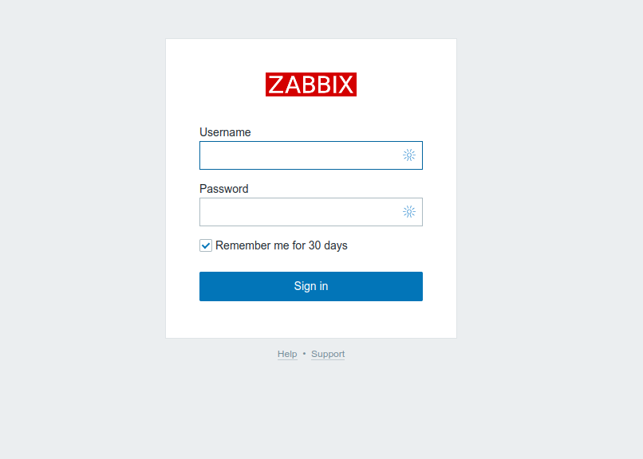

Nesta tela, entre com as informações abaixo:

* **Username:** Admin
* **Password:** zabbix
<p>&nbsp;</p>

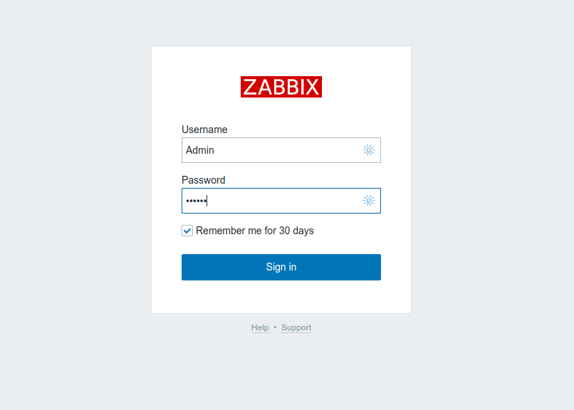
<p>&nbsp;</p>

Pronto! Estamos agora no dashboard do servidor **Zabbix**:

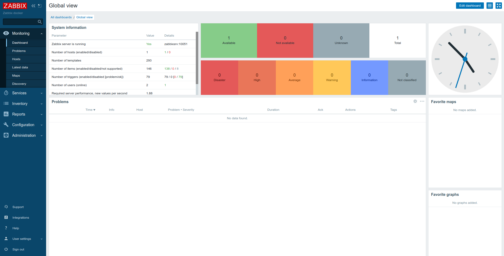

Com isso testamos tanto o servidor **Zabbix Front-end**, que provê a interface WEB, quanto ao servidor **Zabbix Server**.

O próximo passo será testar o servidor **Grafana**.
<p>&nbsp;</p>

## **6.3 - Servidor Grafana**

Por último, iremos testar o servidor **Grafana**, para isso, em seu navegador WEB digite o endereço abaixo:

```zsh
http://localhost:3000
```

Será aberto a tela abaixo:


Nesta tela, entre com as informações abaixo:

* **Email or username:** admin
* **Password:** admin
<p>&nbsp;</p>


Na tela seguinte, o **Grafana** irá pedir para que seja trocado a senha padrão para uma senha segura de sua preferência, entre com os dados pedidos e clique no botão **"Submit"**.


Após efetuar a troca da senha padrão, será aberto a tela de boas vindas do **Grafana**.

Para testar a conectividade do servidor **Grafana** com o servidor **Zabbix**, teremos que instalar um plugin de conectividade, para isso, nesta tela ainda, clique no ícone **"configuration"** e vá até o item **"Plugins"** 

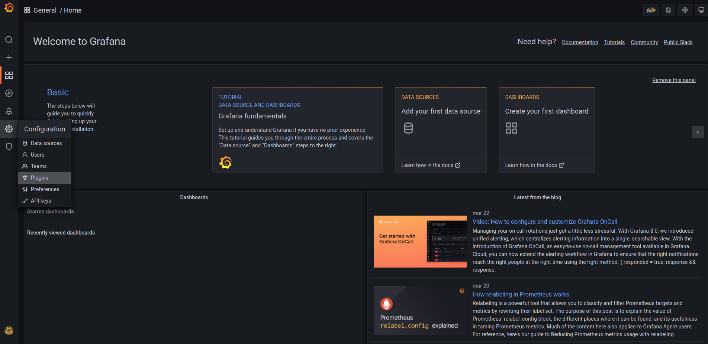

Na janela que abrirá, clique no campo de pesquisa e digite a palavra **zabbix**, será mostrado o resultado da pesquisa, clique no ícone do **Zabbix** para selecionar o mesmo:

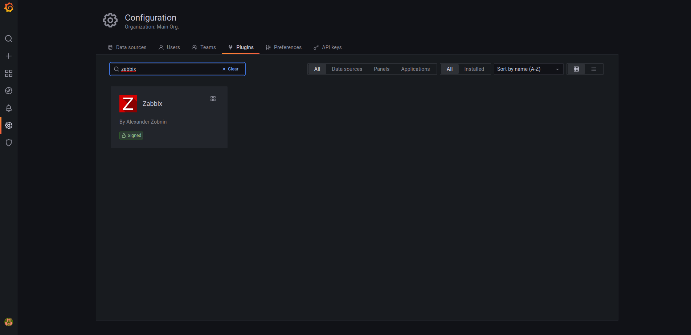

Nesta próxima tela, clique no botão **"Install"** para instalarmos o plugin:

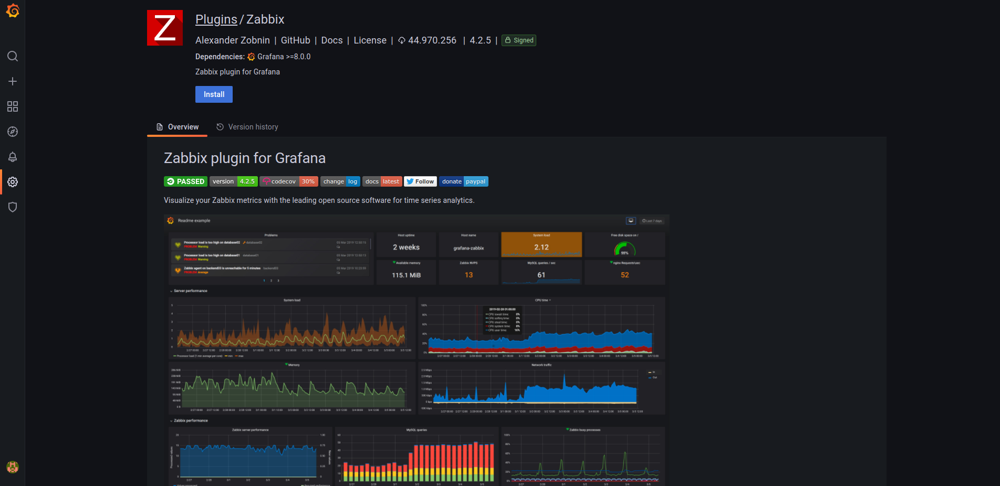

Após a instalação do plugin, clique no botão **"Enable"** para ativar o plugin:

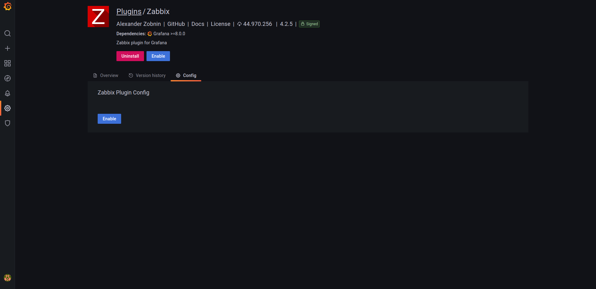

Agora, selecione novamente o ícone **"Configuration"** e vá até a opção **"Data sources"**:

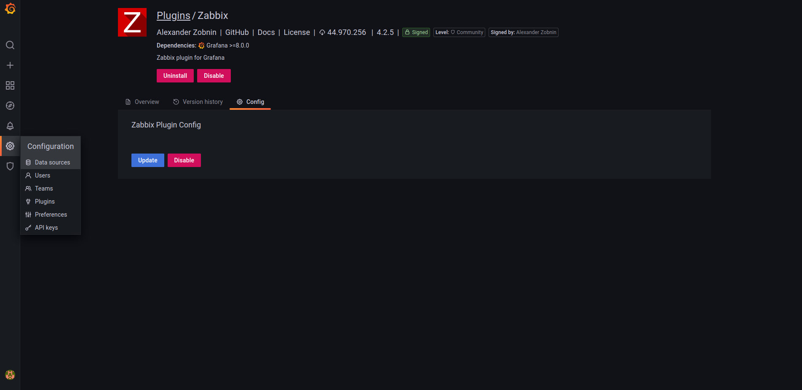

Na tela que abrirá, clique no botão **"Add data source"**:

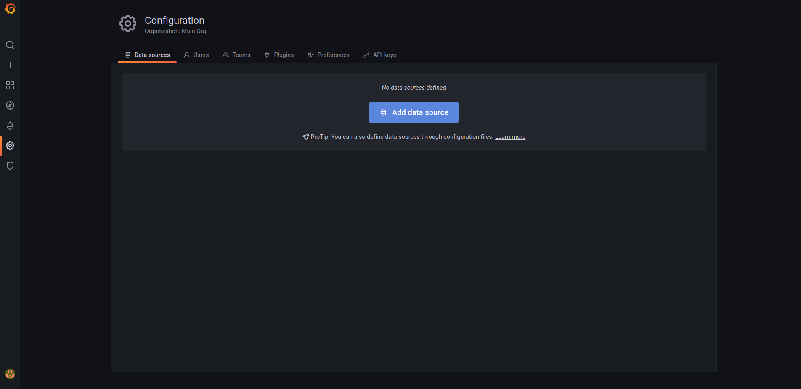

Na tela **"Add data source"**, clique no campo de pesquisa e digite **""zabbix"**
Clique no ícone do **Zabbix** para selecionarmos:

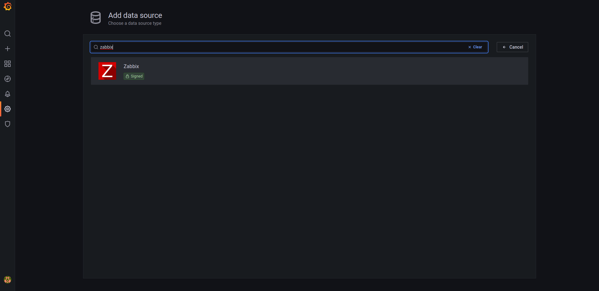

Na tela que será apresentada, preencha os campos abaixo:

* **URL:** http://zabbixweb:8080/api_jsonrpc.php
* **Access:** Server (default)
* **Username:** Admin
* **Password:** zabbix

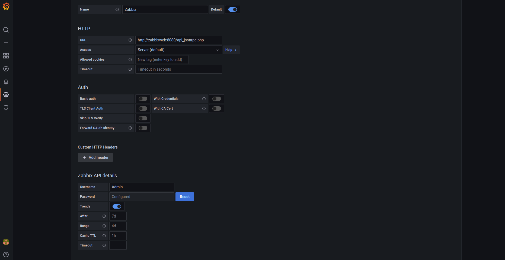

Após preencher esses dados, clique no botão **"Save & test"**

Se tudo estiver preenchido corretamente, irá aparece um pop-up informando que o teste foi executado com sucesso.

Agora você já pode criar dashboards com as informações do servidor **Zabbix** e dar sequência ao laboratório.

Abaixo, segue um exemplo simples de dashboard pegando os dados do servidor **Zabbix**:

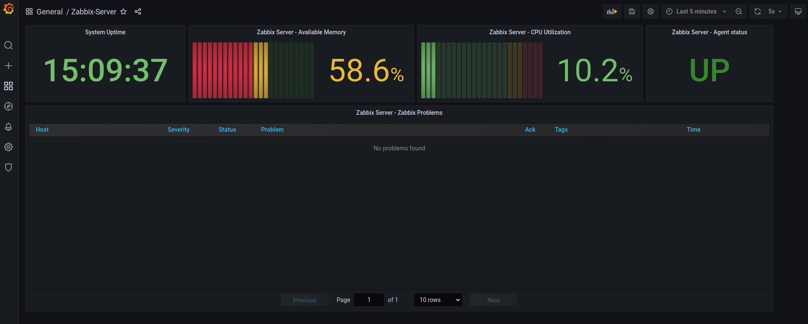


## **7. Conclusão.**

Neste laboratório, vimos que podemos utilizar o **Docker** para criarmos vários ambientes para testes, aproveitando melhor os recursos do host com um baixo consumo de memória, disco e CPU, visto que o ambiente utiliza o próprio kernel do host e cria user spaces separados para cada aplicação, retirando a camada de virtualização utilizada em vários softwares como o **Virtualbox**, **VMWare** e outros, onde há a necessidade de pré-alocar espaço em disco, memória e CPU e a instalação do sistema operacional completo no Guest.

Para dúvidas ou mais informações, deixo os links de documentação utilizado pelas ferramentas deste laboratório:

* **Docker:** https://docs.docker.com
* **Zabbix:** https://www.zabbix.com/documentation/current/en
* **Grafana:** https://grafana.com/docs/grafana/latest/
* **MySQL:** https://dev.mysql.com/doc/